# Online Exam Platform — High Level Design (HLD)

**Project:** `online-exam-platform`
**Document Maintainer:** M. Khubaib Asif
**Version:** 1.0
**Related Documents:** `docs/srs/*`, `BUILD_PLAN.md`

---

## Table of Contents

1. [Purpose & Scope](#1-purpose--scope)
2. [Design Goals & Constraints](#2-design-goals--constraints)
3. [System Context](#3-system-context)
4. [High-Level Architecture](#4-high-level-architecture)
5. [Client Tier Design](#5-client-tier-design)
6. [Gateway & Edge Design](#6-gateway--edge-design)
7. [Backend Services Design](#7-backend-services-design)
8. [Data Tier Design](#8-data-tier-design)
9. [Core Domain Modules](#9-core-domain-modules)
10. [Cross-Cutting Concerns](#10-cross-cutting-concerns)
11. [Key End-to-End Flows](#11-key-end-to-end-flows)
12. [Data Model Overview](#12-data-model-overview)
13. [Security Design](#13-security-design)
14. [Multi-Tenancy Design](#14-multi-tenancy-design)
15. [Scalability & Performance Design](#15-scalability--performance-design)
16. [Reliability & Failure Handling](#16-reliability--failure-handling)
17. [Deployment Architecture](#17-deployment-architecture)
18. [Observability Design](#18-observability-design)
19. [Technology Decisions Summary](#19-technology-decisions-summary)
20. [Open Risks & Future Considerations](#20-open-risks--future-considerations)

---

## 1. Purpose & Scope

This document describes the **high-level design (HLD)** of the Online Exam Platform — a secure, multi-tenant, AI-proctored examination system delivered across web, desktop (Electron), and mobile. It translates the requirements defined in `docs/srs/` (actors, user stories, functional and non-functional requirements) into a coherent system design: what components exist, how they communicate, where data lives, and how the system behaves under normal and failure conditions.

This HLD is intentionally implementation-agnostic about internal code structure (covered in `BUILD_PLAN.md`) and instead focuses on:
- The major subsystems and their responsibilities
- The boundaries and contracts between them
- The data each subsystem owns
- How the system satisfies the NFRs (security, performance, reliability, scalability)

**Out of scope for this document:** detailed API contracts, database column-level schema, UI wireframes, and sprint-level task breakdown — these live in their own design artifacts.

---

## 2. Design Goals & Constraints

### 2.1 Goals (derived from SRS)

| Goal                                                  | Driving requirement      |
| ----------------------------------------------------- | ------------------------ |
| Strict tenant isolation between institutions          | FR-011 to FR-014, NFR-02 |
| No client can be trusted with exam content or grading | NFR-01, NFR-02           |
| Sub-2-second question delivery at scale               | NFR-03                   |
| 99.9% uptime during exam windows                      | NFR-04                   |
| Full auditability of every consequential action       | FR-043 to FR-045, NFR-05 |
| Elastic scaling of video/WebSocket infrastructure     | NFR-06                   |
| One shared core that runs on web, desktop, and mobile | Project mandate          |

### 2.2 Design Constraints

- The student-facing exam-taking surface must run inside a **locked-down native shell** (Electron), not a regular browser tab, because browsers cannot enforce OS-level restrictions (FR-025).
- All three client surfaces (web, Electron, mobile) must share business logic and types to avoid drift — this drives a monorepo, shared validation, and a single source of truth API.
- The system must be buildable and deployable by a 3-person team incrementally — the design is deliberately modular so subsystems can be built and tested independently (see phased build plan).
- The system must assume hostile clients at all times — every design decision below is filtered through "what if the student's machine is compromised or actively trying to cheat."

---

## 3. System Context

The platform sits between four categories of external parties and must mediate every interaction through its backend — no client communicates with another client directly, and no client touches the database directly.

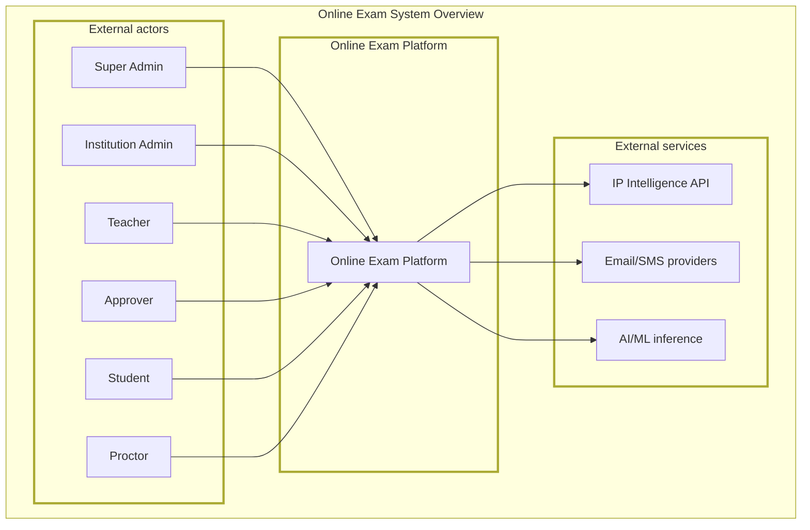

The platform itself is a **closed system from the client's point of view** — every actor, regardless of role, only ever interacts through authenticated API or WebSocket calls into the backend, which is the single arbiter of truth, state, and permissions.

---

## 4. High-Level Architecture

### 4.1 Architectural Style

The system follows a **layered, service-oriented monolith** for the backend (not microservices) at launch. A single, well-modularized backend application is easier for a 3-person team to secure, test, and operate correctly than a distributed microservices system, while still being internally organized into clear domain modules (auth, exams, sessions, proctoring, grading) that *could* be split into services later if scale demands it.

The clients are **thin and untrusted** — they render UI and collect input/telemetry, but every decision of consequence (timing, scoring, access control) is made server-side.

### 4.2 Layered View

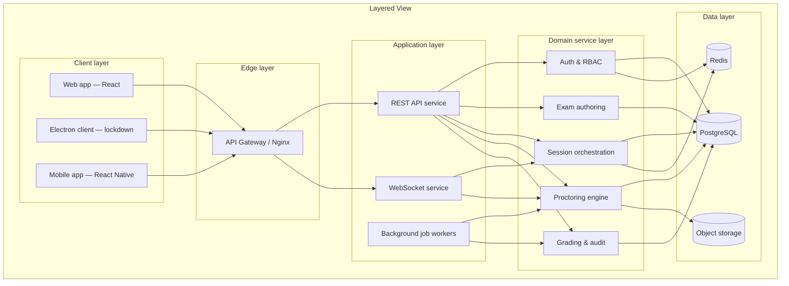

Each domain service in Layer 4 owns its own data access and never reaches into another domain's tables directly — cross-domain needs go through the service's public interface. This keeps the monolith internally decoupled, which matters both for security review (one module's bug doesn't silently corrupt another's data) and for the option to extract a service later.

### 4.3 Why This Shape

- **Gateway in front of everything**: a single choke point enforces TLS, rate limiting, and WAF rules before traffic ever reaches application code — this is the platform's first line of defense.
- **REST for request/response, WebSocket for live state**: exam authoring, grading, and admin operations are naturally request/response (REST). Live exam sessions, proctoring alerts, and timer sync are naturally push-based (WebSocket). Using the right protocol for each avoids polling hacks and reduces latency for the time-sensitive paths.
- **Background jobs decoupled from the request path**: AI grading, telemetry aggregation, and log sanitization are CPU/IO-heavy and must never block a student's request — they run asynchronously in workers fed by a queue.
- **Domain services as internal boundaries**: even without physical service separation, enforcing logical boundaries (auth never directly writes exam data, proctoring never directly writes grades) limits the blast radius of any single component's mistake.

---

## 5. Client Tier Design

### 5.1 Web Application

**Audience:** Teachers, Institution Admins, Super Admins, Approvers, Proctors.

**Responsibilities:**
- Exam authoring UI (question banks, sections, randomization config)
- Approval workflow UI
- Institution and user management
- Live proctoring dashboard (grid of active sessions, risk scores, flag review)
- Grading interface (confirm/override AI suggestions)
- Audit log and integrity report viewing

**Design notes:** Standard SPA architecture. Never handles raw exam content for students, never has lockdown requirements — it's a conventional, trusted-context web application protected by the same auth/RBAC layer as everything else.

### 5.2 Electron Desktop Client (Lockdown)

**Audience:** Students taking proctored exams.

**Responsibilities:**
- Render exam content delivered question-by-question from the server (never the full exam payload at once)
- Enforce OS-level lockdown: disable alt-tab, block external displays, kill forbidden processes, disable clipboard
- Collect device fingerprint, run pre-exam security gate checks
- Run on-device lightweight AI (face presence/gaze) using TensorFlow.js to minimize raw video sent to the server
- Maintain the authoritative WebSocket connection for the live exam session
- Provide a native, app-store-independent install with signed binaries

**Design notes:** Split into **main process** (privileged, talks to OS, talks to backend) and **renderer process** (sandboxed, draws UI, runs face-detection model). They communicate only through a narrow, explicitly whitelisted `contextBridge` API — the renderer never gets `nodeIntegration` or direct OS access. This containment means even if the renderer is compromised via a malicious question payload, it cannot escalate to OS-level control.

### 5.3 Mobile Application

**Audience:** Students (secondary device for proctoring), and optionally students taking lower-stakes exams directly.

**Responsibilities:**
- QR-pairing flow to become a secondary camera angle for an active Electron exam session
- Stream video over WebRTC to a media server for the side-angle proctoring view
- (Later phase) Take exams directly for post-hoc-review-tier exams only, with mobile-appropriate lockdown (screen pinning / guided access)

**Design notes:** Built with React Native/Expo specifically so UI logic and validation schemas can be shared with the web package, minimizing duplicate implementation of business rules across three clients.

### 5.4 Shared Client Logic

All three clients depend on a single `shared` package containing TypeScript types, Zod validation schemas, and constants (roles, permissions, error codes). This guarantees that "what a valid exam answer payload looks like" is defined exactly once and cannot drift between platforms.

---

## 6. Gateway & Edge Design

The gateway (Nginx, or a managed equivalent) is the single network entry point. Its responsibilities:

- **TLS termination** — TLS 1.3, modern cipher suites only
- **Rate limiting** — first-line defense, coarse-grained, before requests even reach the application (fine-grained, per-route limits are enforced again in application middleware — defense in depth)
- **WAF rules** — blocks common attack signatures (SQLi patterns, known exploit payloads) before they reach app code
- **Routing** — REST traffic to the API service, WebSocket upgrade traffic to the WS service, static assets to CDN/storage
- **DDoS mitigation** — connection limits, SYN flood protection at this layer

No business logic lives at the gateway — it is purely infrastructure. This keeps it simple, auditable, and replaceable (e.g., swapping Nginx for a managed cloud load balancer later requires no application changes).

---

## 7. Backend Services Design

### 7.1 REST API Service

Stateless HTTP service. Every request passes through a fixed middleware chain before reaching business logic:

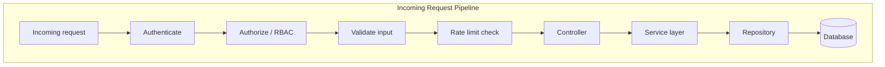

Because this chain is fixed and applied uniformly (no route can opt out), the API has no "forgotten" unauthenticated or unvalidated endpoints by construction — security is structural, not something each developer has to remember per-route.

### 7.2 WebSocket Service

Maintains persistent connections for the duration of an active exam. Key design decisions:

- **Namespace per exam_id**: each exam gets its own Socket.io namespace, so events for Exam A can never leak to a client connected for Exam B, even by accident — isolation is enforced by the transport itself, not just application logic.
- **One active connection per session**: if a second connection authenticates with the same session token, the first is forcibly disconnected. This prevents a student from running the exam client on two machines simultaneously.
- **Server-authoritative timer**: the client displays a countdown, but the server independently tracks elapsed time and enforces the deadline regardless of what the client reports — a tampered client clock cannot extend exam time.
- **Heartbeat-based liveness**: a dropped heartbeat beyond a threshold pauses the session rather than failing it outright, distinguishing "network blip" from "student left."

### 7.3 Background Job Workers

A pool of workers consumes jobs from Redis-backed queues. Three job classes:

| Job class                | Trigger                       | Why async                                                                                                                                                  |
| ------------------------ | ----------------------------- | ---------------------------------------------------------------------------------------------------------------------------------------------------------- |
| Grading jobs             | Exam submission               | Auto-grading and AI-assisted scoring are not needed instantly; doing this synchronously would block the submit response and create timeout risk under load |
| Proctoring analysis jobs | Telemetry/video batch arrival | Risk scoring involves aggregation logic that shouldn't run on the request thread handling a student's live exam traffic                                    |
| Maintenance jobs         | Scheduled or event-triggered  | Log sanitization, audit chain verification, key rotation reminders — none are time-critical to the requester                                               |

Workers scale independently of the API service — under exam load, API capacity (handling many live sessions) and grading capacity (processing submissions after exams end) have different and uncorrelated demand curves, so decoupling them avoids over- or under-provisioning either.

---

## 8. Data Tier Design

### 8.1 PostgreSQL — System of Record

Holds all durable, structured data: institutions, users, exams, questions, sessions, grades, audit logs. Chosen for ACID guarantees (a grade or an approval decision must never be partially written) and mature support for row-level constraints and encrypted columns.

### 8.2 Redis — Ephemeral & Fast-Access State

Used for three distinct purposes that all share the same need for low-latency, short-lived state:
- **Session/auth state**: refresh token families, active exam session tokens with nonces
- **Rate limiting counters**: sliding window counts per IP/user/route
- **Pub/Sub & queue backing**: WebSocket cross-instance event distribution (when the WS service scales horizontally) and the BullMQ job queue

Nothing in Redis is the sole copy of anything important — it is always either a cache of Postgres data, a rebuildable counter, or genuinely ephemeral session state. Losing Redis should degrade the system (force re-login, slow down), not corrupt it.

### 8.3 Object Storage — Large Binary Data

Encrypted video/audio recordings, biometric reference images, and exported integrity reports. Kept out of PostgreSQL because large binary blobs in a relational database hurt backup/restore times and query performance — object storage is purpose-built for this and supports lifecycle policies (e.g., auto-delete recordings after a retention period, per NFR-05).

---

## 9. Core Domain Modules

The application layer is organized into five domain modules. Each is a vertical slice owning its own data, business rules, and external interface.

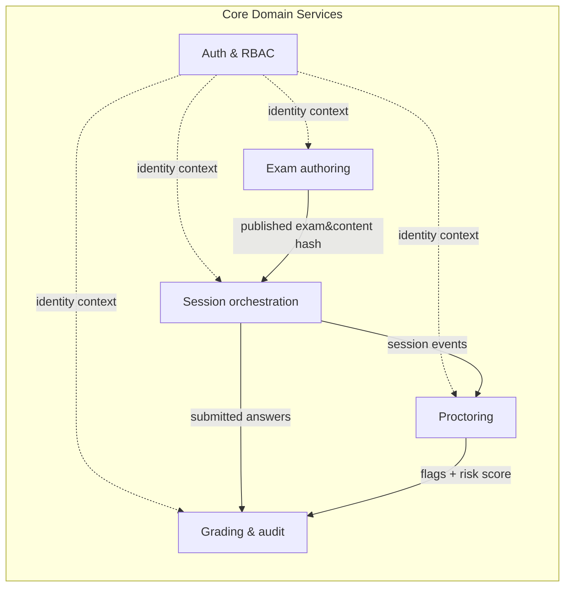

### 9.1 Auth & RBAC Module

Owns: user identity, credentials, sessions, device registrations, role-permission mapping.
Provides to others: a verified identity + role context attached to every request; nothing else in the system makes its own authentication decisions.

### 9.2 Exam Authoring Module

Owns: question banks, questions (encrypted content), exam definitions, sections, randomization rules, the approval workflow, and content hashing.
Provides to others: published, hash-verified exam definitions that the session module can safely deliver to students.

### 9.3 Session Orchestration Module

Owns: exam enrollments, exam sessions, the entry-gate sequence, one-time session tokens, live WebSocket session state, answer submission.
Provides to others: a verified, isolated execution context per student per exam; feeds raw session events to proctoring and final answers to grading.

### 9.4 Proctoring Module

Owns: telemetry ingestion, AI analysis result processing, risk scoring, flag generation, the proctor review queue, proctoring-tier configuration.
Provides to others: flags and risk assessments that grading and audit consume, and that proctors act on through the dashboard — but it never makes grading decisions itself.

### 9.5 Grading & Audit Module

Owns: auto-grading logic, AI-assisted subjective grading suggestions, teacher confirmation workflow, grade immutability and reopen flow, the tamper-evident audit log chain, log sanitization, integrity report generation.
Provides to others: final, confirmed grades and the authoritative historical record of everything that happened in the system.

**Design principle behind this split:** each module corresponds to a distinct *trust boundary* and *lifecycle stage* of an exam (define it → deliver it → watch it happen → score it → prove what happened). This mapping is intentional — it means a security review or a bug investigation can be scoped to "which stage of the exam lifecycle does this touch" rather than searching the entire codebase.

---

## 10. Cross-Cutting Concerns

These concerns are not owned by any single module but apply uniformly across the system.

### 10.1 Authentication & Authorization
Every request, regardless of which domain module it reaches, passes through the same identity verification and permission check before any module-specific logic runs (see Section 7.1). No module is permitted to implement its own ad-hoc auth check.

### 10.2 Validation
Every input — HTTP body, query param, WebSocket message — is validated against a shared schema before it reaches business logic. The same schemas are shared with the client packages, so client-side validation and server-side validation can never disagree about what "valid" means.

### 10.3 Auditing
Every module emits structured audit events for consequential actions (login, grade change, exam publish, session flag, admin config change) to a single, append-only, hash-chained audit log. No module writes audit logs in its own format — there is one audit service and one record shape.

### 10.4 Encryption
Sensitive data (question content, student answers, biometric references) is encrypted before it leaves application memory destined for storage, using a single shared crypto service — encryption logic is not reimplemented per-module.

### 10.5 Multi-Tenant Scoping
Every database query that could return institution-specific data is automatically scoped to the requester's institution, derived from their verified identity — never from a client-supplied parameter (see Section 14).

---

## 11. Key End-to-End Flows

### 11.1 Exam Authoring & Approval Flow

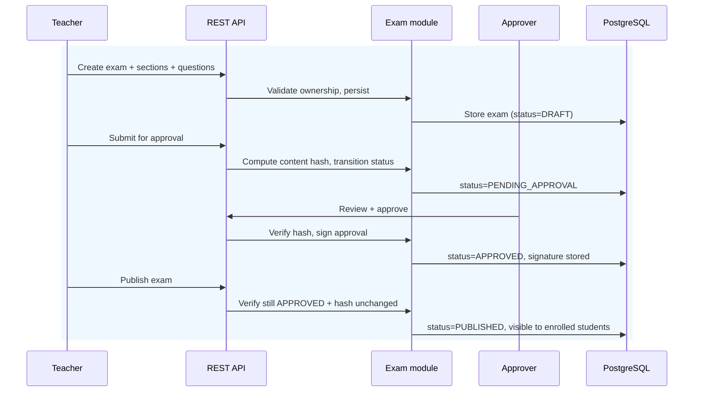

The critical design point: any edit between approval and publish invalidates the content hash, which automatically reverts the exam to DRAFT — the approver's signature is cryptographically bound to exact content, not just "this exam, whatever it currently contains."

### 11.2 Student Exam Entry Flow

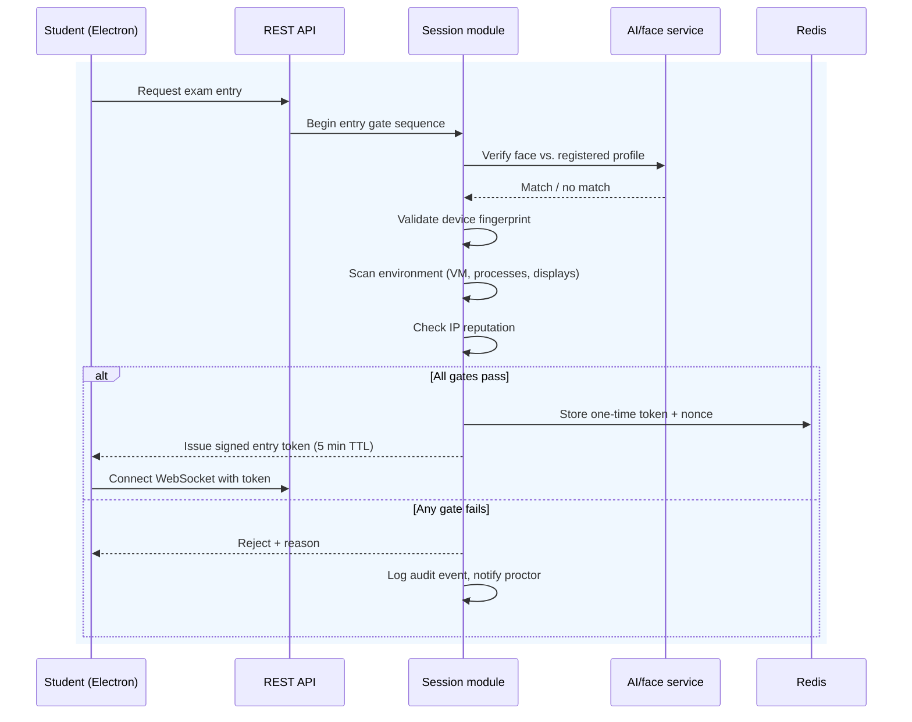

This sequence is deliberately a hard gate chain, not a scored checklist — a single failed gate blocks entry entirely rather than contributing to a "risk score" that might still let a student in. Entry security and in-exam behavioral risk scoring are different mechanisms by design: one prevents unauthorized starts, the other monitors authorized sessions.

### 11.3 Live Proctoring Flow

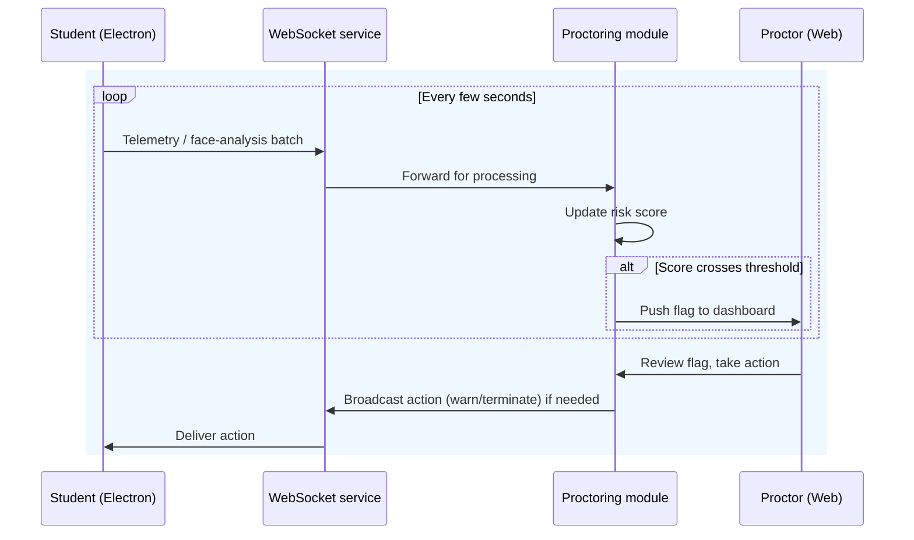

Note that the AI never unilaterally penalizes a student — it only raises flags. A human (proctor or teacher) makes every consequential decision, with the AI's role strictly limited to surfacing signal at the right time. This is a deliberate design choice to keep accountability with a human reviewer.

### 11.4 Grading Flow

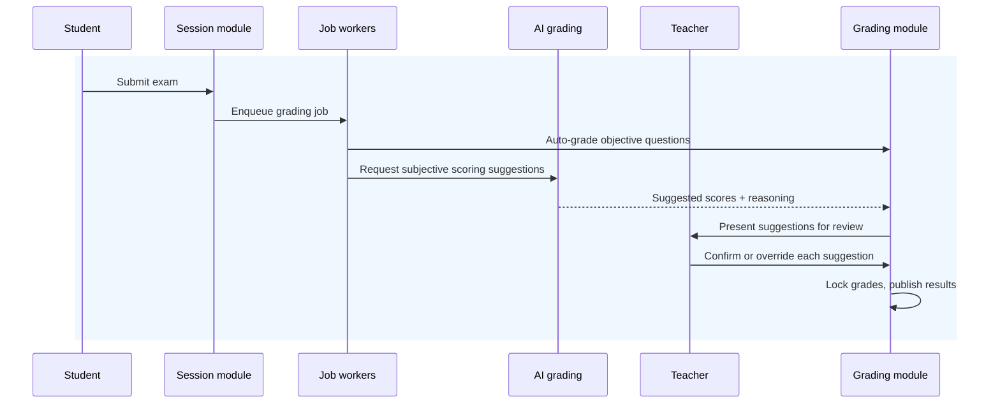

Grades are never visible to the student, and never considered final, until every subjective question has an explicit human confirmation — the AI suggestion alone is never sufficient.

---

## 12. Data Model Overview

This is a conceptual view; full schema detail lives in the Prisma schema and `BUILD_PLAN.md`.

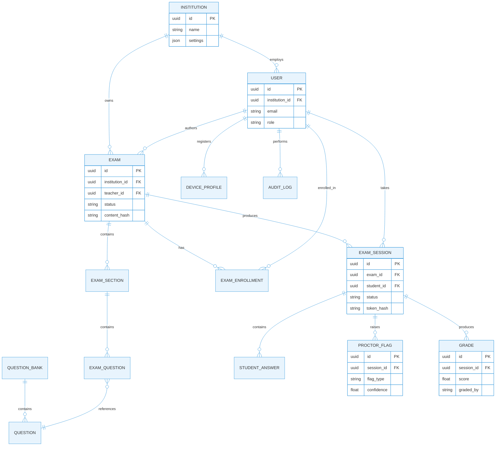

**Key relational design decisions:**
- Every tenant-scoped table carries `institution_id` directly or transitively (via exam/user), enabling a single consistent scoping pattern across all queries.
- `EXAM_SESSION` is the central join point between authoring, identity, proctoring, and grading — it is the record that ties one student's one attempt at one exam to everything that happened during it.
- Grades are append-only with a `graded_by` provenance field (`SYSTEM`, `AI_SUGGESTION`, or a teacher's user ID), preserving who/what produced every score even after human confirmation.

---

## 13. Security Design

Security is treated as a cross-cutting architectural property rather than a bolt-on layer. The design maps directly to the NFRs in the SRS.

### 13.1 Defense in Depth — Layered View

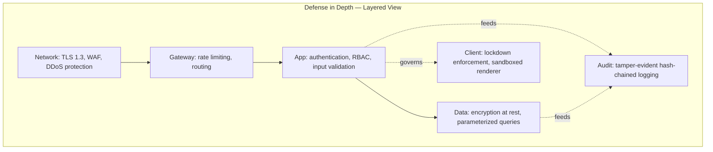

No single layer is assumed sufficient — a failure at one layer (e.g. a leaked access token) is still constrained by the layers around it (short token lifetime, RBAC scoping, audit visibility of any misuse).

### 13.2 Identity & Trust Model

- Access tokens are short-lived (15 min) and signed asymmetrically (RS256), so a leaked token has a narrow exploitation window and verification never requires distributing the signing secret.
- Refresh tokens rotate on every use; reuse of a previously-rotated token is treated as a stolen-token signal and invalidates the entire token family, not just the one token.
- Every exam session token is additionally bound to device fingerprint and IP at issuance — possession of the token alone is not sufficient to act as the student if the binding context doesn't match.

### 13.3 Data Protection

- Question content and student answers are encrypted at the application layer before reaching the database — a database-level breach alone does not expose exam content.
- Biometric data is stored as references to encrypted object storage, never embedded as plaintext anywhere in the relational schema.
- All audit and proctoring records are chained by hash, so any retroactive tampering with historical records is mathematically detectable, not just access-controlled against.

### 13.4 Client Trust Boundary

The Electron client is treated as **semi-trusted at best** — it runs on hardware the platform does not control. The design compensates by:
- Never sending the full exam to the client; questions are streamed one at a time
- Never trusting client-reported timing; the server tracks the authoritative clock
- Sandboxing the renderer so that even a compromised question payload (e.g. malicious rich text) cannot escalate to OS-level code execution
- Treating all client-reported security signals (device fingerprint, environment scan results) as claims to be checked against server-side state, not facts to be trusted outright

### 13.5 Threat Model Summary

| Threat                      | Primary mitigation                                                               |
| --------------------------- | -------------------------------------------------------------------------------- |
| Student impersonation       | Biometric + device binding at entry, one active session enforcement              |
| Exam content leak           | Encryption at rest, one-question-at-a-time delivery, no full payload to client   |
| Cheating via external tools | Lockdown process scanning, virtual camera/VM detection, display count checks     |
| Cross-institution data leak | Institution-scoped queries derived from server-side identity, never client input |
| Privilege escalation        | RBAC enforced identically on every route, no module-specific auth shortcuts      |
| Tampered audit trail        | Hash-chained append-only log, periodic chain verification                        |
| Token theft / replay        | Short-lived tokens, rotation, device/IP binding, one-time nonce for exam entry   |

---

## 14. Multi-Tenancy Design

The platform serves multiple institutions from shared infrastructure, with **logical isolation enforced at the application layer** rather than physically separate databases per institution (chosen for operational simplicity at this scale, while still being strict).

### 14.1 Isolation Principle

Every query capable of returning institution-scoped data is parameterized by an `institution_id` that is derived exclusively from the authenticated user's verified identity — never accepted as a client-supplied value. This single rule, applied consistently across the repository layer, is what prevents one institution's data from ever being reachable by another institution's users, by construction rather than by per-query vigilance.

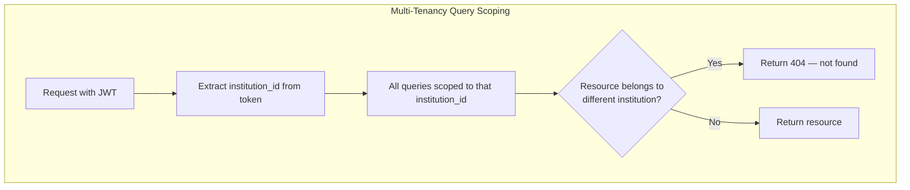

Cross-institution access attempts return **404, not 403** — the design deliberately avoids confirming that a resource exists in another institution at all, denying an attacker even that information.

### 14.2 Exam ID Scoping

Each exam's identifier is cryptographically scoped under the combination `institution_id + teacher_id + class_id`, so even a guessed or enumerated exam ID carries no exploitable information and cannot be reused or replayed across institutions or classes.

### 14.3 WebSocket Isolation

Live exam sessions use one Socket.io namespace per `exam_id`. This means tenant isolation is enforced by the transport layer itself for real-time traffic, not only by application-level checks on each message — an additional structural guarantee on top of the database-level scoping.

---

## 15. Scalability & Performance Design

### 15.1 Independent Scaling Axes

| Component                  | Scales with                                                  | Strategy                                                                      |
| -------------------------- | ------------------------------------------------------------ | ----------------------------------------------------------------------------- |
| REST API                   | Concurrent authoring/admin/dashboard traffic                 | Horizontal — stateless instances behind the gateway                           |
| WebSocket service          | Concurrent live exam sessions                                | Horizontal with Redis pub/sub to fan out events across instances              |
| Job workers                | Submission volume at exam end, telemetry volume during exams | Horizontal, queue-depth-driven autoscaling                                    |
| PostgreSQL                 | Overall data volume and query load                           | Vertical scaling + read replicas for reporting/dashboard queries              |
| Redis                      | Active session count, rate-limit keys                        | Vertical scaling, with eviction policies for non-critical keys                |
| Video/media infrastructure | Concurrent camera streams                                    | Horizontal, scaled specifically against active `exam_id` schedules per NFR-06 |

### 15.2 Meeting the Latency NFR

To hit P99 < 2.0s question-load latency (NFR-03):
- Questions are pre-fetched and cached per session as soon as a session begins, rather than queried fresh on every navigation
- The WebSocket channel avoids HTTP request overhead for in-session navigation entirely
- Read-heavy dashboard/reporting queries are isolated to read replicas so they cannot contend with the latency-sensitive exam-delivery path

### 15.3 Scheduled Load Predictability

Exam traffic is inherently bursty and largely *known in advance* — exams are scheduled. This is a major design advantage over a generically unpredictable web workload: the system can pre-scale WebSocket and media capacity ahead of a scheduled exam window based on enrollment counts, rather than purely reacting to load after it appears.

---

## 16. Reliability & Failure Handling

### 16.1 Fail-Secure Defaults

Every failure mode defaults to the safer, more restrictive outcome rather than silently continuing:

| Failure                           | Behavior                                                                                   |
| --------------------------------- | ------------------------------------------------------------------------------------------ |
| WebSocket drops mid-exam          | Session pauses; server timer keeps running; student gets a bounded reconnect window        |
| Reconnect window exceeded         | Session flagged for proctor review, not auto-failed and not silently resumed               |
| AI proctoring service unavailable | Telemetry still recorded for later post-hoc review; no live alerts are fabricated          |
| Redis unavailable                 | New logins degrade gracefully (forced re-auth) rather than allowing unauthenticated access |
| Approval signature/hash mismatch  | Exam automatically reverts to DRAFT rather than publishing with stale approval             |

### 16.2 Data Durability

- PostgreSQL: automated backups with tested restore procedures; this is the system of record and must never be the single point of data loss
- Object storage: video/audio recordings replicated per the storage provider's durability guarantees, with lifecycle-managed retention per privacy/compliance policy
- Audit log: hash-chained, so partial data loss is at least *detectable* even if not always recoverable, and chain verification can run periodically to catch silent corruption early

### 16.3 Graceful Degradation Under Partial Outage

The design separates "exam can continue" from "non-critical feature available." For example, if the AI grading service is down, exam-taking is entirely unaffected — grading simply queues and completes once the service recovers, rather than coupling exam availability to grading availability.

---

## 17. Deployment Architecture

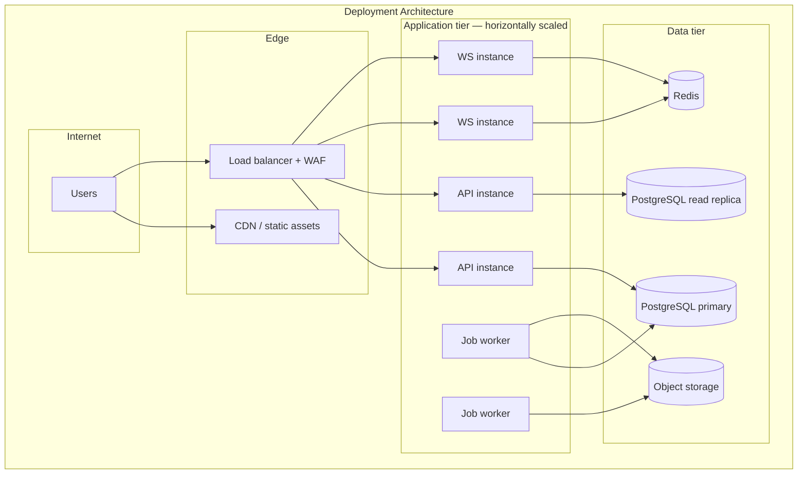

### 17.1 Environment Strategy

Three isolated environments — development, staging, production — with strictly separated databases, secrets, and credentials. Staging mirrors production topology so that load and security testing reflects reality before anything reaches real students.

### 17.2 Containerization

Every backend component (API, WebSocket service, job workers) ships as a container, enabling identical runtime behavior across all three environments and giving the team a fast, reproducible local development stack via Docker Compose.

### 17.3 Release Strategy

- Staging deploys automatically on every merge to the integration branch
- Production deploys require explicit manual approval — never automatic — given the stakes of the platform
- Database migrations are applied as a distinct, reviewed step before application code referencing the new schema is deployed, avoiding any window where running code expects a schema that isn't there yet

---

## 18. Observability Design

### 18.1 Three Pillars

| Pillar          | Purpose                                                 | Where                                                              |
| --------------- | ------------------------------------------------------- | ------------------------------------------------------------------ |
| Structured logs | Reconstruct what happened in a specific request/session | Every service, JSON-structured                                     |
| Metrics         | Detect aggregate trends and threshold breaches          | API latency, error rates, queue depth, WebSocket connection counts |
| Audit trail     | Prove what a specific actor did, immutably              | Dedicated hash-chained store, separate from operational logs       |

These are kept conceptually distinct: operational logs are for debugging and can be pruned/rotated, while the audit trail is a compliance and integrity artifact that is never pruned and is specifically protected against tampering.

### 18.2 Alerting Philosophy

Alerts are tied to symptoms that affect real exam sessions (elevated error rate, latency breach, WebSocket failure rate during an active exam window) rather than purely infrastructure-level noise, so the team's attention is drawn to issues that matter most: students actively unable to take their exam.

---

## 19. Technology Decisions Summary

| Decision area              | Choice                                                      | Primary reason                                                                                             |
| -------------------------- | ----------------------------------------------------------- | ---------------------------------------------------------------------------------------------------------- |
| Backend architecture style | Modular monolith                                            | Manageable security surface for a small team; clean internal boundaries preserve future extraction options |
| API style                  | REST + WebSocket                                            | Right protocol per access pattern (request/response vs. live push)                                         |
| Primary database           | PostgreSQL                                                  | ACID guarantees for grades/approvals, mature encryption/row-level support                                  |
| Cache/session store        | Redis                                                       | Sub-millisecond access for session, rate-limit, and pub/sub needs                                          |
| Background processing      | Queue-backed workers                                        | Decouples slow/CPU-bound work from latency-sensitive request paths                                         |
| Desktop client             | Electron with sandboxed renderer                            | Only practical way to get OS-level lockdown across Windows/macOS from one codebase                         |
| Tenant isolation model     | Logical, identity-derived scoping                           | Operationally simpler than per-tenant databases while remaining strict                                     |
| Token strategy             | Short-lived JWT (RS256) + rotating refresh                  | Limits blast radius of token leakage without sacrificing UX                                                |
| AI proctoring placement    | Client-side lightweight inference + server-side aggregation | Avoids transmitting raw video continuously; server still owns all consequential decisions                  |

---

## 20. Open Risks & Future Considerations

| Risk / consideration                                                       | Notes                                                                                                                                          |
| -------------------------------------------------------------------------- | ---------------------------------------------------------------------------------------------------------------------------------------------- |
| Modular monolith may need service extraction as scale grows                | The domain module boundaries (Section 9) are designed so this is a refactor, not a rewrite, if/when it becomes necessary                       |
| Electron lockdown cannot be made 100% unbeatable on an uncontrolled device | The design accepts this and compensates with layered detection (device, environment, behavioral, AI) rather than relying on any single control |
| AI grading/proctoring model accuracy and bias                              | Mitigated structurally by never letting AI output be final — every AI signal requires human confirmation before having real consequence        |
| Mobile exam-taking lockdown is inherently weaker than desktop              | Scoped deliberately to the lowest proctoring tier only (post-hoc review), not used for high-stakes exams                                       |
| Cross-region latency if institutions are geographically distributed        | Not addressed in v1; a future iteration may need regional read replicas or edge points of presence                                             |
| Key management for encryption and JWT signing at scale                     | v1 uses a secrets manager with scheduled rotation; a dedicated KMS/HSM is a future hardening step as the platform matures                      |

---

*This document describes the system as designed prior to implementation. As building proceeds, any material deviation from this design must be reflected here via a reviewed update, keeping this document the accurate single source of truth for "how the system is shaped."*

*Last updated: 2026-06-30*
