# Online Exam Platform — High Level Design (HLD)

**Project:** `online-exam-platform`
**Document Maintainer:** M. Khubaib Asif
**Version:** 2.0
**Status:** Revised single-platform architecture baseline; Electron-only attempts; persistent two-device registration; server-authoritative timing, navigation, grading, and result publication.
**Related Documents:** `file docs/architecture/LOW_LEVEL_DESIGN.md`, `docs/srs/*`, `file docs/modules/MODULE_DECOMPOSITION.md`, `file docs/modules/SCREEN_INVENTORY.md`, `file docs/design/UI_GUIDELINES.md`

---

## Table of Contents

 1. [Purpose & Scope](#1-purpose--scope)
 2. [Design Goals & Constraints](#2-design-goals--constraints)
 3. [System Context](#3-system-context)
 4. [High-Level Architecture](#4-high-level-architecture)
 5. [Client Tier Design](#5-client-tier-design)
 6. [Gateway & Edge Design](#6-gateway--edge-design)
 7. [Backend Services Design](#7-backend-services-design)
 8. [Data Tier Design](#8-data-tier-design)
 9. [Core Domain Modules](#9-core-domain-modules)
10. [Cross-Cutting Concerns](#10-cross-cutting-concerns)
11. [Key End-to-End Flows](#11-key-end-to-end-flows)
12. [Data Model Overview](#12-data-model-overview)
13. [Security Design](#13-security-design)
14. [Single-Platform Scope Design](#14-single-platform-scope-design)
15. [Scalability & Performance Design](#15-scalability--performance-design)
16. [Reliability & Failure Handling](#16-reliability--failure-handling)
17. [Deployment Architecture](#17-deployment-architecture)
18. [Observability Design](#18-observability-design)
19. [Technology Decisions Summary](#19-technology-decisions-summary)
20. [Open Risks & Future Considerations](#20-open-risks--future-considerations)

---

## 1. Purpose & Scope

This document describes the **high-level design (HLD)** of the Online Exam Platform: a secure, single-platform, AI-assisted examination system delivered through an authenticated web application and a protected Electron desktop client. It translates the approved product decisions and requirements into a coherent system design: what components exist, how they communicate, where data lives, and how the system behaves under normal and failure conditions.

The v1 platform is intentionally not an institution-management or academic-information system. A teacher creates and owns an exam; authenticated users discover or receive that exam, register according to its access policy, take the approved attempt in Electron, and see their own result after teacher publication.

The deployment owner initialises a fresh deployment through a one-time bootstrap flow supplied by a protected deployment secret. The server creates exactly one `OWNER` account transactionally, invalidates the secret, records the audit event, and closes the bootstrap path. The authenticated owner then uses the shared web application to issue short-lived, single-use teacher invitations. A teacher activates an invitation through the same web application; the server derives the `TEACHER` role and never accepts a client-selected privileged role. Public self-registration creates `STUDENT` accounts only.

This HLD is implementation-agnostic about column-level database schema, detailed API contracts, UI wireframes, and sprint tasks. Those concerns remain in the LLD, SRS, module documents, screen inventory, and build plan. This document defines the system boundaries and architectural invariants those lower-level documents must implement.

**In scope:**

- Teacher-owned question banks and immutable exam revisions
- Public, invitation-only, and approval-required exam access
- Authenticated catalogue discovery and one-attempt registration
- Electron-only exam execution with native lockdown and device-bound entry
- Persistent registration of at most two active devices per user
- Per-attempt security gates and server-authoritative session state
- Whole-paper, section, question, and mixed timing
- Strictly forward-only navigation and permanent question locking
- Objective auto-grading and AI-assisted subjective grading
- Teacher approval/change of subjective marks
- Teacher-controlled result publication and student result dashboards
- Proctoring telemetry, risk scoring, evidence, review, and auditability
- High-concurrency exam windows and failure-safe recovery

**Out of scope for v1:**

- Institutions, tenants, classes, courses, departments, terms, and academic rosters
- Institution administrators, super administrators, and institution-scoped roles
- Class-based exam assignment
- Multiple attempts for one exam registration
- Browser-based exam taking
- Fill-in-the-blank as a dedicated question type
- Automatic finalisation of AI grades or automatic disciplinary penalties
- Mobile exam-taking; mobile is limited to optional secondary-camera pairing

---

## 2. Design Goals & Constraints

### 2.1 Goals (derived from the approved product direction)

| Goal | Architectural consequence |
| --- | --- |
| Keep the v1 product single-platform and implementable | Use a modular monolith with teacher-owned exams; do not introduce tenant/class/course abstractions. |
| Prevent unauthorised exam access | Require authenticated registration, a short-lived Electron launch ticket, device binding, fresh attestation, per-attempt gates, and a server-created session before question delivery. |
| Prevent browser-based exam execution | The Web application handles catalogue, registration, launch, grading, and results; only Electron can obtain session-entry authority and question delivery. |
| Protect exam content and answer keys | Store encrypted/versioned content; bind delivery to an active session and current server sequence; never expose the key to the student. |
| Make progress irreversible | The server owns sequence, timing, terminal question state, answer persistence, and all transitions. |
| Support flexible teacher timing | Validate whole-paper, section, question, and mixed timing before approval/publication. |
| Make timing tamper-resistant | Persist server deadlines; reject late, stale, replayed, and out-of-order commands; reconcile from PostgreSQL after cache loss. |
| Support high concurrent load | Keep APIs stateless, scale WebSockets horizontally, coordinate with Redis, persist to PostgreSQL, use queues, and pre-scale around exam windows. |
| Preserve teacher accountability | AI can suggest subjective marks and evidence; only teacher approval/change makes them final. |
| Preserve an auditable record | Emit append-only, hash-chained audit events for every consequential transition. |
| Fail securely | A missing gate, invalid token, lost authority, or ambiguous transition blocks or pauses safely; it never grants access or extra time. |

### 2.2 Design Constraints

- The student-facing exam-taking surface must run inside a **locked-down native shell** (Electron), not a regular browser tab.
- Every actual attempt runs in Electron. A normal browser must never receive question content, answer-submission authority, or an exam WebSocket session.
- Electron provides layered controls and evidence, not an absolute guarantee against a compromised operating system. The server remains the only business authority.
- A device fingerprint is evidence, not cryptographic identity. Persistent device keys, secure key storage, signed builds, and attestation are required.
- Each user may have at most two active registered devices. Registering a third requires revoking a non-current device first.
- Device registration is persistent. Security gates run again for every attempt.
- The server must tolerate duplicate, delayed, reordered, replayed, and concurrent requests.
- Redis is never the only durable copy of deadlines, answers, registrations, grades, results, or audit events.
- Question types in v1 are `MCQ`, `MSQ`, `TRUE_FALSE`, `SHORT`, and `LONG`. Fill-in-the-blank is intentionally excluded.
- A teacher may provide keywords, a reference source, or no answer key for subjective grading. Web research is controlled assistive evidence only and never final authority.
- The reconnect policy is a bounded reconnect window with a maximum of three reconnect attempts. The exact duration is an LLD configuration decision and must be persisted in the published/session snapshot.

---

## 3. System Context

The platform sits between students, teachers, optional approvers/proctors, and controlled external services. No client communicates directly with another client or with the database; every interaction is mediated by the backend, which is the single arbiter of identity, access, state, timing, scoring, and publication.

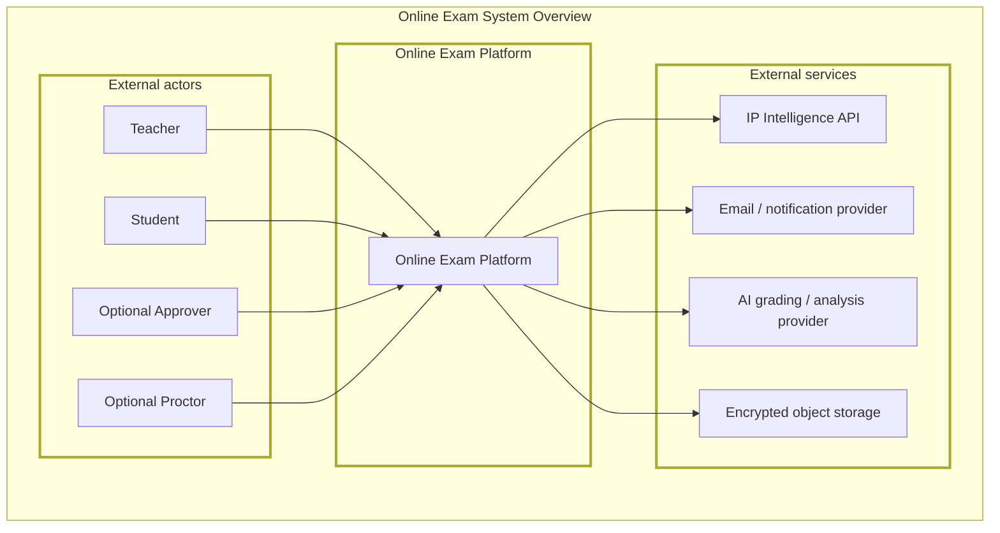

The platform is a **closed system from the client's point of view**. Every actor interacts through authenticated API or WebSocket calls. The Web application manages non-exam relationships; Electron manages the protected attempt; the backend decides whether either action is allowed.

---

## 4. High-Level Architecture

### 4.1 Architectural Style

The system follows a **layered, service-oriented monolith** for the backend at launch. A single modular backend is easier for a small team to secure, test, and operate than distributed microservices, while explicit domain boundaries preserve the option to extract a component later if scale demands it.

The clients are **thin and untrusted**. They render UI, collect input, and produce native/proctoring evidence; every consequential decision—access, timing, navigation, answer acceptance, scoring, risk action, and result publication—is made server-side.

### 4.2 Layered View

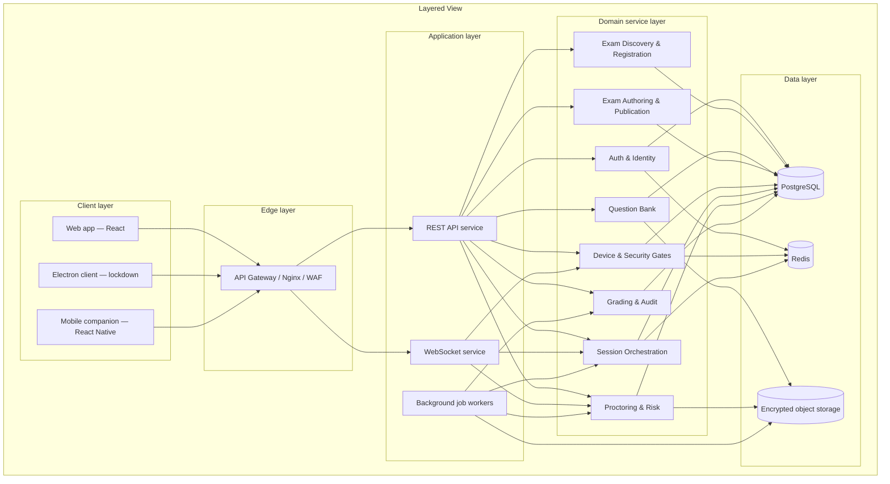

Each domain module owns its data-access boundary. Cross-domain needs use explicit service interfaces or application commands rather than silently reaching into another module's tables. This keeps the monolith internally decoupled and limits the blast radius of a defect.

### 4.3 Why This Shape

- **Gateway in front of everything:** a single choke point enforces TLS, rate limits, WAF rules, request IDs, and safe rejection before traffic reaches application code.
- **REST for workflow, WebSocket for live state:** catalogue, registration, authoring, grading, and results are request/response; active sessions, timer synchronisation, delivery acknowledgements, and live telemetry require a stream.
- **Background jobs decoupled from request paths:** AI grading, telemetry analysis, evidence processing, notifications, and timer safety jobs must not block a student's command.
- **Domain modules as internal boundaries:** identity does not write answers; registration does not deliver questions; proctoring does not change grades; grading does not bypass session state.
- **One durable authority:** PostgreSQL owns authoritative state; Redis accelerates coordination but cannot grant access or time.

---

## 5. Client Tier Design

### 5.1 Web Application

**Audience:** Deployment owners, teachers, students, optional approvers, and optional proctors.

**Responsibilities:**

- First-run owner bootstrap and owner security status
- Owner-authorised teacher invitations, activation status, revocation, and account-status management
- Student login, signup with required reference profile photo, email verification, recovery, and profile management
- Owner-issued teacher invitation activation and normal teacher credential setup
- Authenticated exam catalogue and safe exam metadata
- Invitation redemption and registration submission/status
- Teacher-owned question-bank authoring
- Exam authoring, timing configuration, access policy, proctoring policy, approval, and publication
- Teacher registration roster and approval/rejection workflow
- Teacher grading workspace, AI evidence review, mark approval/change, and result publication
- Proctor review dashboard and evidence queue
- Student published-results dashboard
- Device list and revocation of a non-current device
- Web-to-Electron launch handoff

**Design notes:** The Web client must never render the active student exam interface or receive question content. The server must enforce this independently of the UI.

### 5.2 Electron Desktop Client (Lockdown)

**Audience:** Students taking every exam attempt.

**Responsibilities:**

- Redeem a short-lived launch ticket through a controlled deep-link/handoff
- Create and use a persistent device key in secure native storage
- Sign fresh server challenges and submit native device evidence
- Run per-attempt security gates: build/version, device binding, environment, display, process, camera/microphone, identity, and network checks according to policy
- Enforce native lockdown: navigation, new windows, clipboard, printing, developer tools, shortcuts, and external-display policy
- Render only the server-authorised current question and permitted answer controls
- Maintain the session-bound WebSocket and bounded reconnect flow
- Capture and transmit bounded telemetry/evidence through the approved IPC bridge

The Electron main process handles privileged OS operations; the sandboxed renderer draws the interface. Renderer code has no Node integration or direct OS access. Electron is evidence-producing infrastructure, not the source of truth.

### 5.3 Mobile Application

**Audience:** Students using a secondary device for optional camera pairing.

**Responsibilities:**

- QR pairing to an active Electron session
- Camera capture/streaming over the approved media path
- Pairing status, consent, disconnect, and evidence-health display

Direct mobile exam-taking is outside v1. Mobile controls cannot create, resume, or authorise an exam attempt.

### 5.4 Shared Client Logic

The `shared` package contains TypeScript types, Zod validation schemas, constants, error codes, timing-policy types, question-state types, and command/event contracts. It must not contain secrets or authoritative business decisions. Server validation remains mandatory even when the same schema is used client-side.

---

## 6. Gateway & Edge Design

The gateway (Nginx, or a managed equivalent) is the single network entry point. Its responsibilities are:

- **TLS termination** — TLS 1.3 and modern cipher suites only
- **Rate limiting** — coarse first-line limits before application code, with finer limits in the API
- **WAF rules** — common injection, malformed request, abuse, and bot controls
- **Request identity** — correlation/request IDs and trace propagation
- **Routing** — REST, WebSocket, static Web, and Electron update endpoints
- **Payload limits** — bounded answer, telemetry, evidence, and upload sizes
- **Connection controls** — WebSocket duration, heartbeat, idle, and per-session limits
- **Safe error shaping** — no stack traces, answer keys, internal IDs, or sensitive gate detail
- **Health routing** — readiness and liveness separation

The gateway is not the authority for exam permissions. Every security-sensitive decision is rechecked inside the backend transaction.

### 6.1 Request pipeline

```text
Request
  → TLS / WAF / coarse rate limit
  → token or session authentication
  → account-status check
  → role and resource authorisation
  → schema validation
  → idempotency / replay check where required
  → domain command
  → transaction and audit event
  → response
```

---

## 7. Backend Services Design

### 7.1 REST API Service

The REST API handles:

- authentication and account recovery;
- catalogue queries and safe exam metadata;
- invitation redemption and exam registration;
- teacher question-bank and exam authoring;
- approval and publication workflows;
- device management and launch-ticket issuance;
- gate evidence submission and session commands that do not require a stream;
- grading, audit, result publication, and dashboard reads.

Every route uses authenticated actor context, resource-level authorisation, shared schema validation, idempotency where applicable, and an audit event for consequential changes.

### 7.2 WebSocket Service

The WebSocket service is used only for authorised, session-bound streams:

- current question delivery;
- timer synchronisation;
- answer acknowledgement;
- next-question and section transitions;
- timeout and termination events;
- proctor actions;
- bounded telemetry and native violation events;
- reconnect state.

A connection is bound to `sessionId`, user, registration, exam revision, device, attestation, and an expiring session credential. The exam ID alone is never sufficient.

### 7.3 Background Job Workers

Workers process:

- objective grading;
- AI subjective-grade suggestions;
- controlled web/reference retrieval;
- proctoring signal analysis and evidence processing;
- durable timeout and reconnect safety transitions;
- notifications;
- report/export generation;
- audit verification and retention jobs.

Every job is idempotent, retryable where safe, and backed by a durable state transition or outbox record.

---

## 8. Data Tier Design

### 8.1 PostgreSQL — System of Record

PostgreSQL owns durable authoritative records for:

- users, credentials, roles, sessions, and consent;
- devices, public keys, attestation records, and revocation;
- question banks, question versions, tags, rubrics, keywords, and reference-source snapshots;
- exams, immutable revisions, sections, timing, access, proctoring, and publication policy;
- invitations, registrations, approvals, capacity, and one-attempt constraints;
- exam sessions, deadlines, sequence, question attempts, answers, and terminal locks;
- telemetry summaries, proctoring flags, risk state, and review actions;
- objective grades, AI suggestions, teacher mark decisions, result publication, and grade history;
- append-only audit records and outbox events.

### 8.2 Redis — Ephemeral & Fast-Access State

Redis is used for:

- rate-limit counters;
- short-lived launch-ticket and entry-credential coordination;
- WebSocket presence, session rooms, and pub/sub;
- timer notifications and queue backing;
- ephemeral gate coordination and bounded reconnect coordination.

Redis is never the only copy of an answer, deadline, question lock, registration, grade, result, or audit event. After Redis loss, the application reconstructs state from PostgreSQL and does not grant extra time.

### 8.3 Object Storage — Large Binary Data

Encrypted object storage holds:

- reference biometric images/embeddings;
- teacher-provided reference books, documents, notes, and media;
- proctoring evidence frames and optional recordings;
- imported question media;
- integrity reports, exports, and certificate artifacts.

Objects use opaque paths, encryption, short-lived signed access, access logging, and retention/deletion policies. Raw biometric and proctoring material is never written to ordinary application logs.

---

## 9. Core Domain Modules

The v1 domain boundary is organised around the exam lifecycle rather than institutional hierarchy:

```text
Define identity → discover/register → build/publish → secure entry
→ execute/timing → monitor → grade/review → publish result → audit
```

### 9.1 Auth & Identity Module

Owns: deployment bootstrap state, exactly-one-owner creation, owner-authorised teacher invitation lifecycle, teacher activation, user identity, credentials, authentication sessions, account status, roles, required signup profile-photo enrolment and opaque metadata, profile consent, email verification, recovery, and the reference-photo contract consumed by per-attempt identity gates.

Provides: a verified actor context. It does not decide exam registration, device eligibility, session timing, or grading.

### 9.2 Exam Discovery & Registration Module

Owns: authenticated catalogue metadata, public/invitation/approval-required policy evaluation, invitations, registration lifecycle, capacity, duplicate-registration constraints, teacher roster, and approval/rejection decisions.

Provides: an approved `ExamRegistration` to the device/session modules. It never delivers question content.

### 9.3 Question Bank Module

Owns: teacher-owned banks, question versions, supported types (`MCQ`, `MSQ`, `TRUE_FALSE`, `SHORT`, `LONG`), marks, options, rubrics, tags, keywords, reference sources, encrypted content, import validation, and authorised previews.

Provides: immutable question-version references to the exam builder.

### 9.4 Exam Authoring Module

Owns: exam identity, revisions, sections, question arrangement, access policy, timing policy, proctoring policy, approval workflow, publication lifecycle, content hash, and immutable revision snapshot.

Provides: a published exam revision to registration, device, session, grading, and result modules.

### 9.5 Device & Security Gates Module

Owns: persistent device registration, device public keys, attestation, two-device cap, device revocation, per-attempt gates, gate evidence, gate outcomes, and Electron-only entry authorisation.

Provides: a verified attempt-entry decision. It does not own exam timing, answer transitions, or grades.

### 9.6 Session Orchestration Module

Owns: one-attempt session creation, launch/entry credentials, paper/section/question deadlines, forward-only sequence, answer persistence, terminal locks, timeout transitions, reconnect windows, session WebSocket state, and session termination.

Provides: one isolated execution context per approved registration and feeds immutable attempt data to proctoring and grading.

### 9.7 Proctoring Module

Owns: telemetry ingestion, native evidence, AI signal analysis, risk aggregation, policy thresholds, flags, evidence review, and proctor actions.

A threshold-triggered auto-submit is an idempotent session-state command. It is not a final academic or disciplinary judgement.

### 9.8 Grading & Audit Module

Owns: objective grading, AI-assisted subjective suggestions, reference/web evidence snapshots, teacher approval/change, grade history, result publication, integrity reports, and the tamper-evident audit chain.

Provides: final confirmed grades and the historical record of what happened.

---

## 10. Cross-Cutting Concerns

These concerns apply uniformly across the platform and are not optional module features.

### 10.1 Authentication & Authorization

Every request passes through the same authentication and resource-authorisation pipeline. Resource scope is derived from verified identity and ownership/registration relationships, never from client-supplied user, teacher, exam, device, or result IDs.

### 10.2 Validation

Every HTTP body, query parameter, WebSocket message, timing policy, answer payload, and imported question is validated against shared schemas and server-side domain invariants.

### 10.3 Auditing

Every consequential action emits one structured audit record through the common audit service. Events are append-only, hash-chained, correlated with actor/resource/session/device identifiers, and written through a durable outbox path where required.

### 10.4 Encryption

Question content, answer keys, student answers, reference sources, biometric references, and proctoring evidence use a shared cryptographic service for application-layer encryption before durable storage. Key separation and rotation are operational requirements.

### 10.5 Single-Platform Scope

The v1 schema and APIs do not contain institution, tenant, class, course, department, term, or academic-roster ownership. Teacher ownership and authenticated registration are the only exam-distribution relationships. Any future organisation feature must be introduced as a reviewed extension, not through accidental remnants in core queries.

---

## 11. Key End-to-End Flows

### 11.1 First-Run Bootstrap & Teacher Onboarding Flow

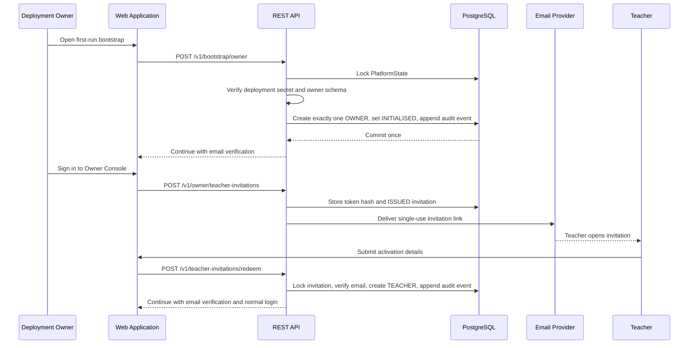

The bootstrap secret is injected by deployment secret management, is never stored in plaintext or returned to the client, and is unavailable after the first owner transaction commits. The owner console is not an exam-administration bypass: owner operations are limited to teacher onboarding and account status, while exam resources remain teacher-owned. Public self-registration creates `STUDENT` only and cannot select a privileged role.

### 11.2 Student Signup and Reference-Photo Enrolment Flow

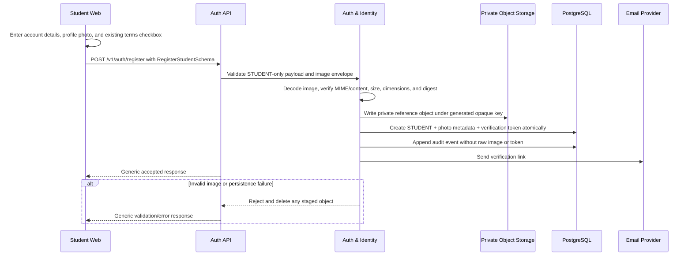

The profile photo is part of signup; there is no separate photo-consent or photo-registration screen. The existing terms-and-conditions checkbox remains the single consent control. The server accepts only the allowlisted image types and 5 MB bound, strips metadata, stores an opaque private object reference plus digest/MIME metadata, and never returns the photo object key to the Web client.

### 11.3 Exam Authoring & Approval Flow

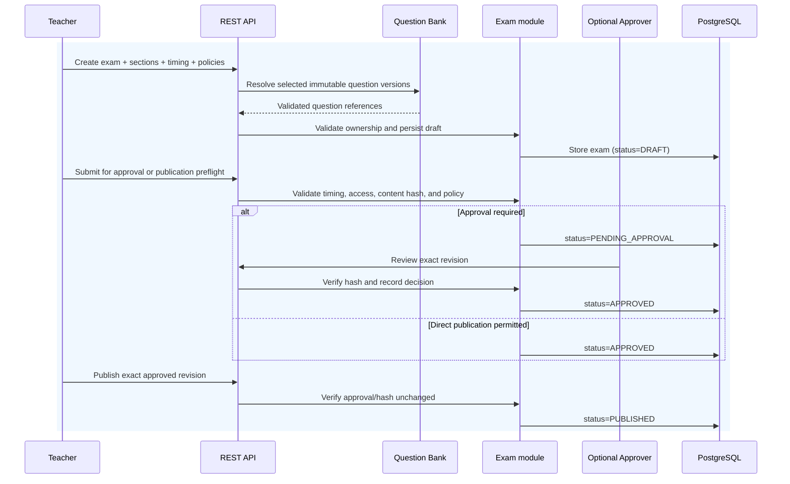

The approval/publication decision is bound to the exact exam revision. Any edit to questions, order, marks, sections, timing, access, proctoring, or grading policy invalidates the previous approval and returns the exam to draft or requires a new revision.

### 11.4 Student Exam Entry Flow

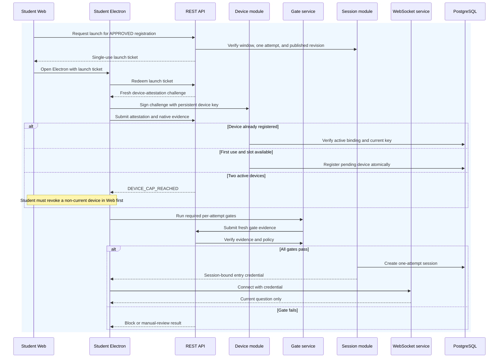

Persistent device registration answers **“is this an approved user device?”**. Per-attempt gates answer **“is this device and environment acceptable for this attempt right now?”**. They are separate controls and must not be collapsed into one registration event.

### 11.5 Live Proctoring Flow

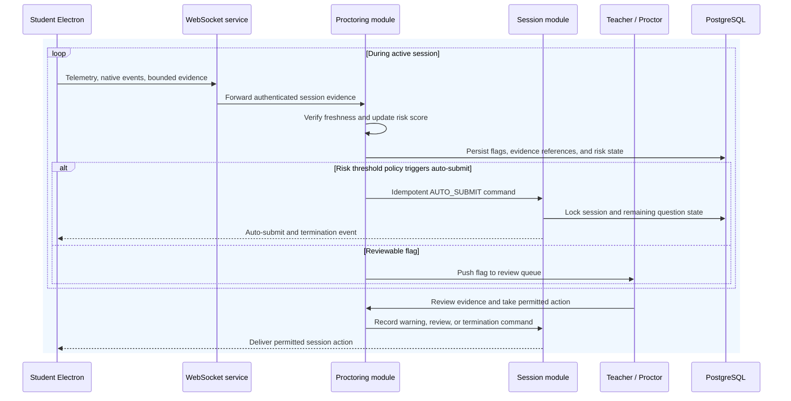

AI and automated signals produce evidence and policy actions; they do not silently change grades or create a final disciplinary judgement. Every action is auditable and human review remains available.

### 11.6 Grading Flow

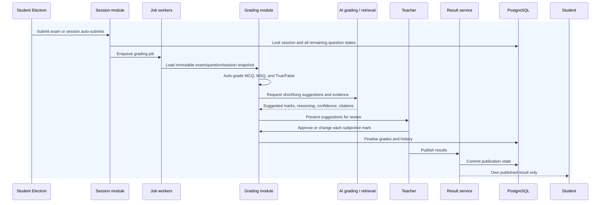

Grades are not visible as final results until objective grading is complete and every subjective answer requiring review has an explicit teacher decision. AI suggestions, evidence, and teacher changes remain in the grade history.

---

## 12. Data Model Overview

The following is a conceptual model. The LLD defines exact tables, constraints, indexes, encryption envelopes, and transaction boundaries.

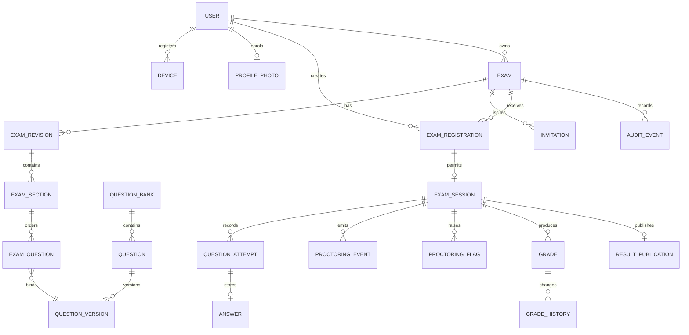

### 12.1 Key aggregate boundaries

| Aggregate | Owner | Important invariants |
| --- | --- | --- |
| `User` | Auth & Identity | Verified identity, account status, and private signup reference-photo metadata are server-derived. |
| `ProfilePhoto` | Auth & Identity | One private, metadata-stripped signup photo reference per user; raw bytes are never exposed through normal APIs. |
| `Device` | Device & Gates | At most two active devices per user; public key is bound to user; current active device cannot be revoked. |
| `QuestionBank` / `QuestionVersion` | Question Bank | Published versions are immutable and encrypted. |
| `Exam` / `ExamRevision` | Exam Authoring | Teacher ownership; approval/publication binds to exact content hash. |
| `ExamRegistration` | Discovery & Registration | Access policy, capacity, duplicate registration, and one-attempt rule are transactional. |
| `ExamSession` | Session Orchestration | Electron-bound, server-authoritative, one current sequence, durable deadlines, reconnect policy. |
| `QuestionAttempt` | Session Orchestration | Forward-only; terminal states are permanently locked. |
| `Grade` | Grading & Audit | Objective grade or teacher-approved subjective grade with append-only history. |
| `ResultPublication` | Grading & Audit | Student-visible only after explicit teacher publication. |
| `AuditEvent` | Common audit service | Append-only, hash-chained, correlated, tamper-evident. |

### 12.2 Timing policy model

```text
ExamRevision
├── paperDurationSeconds: optional positive integer
├── timingMode: WHOLE_PAPER | SECTION_TIMED | QUESTION_TIMED | MIXED
├── sections[]
│   ├── durationSeconds: optional positive integer
│   └── questions[]
│       └── timeLimitSeconds: optional positive integer
└── policy validation
```

Timing invariants:

- Every published attempt has an effective paper, section, or question deadline.
- If all sections are timed, `sum(section.durationSeconds) === paperDurationSeconds` exactly.
- A question timer is an upper bound and does not need to sum to its section duration.
- The effective deadline is the earliest applicable question, section, or paper deadline.
- Question timers cannot extend their containing section or paper.
- Timing policy is immutable within an attempt.

### 12.3 Question and session state

```text
Question outcome:
  NOT_STARTED → ACTIVE → SUBMITTED → LOCKED
                     ├── TIMED_OUT → LOCKED
                     ├── SKIPPED_BY_SECTION_TIMEOUT → LOCKED
                     └── SKIPPED_BY_PAPER_TIMEOUT → LOCKED

Session:
  PENDING → ENTRY_GATES → ACTIVE → PAUSED_RECONNECT → ACTIVE
                                  ├── SUBMITTED → GRADING → GRADED
                                  ├── AUTO_SUBMITTED → GRADING → GRADED
                                  └── TERMINATED
```

A terminal question cannot be reopened, edited, resubmitted, or revisited. On section timeout, the active question is auto-submitted and locked; unreached questions are skipped, permanently locked, and scored as blank/no response. On paper timeout, the active question is auto-submitted and locked; unreached questions are skipped and permanently locked.

---

## 13. Security Design

Security is treated as a cross-cutting architectural property rather than a bolt-on layer. The design assumes that the browser, Electron renderer, operating system, network, and local process environment may be hostile.

### 13.1 Defense in Depth — Layered View

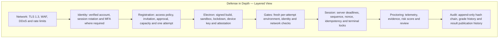

No single layer is sufficient. A proxy may modify an HTTP request, but it cannot make the server accept a different authenticated identity, active registration, device key, current sequence, or deadline.

### 13.2 Identity & Trust Model

```text
Student Web identity
  → signup terms accepted + required profile photo enrolled
  → approved ExamRegistration
  → Electron launch ticket
  → persistent device public key + fresh challenge response
  → fresh live face sample compared with private signup reference
  → per-attempt gate evidence
  → server-created ExamSession
  → session-bound entry credential
  → current-question delivery and command validation
```

The client proposes; the server authenticates, authorises, validates, persists, and audits. Client-supplied `userId`, `examId`, `deviceId`, `sessionId`, `questionId`, deadlines, scores, risk values, profile-photo object keys, and gate verdicts are never trusted as authority.

The signup profile photo is an identity reference, not an exam-time registration event. It is collected as a required field in the existing student signup form under the existing terms-and-conditions checkbox. The server validates and privately stores the canonical image; the Electron-loaded web application never receives the stored reference bytes. At each attempt, the identity gate compares fresh client evidence against that server-held reference and persists only the decision data required for policy, review, and audit.

### 13.3 Data Protection

- Question content and answer keys are encrypted at rest and never sent to the Web application for student attempts.
- Student answers and proctoring material are encrypted at rest with separated access policies.
- Signed URLs are short-lived, scoped, and never expose predictable object paths.
- Tokens are short-lived, single-use where specified, bound to context, and not logged.
- PII, biometric data, raw answer text, private keys, and credentials are excluded from ordinary logs. Signup reference photos are private objects with opaque keys, strict access policy, digest/MIME metadata, and lifecycle deletion controls; their raw bytes are never logged.
- AI grading receives only the minimum data required and stores source/citation provenance.

### 13.4 Client Trust Boundary

The Web client and Electron renderer are untrusted. Electron main-process checks are stronger native evidence but remain fallible on a user-controlled machine. The server verifies all security evidence and owns every business transition. A modified client must not be able to set its own grade, deadline, question, registration, result, or gate outcome.

### 13.5 Threat Model Summary

| Threat | Mitigation | Residual risk |
| --- | --- | --- |
| Browser calls exam API directly | Electron-bound attestation, gate, session, and entry checks | A compromised valid client may imitate some protocol behaviour. |
| Burp changes user/exam/device IDs | Derive identity from authenticated context; check relationships and ownership | Implementation bugs require security and concurrency tests. |
| Replay of launch/entry token | Short expiry, nonce, single use, user/exam/device/session binding | Token theft inside its valid window remains possible. |
| Third device registration | Atomic two-device cap; non-current revocation; reauthentication/MFA for revocation | Account compromise may disrupt legitimate devices. |
| Modified Electron binary | Signed builds, version allowlist, device keys, platform attestation where available | No universal proof on uncontrolled hardware. |
| Process-scan bypass | Multiple native layers, continuous evidence, review, and audit | OS-level compromise can evade local controls. |
| Timer manipulation | Durable server deadlines and transaction-locked transitions | Network latency needs bounded, tested handling. |
| Backtracking or answer mutation | Server sequence and immutable terminal state machine | Race bugs require concurrency testing. |
| AI grading error | Teacher approval/change; evidence and uncertainty displayed | A teacher may still accept a poor suggestion. |
| Web-source poisoning | Controlled retrieval, captured citations, policy controls, teacher finalisation | External sources can be wrong or malicious. |
| Proctoring false positive | Evidence, human review, appeal policy | Privacy, bias, and consent require governance. |
| Database compromise | Encryption, key separation, access controls | Runtime key compromise can expose active data. |
| Queue duplication | Idempotent jobs and durable transitions | Processing may still be delayed. |

---

## 14. Single-Platform Scope Design

### 14.1 Scope Principle

The v1 core models one platform with teacher-owned exams and user registrations. It deliberately does not model institutions, tenants, classes, courses, departments, academic terms, or teacher-course assignments. This keeps exam distribution explicit and avoids pretending that an academic hierarchy exists.

Platform bootstrap and teacher onboarding are identity concerns, not exam-distribution relationships. The one-time deployment secret creates only the initial owner account; the owner then issues teacher invitations through the authenticated Web application. Exam ownership begins only after a teacher account is active and verified.

### 14.2 Exam Access Policies

| Policy | Discovery | Registration | Approval | Intended use |
| --- | --- | --- | --- | --- |
| `PUBLIC` | Authenticated catalogue | User registers directly | Automatic | Open exams or low-friction assessments |
| `INVITATION_ONLY` | Not broadly discoverable | Valid invitation token | Automatic after token redemption | Selected candidate lists |
| `APPROVAL_REQUIRED` | Authenticated catalogue or direct link | User submits request | Teacher approves/rejects | High-stakes or capacity-controlled exams |

A public exam is not anonymous. The user must have a verified account, and registration still creates the authoritative relationship used for capacity, one-attempt enforcement, launch, audit, and result ownership. An invitation is scoped to the intended exam and, where required, to a candidate identity; a guessed or copied exam identifier cannot create access.

### 14.3 Distribution and Notification

- Catalogue metadata is limited to exams whose access policy permits discovery.
- Teachers can generate scoped invitation links/tokens for selected users without exposing the question content.
- The platform can notify registered, approved, and invited users through email/in-app notifications; notification delivery is not the authorisation mechanism.
- Users may discover public/approval-required exams from the authenticated catalogue and register under the exam's stated window and capacity.
- Only approved registrations can request Electron launch; publication does not grant attempt authority by itself.

### 14.4 Teacher Ownership

A teacher can view and manage only exams they own or are explicitly authorised to grade/proctor. Teacher ownership does not allow changing a live revision, reading another student's answers outside the permitted grading workflow, or publishing a result without the required grade state.

### 14.5 Future Organisation Extension

If institutions, classes, or courses are added later, they must be modelled as a separate, reviewed organisation layer over this exam-registration core. They must not be reintroduced through ad hoc columns or client-provided scope parameters.

---

## 15. Scalability & Performance Design

### 15.1 Stateless Horizontal Scaling

REST and WebSocket instances are stateless. Session affinity is not a correctness requirement. Shared coordination uses Redis, while authoritative reads and writes use PostgreSQL.

### 15.2 Exam-Window Capacity Planning

Before a scheduled exam window, operators should:

1. estimate concurrent Electron sessions and peak registration/launch traffic;
2. pre-scale API, WebSocket, Redis, and worker capacity;
3. warm database pools and required caches;
4. verify object-storage and external-provider quotas;
5. run a synthetic launch and active-session test;
6. freeze nonessential deployments during the live window.

### 15.3 Hot-Path Optimisation

- Cache safe catalogue metadata with short TTLs.
- Use indexed lookups for registration, session, sequence, and deadline checks.
- Batch telemetry ingestion while keeping security-critical events durable.
- Keep answer writes idempotent and compact.
- Use outbox events for notifications and grading jobs.
- Keep AI and web retrieval off the request path.

### 15.4 Backpressure and Abuse Controls

Rate limits are applied per IP, account, device, registration, session, and endpoint class. Telemetry and evidence have bounded payloads and quotas. Queues expose lag and dead-letter metrics. When a non-critical downstream provider is degraded, the platform retains the authoritative session path and marks the dependent work pending rather than granting or silently losing authority.

---

## 16. Reliability & Failure Handling

### 16.1 Failure Principles

- PostgreSQL commits authoritative transitions before success is reported.
- Every consequential command has an idempotency key or a replay-safe sequence check.
- Timeouts are evaluated against server time, not client clocks.
- A lost WebSocket is not an automatic extra-time grant.
- Reconnection is allowed only inside the published bounded policy.
- A failed gate does not partially open an attempt.
- A worker retry cannot duplicate a grade, publication, or termination transition.
- Audit/outbox writes are part of the required transaction boundary.

### 16.2 Reconnect Flow

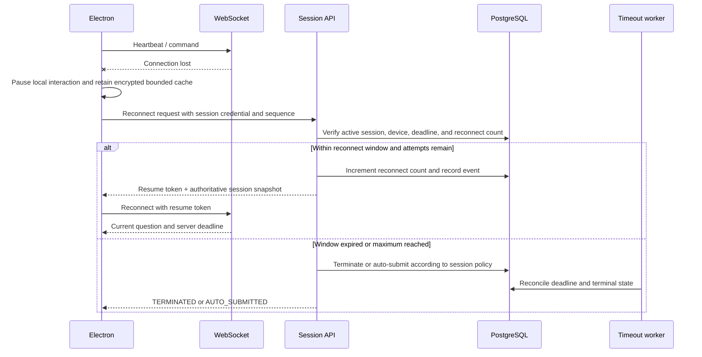

### 16.3 Reconnect Policy

The default v1 policy is a bounded reconnect window with a maximum of three reconnect attempts. The LLD must define the exact duration, whether the counter is per disconnect episode or per session, and the atomic transaction used to reserve an attempt. The server never restores time elapsed during the disconnected period unless a separately approved product policy explicitly says so.

### 16.4 Timeout Semantics

- **Whole-paper timeout:** the active question is auto-submitted and locked; all unreached questions are skipped and permanently locked; the session transitions to `AUTO_SUBMITTED`.
- **Section timeout:** the active question is auto-submitted and locked; all unreached questions in that section are skipped and permanently locked as blank/no response; the session advances to the next section. If there is no next section, the session transitions to `AUTO_SUBMITTED`.
- **Question timeout:** the active question is auto-submitted and locked; the session advances to the next question in the same section. If no question remains, the section transition rules apply.
- **Mixed timing:** the earliest applicable paper, section, or question deadline wins. The transition is performed once in a transaction and broadcast as an authoritative event.
- **Manual question submission:** submission permanently locks the question and advances the session. Backtracking is never allowed.

### 16.5 Graceful Degradation

- If AI grading is unavailable, objective grading still completes and subjective answers remain pending for teacher review.
- If web/reference retrieval is unavailable, the teacher's answer key, keywords, and provided book/source remain usable; the system must not silently treat unavailable retrieval as correct evidence.
- If proctoring analysis is delayed, evidence remains queued and the configured review/auto-submit policy is explicit; no final disciplinary conclusion is silently inferred.
- If Redis is unavailable, the system fails closed for operations requiring coordination and reconstructs from PostgreSQL where safe.
- If object storage is unavailable, evidence/upload operations fail or queue explicitly; exam answer and state transitions do not fabricate success.

---

## 17. Deployment Architecture

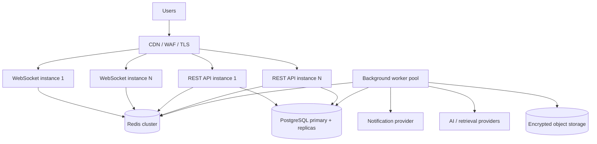

### 17.1 Deployment Principles

- API, WebSocket, and worker processes are independently scalable.
- PostgreSQL has automated backups, point-in-time recovery, replication/HA appropriate to the deployment target, and tested restoration.
- Redis is deployed with persistence/HA appropriate to its coordination role, but PostgreSQL remains authoritative.
- Object storage uses versioning, encryption, lifecycle retention, and access logging.
- Electron releases are signed, versioned, rolled out through a controlled update channel, and allowlisted by the server.
- Secrets are injected through a secret manager and never committed to source control.
- Infrastructure changes are reviewed, reproducible, and observable.

---

## 18. Observability Design

### 18.1 Three Pillars

**Logs**

- Structured JSON logs with correlation ID, actor category, resource type, session ID, device ID, and outcome.
- Never log passwords, tokens, private keys, raw biometric data, answer content, or proctoring media.

**Metrics**

- Request latency/error rate by route and status.
- Registration approval latency and capacity rejection rate.
- Electron launch, gate, attestation, and session-entry success rates.
- Active sessions, command rejection reasons, timeout/reconnect counts.
- WebSocket connections, heartbeat health, message lag, and delivery failures.
- Queue depth/lag, AI grading latency/error rate, subjective review backlog.
- Database pool saturation, lock waits, Redis health, object-storage failures.

**Traces**

- Trace request-to-command-to-database paths across REST, WebSocket, jobs, AI/retrieval, and notifications.
- Propagate correlation IDs into audit/outbox records without including sensitive payloads.

### 18.2 Alerting Philosophy

Alerts are tied to user-visible or security-relevant symptoms: unusual gate-failure spikes, launch failures, timer-worker lag, command rejection anomalies, database saturation, queue growth, evidence loss, result-publication errors, and unexpected client-version patterns. Operational alerts must not disclose student content.

---

## 19. Technology Decisions Summary

| Area | Decision | Reason |
| --- | --- | --- |
| Backend | TypeScript modular monolith | Clear boundaries with lower operational complexity at v1 scale. |
| Web | React + TypeScript | Mature ecosystem for teacher, catalogue, and result workflows. |
| Desktop | Electron with hardened main/renderer separation | Required native lockdown and cross-platform delivery. |
| Mobile companion | React Native or approved equivalent | Optional secondary-camera pairing only. |
| Database | PostgreSQL | Strong transactions, constraints, indexing, and durable audit state. |
| Cache/coordination | Redis | Fast ephemeral coordination, pub/sub, rate limits, and queue backing. |
| Queue | BullMQ or equivalent durable queue | Retryable asynchronous grading, evidence, notifications, and reconciliation. |
| Object storage | S3-compatible encrypted storage | Durable large-object handling with lifecycle controls. |
| Validation | Zod/shared contracts | Consistent boundary validation; server remains authoritative. |
| Realtime | WebSocket | Session-bound live state, timer and telemetry transport. |
| Cryptography | Application-layer envelope encryption + managed key protection | Protect sensitive exam, answer, biometric, and evidence data. |
| AI grading | Provider abstraction with evidence/provenance | Avoid lock-in and preserve teacher control. |
| Deployment | Containers/orchestrated services | Repeatable rollout and horizontal scale. |

---

## 20. Open Risks & Future Considerations

- **Electron is not a perfect security boundary.** A compromised operating system can bypass local controls; native evidence, attestation, server authority, and review reduce but cannot eliminate this risk.
- **Biometric/proctoring governance:** consent, retention, deletion, accessibility, false positives, bias, appeals, and lawful processing require explicit policy and testing.
- **AI grading governance:** the system must preserve teacher authority, evidence provenance, confidence/uncertainty, model/version records, and correction history.
- **Web research governance:** if enabled, retrieval must use an allowlist and snapshot citations at grading time; external content must never silently become answer truth.
- **Reconnect policy:** the LLD must fix the exact duration and transaction semantics before implementation.
- **High-stakes certification:** stronger identity proofing, manual review, appeals, and possibly hardware-backed attestation may be required.
- **Future organisation features:** institution/class/course support must be designed as a separate extension over registration, not smuggled into v1 core entities.
- **Operational readiness:** load testing, chaos testing, restore drills, Electron release signing, key rotation, and security review are release gates.

---

*This HLD is the architectural source of truth for the revised single-platform direction. Any material implementation deviation must be reflected here through a reviewed update. Lower-level documents must be reconciled against this HLD before implementation of security-critical flows.*

*Last updated: 2026-07-30*