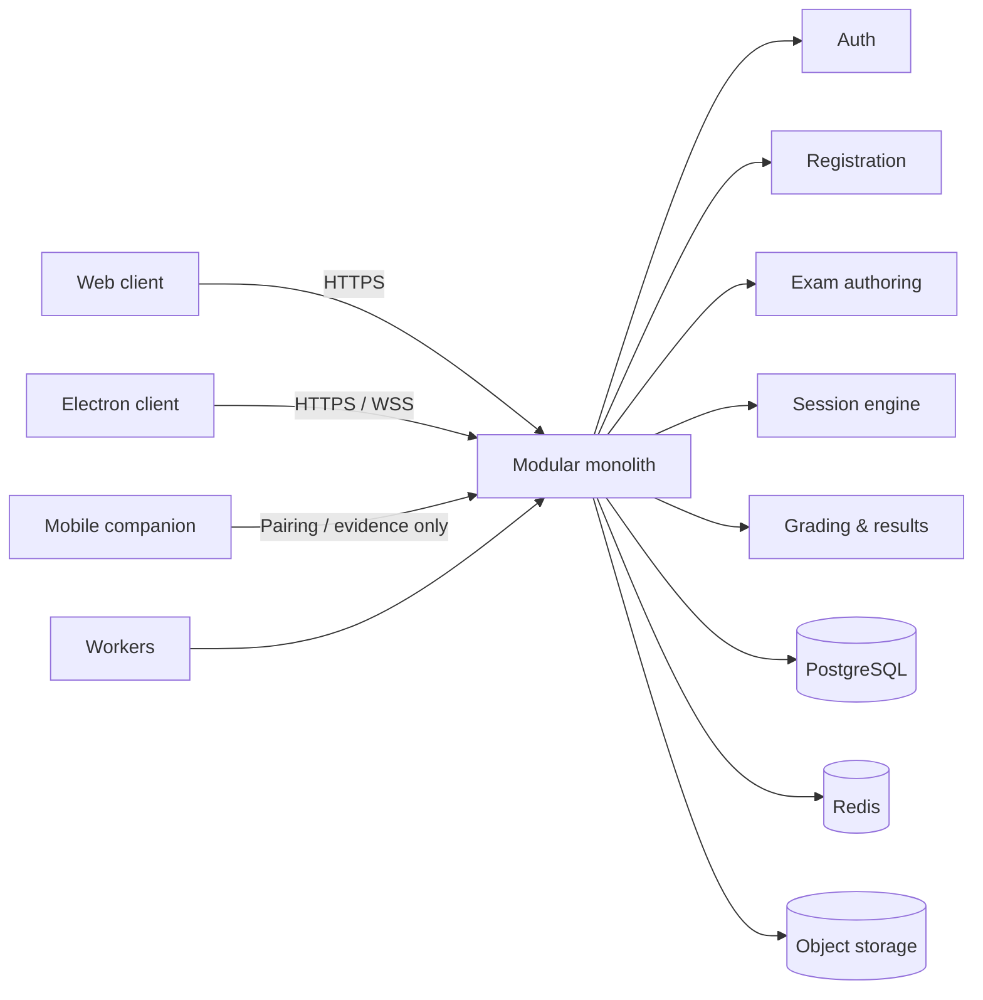
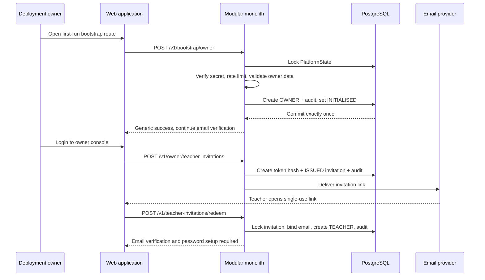
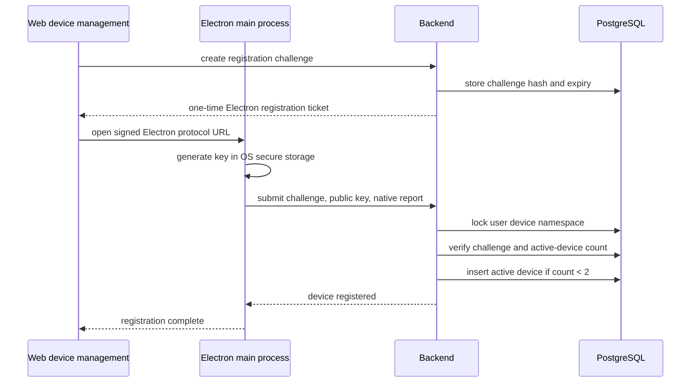
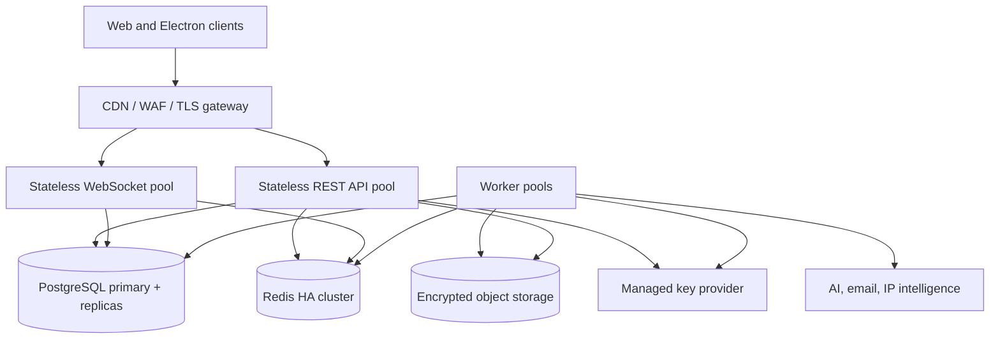

# Online Exam Platform — Low-Level Design

**Project:** `online-exam-platform`
**Document Maintainer:** M. Khubaib Asif
**Version:** 2.0
**Status:** Final implementation baseline for the single-platform, Electron-only exam engine.
**Related Documents:** `file architecture/HIGH_LEVEL_DESIGN.md`, `docs/srs/*`, `file docs/modules/MODULE_DECOMPOSITION.md`, `file docs/modules/SCREEN_INVENTORY.md`, `file docs/design/UI_GUIDELINES.md`

---

## Table of Contents

 1. [Architecture Authority and Final Decisions](#1-architecture-authority-and-final-decisions)
 2. [Modular Monolith and Dependency Boundaries](#2-modular-monolith-and-dependency-boundaries)
 3. [Shared Contracts, Types, and Validation](#3-shared-contracts-types-and-validation)
 4. [Database Schema and Transaction Boundaries](#4-database-schema-and-transaction-boundaries)
 5. [Backend Configuration and Bootstrap](#5-backend-configuration-and-bootstrap)
 6. [HTTP Middleware and Request Security](#6-http-middleware-and-request-security)
 7. [Authentication and Identity](#7-authentication-and-identity)
 8. [Question Bank](#8-question-bank)
 9. [Exam Authoring, Revision, and Timing](#9-exam-authoring-revision-and-timing)
10. [Exam Discovery and Registration](#10-exam-discovery-and-registration)
11. [Device Registration and Security Gates](#11-device-registration-and-security-gates)
12. [Session Orchestration and Timing Engine](#12-session-orchestration-and-timing-engine)
13. [WebSocket Protocol](#13-websocket-protocol)
14. [Electron Client and Lockdown](#14-electron-client-and-lockdown)
15. [Proctoring and Risk](#15-proctoring-and-risk)
16. [Grading, AI Assistance, and Results](#16-grading-ai-assistance-and-results)
17. [HTTP API Reference](#17-http-api-reference)
18. [Workers, Queues, and Outbox](#18-workers-queues-and-outbox)
19. [Encryption, Secrets, and Audit](#19-encryption-secrets-and-audit)
20. [Web Frontend](#20-web-frontend)
21. [Mobile Companion Boundary](#21-mobile-companion-boundary)
22. [Caching, Scalability, and Backpressure](#22-caching-scalability-and-backpressure)
23. [Security Controls and Threat Model](#23-security-controls-and-threat-model)
24. [Observability, Deployment, and Operations](#24-observability-deployment-and-operations)
25. [Testing and Release Gates](#25-testing-and-release-gates)
26. [Seed Data and Complete File Tree](#26-seed-data-and-complete-file-tree)

---

## 1. Architecture Authority and Final Decisions

### 1.1 Scope and authority

This document is the implementation-level authority for the single-platform exam engine. It refines `file HIGH_LEVEL_DESIGN.md` into concrete module boundaries, contracts, schemas, transactions, APIs, client boundaries, security controls, operational behaviour, and release gates.

The backend is a modular monolith. PostgreSQL is authoritative for identity, registration, device state, session state, deadlines, question locks, answers, grading, result publication, and audit history. Redis, workers, clients, and object storage support these decisions but cannot replace or override them.

Every real exam attempt runs in the signed Electron client. The web application provides discovery, registration, device management, authoring, grading, proctoring review, and result workflows; it never receives active exam question content or an exam-session credential.

### 1.2 Final decisions and invariants

| Area | Final v1 decision |
| --- | --- |
| Product scope | One platform; no institution, tenant, class, course, department, term, or academic-roster entities. |
| Exam ownership | A teacher owns and publishes an exam revision. |
| Distribution | `PUBLIC`, `INVITATION_ONLY`, or `APPROVAL_REQUIRED` registration policy. |
| Exam execution | Every real attempt runs in the signed Electron client. A browser never receives question content or an exam session credential. |
| Attempts | Exactly one registration and one attempt per user per exam. |
| Devices | At most two active registered devices per user. A third requires revoking a non-current device first. |
| Device registration | Persistent per user/device. It is not repeated for every exam. |
| Security gates | Re-run for every attempt, even on a previously registered device. |
| Navigation | Strictly forward-only. No backtracking. |
| Question submission | Permanent lock. A submitted answer cannot be edited. |
| Question timeout | Auto-submit the active question, lock it, and advance. |
| Section timeout | Lock the active question and all unreached questions in the section as blank/skipped, then advance. |
| Timing | Whole-paper, section, question, or mixed mode. If every section is timed, section durations must sum exactly to paper duration. |
| Reconnect | Timer continues. A bounded 60-second reconnect window and a maximum of three reconnect attempts per session. Expiry terminates the session. |
| Grading | MCQ, MSQ, and true/false are system-graded. Short and long answers receive AI suggestions and remain pending until teacher decision. |
| AI/web evidence | Teacher keywords, supplied references, or controlled web research may inform a suggestion; none is final authority. |
| Results | Teacher explicitly publishes results. Students see only their own published result. |
| Source of truth | PostgreSQL owns identity, registration, device state, session state, deadlines, locks, answers, grades, results, and audit records. |

### 1.3 Supersession rule

This document supersedes contradictory lower-level documents. In particular, references to `institutionId`, `classId`, `courseId`, institution login slugs, institution administrators, class-based bulk enrolment, browser-based exam attempts, configurable back-navigation, multiple attempts, fill-in-the-blank questions, and client-authoritative timing are obsolete for v1 and must not be implemented.

---

## 2. Simple Poly-App Repository and Dependency Boundaries

### 2.1 Root application structure

The platform is delivered from one repository and one coordinated application codebase. It is not a multi-repository system and it does not use package workspaces. The backend is a modular monolith; the web application and Electron shell are application surfaces within the same repository and release unit. The Electron shell does not contain a second exam frontend. It loads the approved web application URL inside a hardened native window and supplies only the native capabilities that the web surface cannot provide.

```text
online-exam-platform/
├── src/
│   ├── app.ts
│   ├── server.ts
│   ├── config/
│   ├── db/
│   ├── http/
│   ├── websocket/
│   ├── jobs/
│   ├── infrastructure/
│   ├── contracts/
│   └── modules/
│       ├── auth/
│       ├── question-bank/
│       ├── exams/
│       ├── registrations/
│       ├── devices/
│       ├── sessions/
│       ├── proctoring/
│       ├── grading/
│       ├── results/
│       ├── notifications/
│       └── audit/
├── web/
│   └── src/
│       ├── api/
│       ├── pages/
│       ├── components/
│       ├── features/
│       ├── stores/
│       ├── native-bridge/
│       └── routes.tsx
├── electron/
│   ├── main/
│   ├── preload/
│   └── types/
├── prisma/
├── scripts/
├── tests/
├── docs/
├── package.json
└── tsconfig.json
```

### 2.2 Module boundary rules

- `src/modules/<module>` owns its application services, domain rules, repositories, controllers, validators, events, and tests.
- A module may import shared primitives and infrastructure interfaces, but it must not import another module's repository or mutate another module's tables directly.
- Cross-module work uses an application service interface, an in-process command, or a durable outbox event. The caller receives a typed result and cannot bypass the callee's authorisation and transaction rules.
- Prisma models are centralised in `prisma/schema.prisma`; table ownership is enforced by code review and repository placement, not by pretending the database is a set of independent services.
- `web/` never imports backend source, Prisma, secrets, or exam-session repositories.
- `electron/` contains only the signed native shell, main-process lockdown, preload bridge, and native type declarations; it does not contain a second frontend or exam renderer application.
- `src/contracts/` is limited to serialisable DTOs and validators if a shared client contract is required; it contains no database client, environment loader, cryptographic key, or server authority.



### 2.3 Root scripts

```json
{
  "private": true,
  "scripts": {
    "dev": "tsx watch src/server.ts",
    "dev:web": "npm --prefix web run dev",
    "dev:electron": "npm --prefix electron run dev",
    "build": "tsc -p tsconfig.json && npm --prefix web run build && npm --prefix electron run build",
    "type-check": "tsc -p tsconfig.json --noEmit",
    "lint": "eslint src tests scripts",
    "test": "vitest run",
    "test:integration": "vitest run tests/integration",
    "db:migrate": "prisma migrate deploy",
    "db:generate": "prisma generate",
    "seed": "tsx scripts/seed-db.ts"
  }
}
```

The backend runtime must be started as one application process per replica. HTTP, WebSocket, and job consumers share the same module services but must still use explicit transaction boundaries. Horizontal replicas coordinate through PostgreSQL and Redis; no process-local map is authoritative.

The static web build and Electron shell are released from the same repository but remain separately startable deliverables inside the same application repository.

---

## 3. Shared Contracts, Types, and Validation

### 3.1 Contract placement

Transport DTOs that are consumed by both client applications may live in `src/contracts/` and be published as a browser-safe build artefact. They must remain free of backend imports. Server-only command handlers, database records, answer keys, grading rubrics, risk policy, and secrets remain inside the backend.

```text
src/contracts/
├── auth.ts
├── exams.ts
├── registrations.ts
├── devices.ts
├── sessions.ts
├── grading.ts
└── errors.ts
```

### 3.2 Validation rule

Zod validation proves only that a message has an allowed shape. It never proves ownership, registration, current question, device binding, deadline, or grade authority. Those checks occur inside the authoritative module service within a PostgreSQL transaction.

### 3.3 Contract design rules

Make shared schemas describe transport shape only. Server services must derive actor identity from the authenticated context and derive exam/session/question relationships from PostgreSQL. Use explicit timing-policy schemas, command IDs, sequence numbers, bounded metadata, and discriminated answer unions. Never place answer keys or grade authority in a client contract.

### 3.4 Domain constants and transport types

```typescript
// src/contracts/constants/domain.ts
export const Role = {
  TEACHER: 'TEACHER',
  STUDENT: 'STUDENT',
  PROCTOR: 'PROCTOR',
} as const;
export type Role = typeof Role[keyof typeof Role];

export const Permission = {
  CREATE_EXAM: 'exam:create',
  EDIT_OWN_EXAM: 'exam:edit-own',
  PUBLISH_OWN_EXAM: 'exam:publish-own',
  MANAGE_OWN_REGISTRATIONS: 'registration:manage-own-exam',
  TAKE_EXAM: 'exam:take',
  MANAGE_OWN_DEVICES: 'device:manage-own',
  VIEW_OWN_RESULTS: 'result:view-own',
  VIEW_OWN_EXAM_SESSIONS: 'session:view-own',
  GRADE_OWN_EXAM: 'grade:own-exam',
  REVIEW_PROCTORING: 'proctoring:review',
  TERMINATE_SESSION: 'session:terminate',
  VIEW_AUDIT: 'audit:view',
} as const;
export type Permission = typeof Permission[keyof typeof Permission];

export const AccessPolicy = {
  PUBLIC: 'PUBLIC',
  INVITATION_ONLY: 'INVITATION_ONLY',
  APPROVAL_REQUIRED: 'APPROVAL_REQUIRED',
} as const;
export type AccessPolicy = typeof AccessPolicy[keyof typeof AccessPolicy];

export const QuestionType = {
  MCQ: 'MCQ',
  MSQ: 'MSQ',
  TRUE_FALSE: 'TRUE_FALSE',
  SHORT: 'SHORT',
  LONG: 'LONG',
} as const;
export type QuestionType = typeof QuestionType[keyof typeof QuestionType];

export const TimingMode = {
  WHOLE_PAPER: 'WHOLE_PAPER',
  SECTION_TIMED: 'SECTION_TIMED',
  QUESTION_TIMED: 'QUESTION_TIMED',
  MIXED: 'MIXED',
} as const;
export type TimingMode = typeof TimingMode[keyof typeof TimingMode];

export const QuestionOutcome = {
  NOT_STARTED: 'NOT_STARTED',
  ACTIVE: 'ACTIVE',
  SUBMITTED: 'SUBMITTED',
  TIMED_OUT: 'TIMED_OUT',
  SKIPPED_BY_SECTION_TIMEOUT: 'SKIPPED_BY_SECTION_TIMEOUT',
  SKIPPED_BY_PAPER_TIMEOUT: 'SKIPPED_BY_PAPER_TIMEOUT',
  LOCKED: 'LOCKED',
} as const;
export type QuestionOutcome = typeof QuestionOutcome[keyof typeof QuestionOutcome];

export const SessionStatus = {
  PENDING: 'PENDING',
  ENTRY_GATES: 'ENTRY_GATES',
  ACTIVE: 'ACTIVE',
  PAUSED_RECONNECT: 'PAUSED_RECONNECT',
  SUBMITTED: 'SUBMITTED',
  AUTO_SUBMITTED: 'AUTO_SUBMITTED',
  TERMINATED: 'TERMINATED',
  GRADING: 'GRADING',
  GRADED: 'GRADED',
  PUBLISHED: 'PUBLISHED',
} as const;
export type SessionStatus = typeof SessionStatus[keyof typeof SessionStatus];

export const ExamStatus = {
  DRAFT: 'DRAFT',
  PUBLISHED: 'PUBLISHED',
  ACTIVE: 'ACTIVE',
  CLOSED: 'CLOSED',
  ARCHIVED: 'ARCHIVED',
} as const;
export type ExamStatus = typeof ExamStatus[keyof typeof ExamStatus];
```

```typescript
// src/contracts/types/timing.ts
export interface TimingPolicy {
  mode: TimingMode;
  paperDurationSeconds: number;
  sections: SectionTiming[];
}

export interface SectionTiming {
  sectionId: string;
  durationSeconds: number | null;
  questions: QuestionTiming[];
}

export interface QuestionTiming {
  examQuestionId: string;
  timeLimitSeconds: number | null;
}
```

Timing validation is a pure function and a server-side domain invariant:

```typescript
export function validateTimingPolicy(policy: TimingPolicy): string[] {
  const errors: string[] = [];
  const sections = policy.sections;
  if (sections.length === 0) errors.push('At least one section is required');
  if (policy.paperDurationSeconds < 60) errors.push('Paper duration must be at least 60 seconds');

  const sectionDurations = sections.map(section => section.durationSeconds);
  const allSectionsTimed = sectionDurations.every(value => value !== null);
  if (allSectionsTimed) {
    const total = sectionDurations.reduce((sum, value) => sum + (value ?? 0), 0);
    if (total !== policy.paperDurationSeconds) {
      errors.push('Timed section durations must sum exactly to paperDurationSeconds');
    }
  }
  if (policy.mode === 'WHOLE_PAPER' && allSectionsTimed) {
    errors.push('WHOLE_PAPER cannot define section timers');
  }
  if (policy.mode === 'SECTION_TIMED' && !allSectionsTimed) {
    errors.push('SECTION_TIMED requires every section to have a duration');
  }
  if (policy.mode === 'QUESTION_TIMED' && !sections.every(s => s.questions.every(q => q.timeLimitSeconds !== null))) {
    errors.push('QUESTION_TIMED requires every question to have a time limit');
  }
  for (const section of sections) {
    for (const question of section.questions) {
      if (question.timeLimitSeconds !== null && question.timeLimitSeconds < 1) {
        errors.push('Question time limits must be positive');
      }
    }
  }
  return errors;
}
```

```typescript
// src/contracts/commands.ts
export interface CommandEnvelope<T> {
  commandId: string;
  sessionId: string;
  clientSequence: number;
  issuedAtClientMs: number;
  payload: T;
}

export interface SubmitQuestionPayload {
  examQuestionId: string;
  answer: AnswerValue;
}

export type AnswerValue =
  | { kind: 'MCQ'; optionId: string }
  | { kind: 'MSQ'; optionIds: string[] }
  | { kind: 'TRUE_FALSE'; value: boolean }
  | { kind: 'SHORT'; text: string }
  | { kind: 'LONG'; text: string };
```

The server accepts only known fields. Every text field has a byte limit, every metadata object has a maximum of 20 keys and 4 KiB serialised size, and unknown fields are rejected with `z.object(...).strict()`.

---

## 4. Database Schema and Transaction Boundaries

### 4.1 Prisma schema

```prisma
generator client {
  provider = "prisma-client-js"
}

datasource db {
  provider = "postgresql"
  url      = env("DATABASE_URL")
}

enum Role { OWNER TEACHER STUDENT PROCTOR }
enum AccountStatus { ACTIVE DISABLED PENDING_EMAIL }
enum ExamStatus { DRAFT PUBLISHED ACTIVE CLOSED ARCHIVED }
enum ExamRevisionStatus { DRAFT PUBLISHED RETIRED }
enum AccessPolicy { PUBLIC INVITATION_ONLY APPROVAL_REQUIRED }
enum RegistrationStatus { REQUESTED APPROVED REJECTED CANCELLED EXPIRED }
enum DeviceStatus { ACTIVE REVOKED }
enum SessionStatus { PENDING ENTRY_GATES ACTIVE PAUSED_RECONNECT SUBMITTED AUTO_SUBMITTED TERMINATED GRADING GRADED PUBLISHED }
enum TimingMode { WHOLE_PAPER SECTION_TIMED QUESTION_TIMED MIXED }
enum QuestionType { MCQ MSQ TRUE_FALSE SHORT LONG }
enum QuestionOutcome { NOT_STARTED ACTIVE SUBMITTED TIMED_OUT SKIPPED_BY_SECTION_TIMEOUT SKIPPED_BY_PAPER_TIMEOUT LOCKED }
enum GradeState { NOT_REQUIRED PENDING_AI_REVIEW TEACHER_CONFIRMED }
enum GradeSource { SYSTEM AI_SUGGESTION TEACHER }
enum FlagType { FACE_MISSING MULTIPLE_FACES GAZE_OFF_SCREEN FORBIDDEN_PROCESS TAB_BLUR COPY_ATTEMPT SECONDARY_VOICE DEVICE_MISMATCH IP_CHANGE WINDOW_RESIZE SCREENSHOT_ATTEMPT CONTEXT_MENU FULLSCREEN_EXIT GATE_FAILURE }
enum FlagDecision { OPEN NO_ACTION WARNING_ISSUED ESCALATED TERMINATED }
enum RegistrationDecision { AUTO_APPROVED TEACHER_APPROVED TEACHER_REJECTED }
enum GateStatus { PASSED FAILED REVIEW_REQUIRED }
enum EvidenceType { FACE_FRAME SCREEN_RECORDING AUDIO_SAMPLE NATIVE_REPORT NETWORK_REPORT DOCUMENT }
enum OutboxStatus { PENDING PUBLISHED FAILED }

enum BootstrapStatus { UNINITIALISED INITIALISED }
enum InvitationStatus { ISSUED REDEEMED EXPIRED REVOKED }

model User {
  id                String        @id @default(uuid())
  email             String        @unique @db.VarChar(254)
  passwordHash      String        @db.VarChar(512)
  role              Role
  status            AccountStatus @default(PENDING_EMAIL)
  firstName         String        @db.VarChar(64)
  lastName          String        @db.VarChar(64)
  biometricRef       String?        @db.VarChar(512)
  profilePhotoRef    String?        @db.VarChar(512)
  profilePhotoSha256 String?       @db.VarChar(64)
  profilePhotoMime   String?       @db.VarChar(32)
  profilePhotoEnrolledAt DateTime?
  emailVerifiedAt   DateTime?
  lastLoginAt       DateTime?
  failedLoginCount  Int           @default(0)
  lockedUntil       DateTime?
  passwordChangedAt DateTime      @default(now())
  createdAt         DateTime      @default(now())
  updatedAt         DateTime      @updatedAt

  refreshTokens     RefreshToken[]
  devices           Device[]
  questionBanks     QuestionBank[]
  exams             Exam[]         @relation("ExamOwner")
  registrations     ExamRegistration[]
  sessions          ExamSession[]
  auditEvents       AuditEvent[]   @relation("AuditActor")
  grades            Grade[]         @relation("GradeTeacher")
  flagsReviewed     ProctoringFlag[] @relation("FlagReviewer")
  registrationDecisions ExamRegistration[] @relation("RegistrationDecider")
  teacherInvitationsIssued TeacherInvitation[] @relation("TeacherInvitationIssuer")
  teacherInvitationRedemptions TeacherInvitation[] @relation("TeacherInvitationRedeemer")
  ownerAuditEvents AuditEvent[] @relation("OwnerAuditActor")

  @@index([role, status])
}

model RefreshToken {
  id          String    @id @default(uuid())
  userId      String
  tokenHash   String    @unique @db.VarChar(64)
  familyId    String    @db.VarChar(36)
  expiresAt   DateTime
  revokedAt   DateTime?
  userAgent   String?   @db.VarChar(512)
  ipAddress   String?  @db.VarChar(45)
  createdAt   DateTime  @default(now())
  user        User      @relation(fields: [userId], references: [id], onDelete: Restrict)
  @@index([userId, expiresAt])
  @@index([familyId])
}

model Device {
  id                    String       @id @default(uuid())
  userId                String
  publicKeyJwkEncrypted String       @db.Text
  publicKeyThumbprint   String       @db.VarChar(128)
  fingerprintHash       String       @db.VarChar(64)
  platform              String       @db.VarChar(32)
  appVersion            String       @db.VarChar(32)
  label                 String?      @db.VarChar(128)
  status                DeviceStatus @default(ACTIVE)
  registeredAt          DateTime     @default(now())
  lastSeenAt            DateTime     @default(now())
  lastExamSessionId     String?      @db.VarChar(36)
  revokedAt             DateTime?
  user                  User         @relation(fields: [userId], references: [id], onDelete: Restrict)
  sessions              ExamSession[]
  gates                 SecurityGate[]
  @@unique([userId, publicKeyThumbprint])
  @@index([userId, status])
}

model QuestionBank {
  id          String     @id @default(uuid())
  ownerId     String
  name        String     @db.VarChar(256)
  description String?    @db.VarChar(2000)
  createdAt   DateTime   @default(now())
  updatedAt   DateTime   @updatedAt
  owner       User       @relation(fields: [ownerId], references: [id], onDelete: Restrict)
  questions   Question[]
  @@index([ownerId, updatedAt])
}

model Question {
  id          String          @id @default(uuid())
  bankId      String
  active      Boolean         @default(true)
  createdAt   DateTime        @default(now())
  updatedAt   DateTime        @updatedAt
  bank        QuestionBank    @relation(fields: [bankId], references: [id], onDelete: Restrict)
  versions    QuestionVersion[]
  examQuestions ExamQuestion[]
  @@index([bankId, active])
}

model QuestionVersion {
  id                    String       @id @default(uuid())
  questionId            String
  versionNumber         Int
  type                  QuestionType
  encryptedContent      String       @db.Text
  encryptedOptions      String?      @db.Text
  encryptedAnswerKey    String?      @db.Text
  encryptedRubric       String?      @db.Text
  encryptedKeywords     String?      @db.Text
  referenceSourceRefs   Json         @default("[]")
  marks                 Int
  tags                  String[]     @default([])
  contentHash           String       @db.VarChar(64)
  createdAt             DateTime     @default(now())
  question              Question     @relation(fields: [questionId], references: [id], onDelete: Restrict)
  examQuestions         ExamQuestion[]
  @@unique([questionId, versionNumber])
  @@unique([id, contentHash])
  @@index([questionId, createdAt])
}

model Exam {
  id             String      @id @default(uuid())
  ownerId        String
  title          String      @db.VarChar(256)
  description    String?     @db.VarChar(4000)
  status         ExamStatus  @default(DRAFT)
  accessPolicy   AccessPolicy
  capacity       Int?
  registrationOpensAt DateTime
  registrationClosesAt DateTime
  startsAt       DateTime
  closesAt       DateTime
  publishedAt    DateTime?
  closedAt       DateTime?
  createdAt      DateTime    @default(now())
  updatedAt      DateTime    @updatedAt
  owner          User        @relation("ExamOwner", fields: [ownerId], references: [id], onDelete: Restrict)
  revisions      ExamRevision[]
  invitations    ExamInvitation[]
  registrations  ExamRegistration[]
  sessions       ExamSession[]
  @@index([status, registrationOpensAt, registrationClosesAt])
  @@index([ownerId, status, updatedAt])
}

model ExamRevision {
  id                       String            @id @default(uuid())
  examId                   String
  revisionNumber           Int
  status                   ExamRevisionStatus @default(DRAFT)
  timingMode               TimingMode
  paperDurationSeconds     Int
  proctoringPolicy         Json
  gradingPolicy            Json
  settings                 Json
  contentHash              String            @db.VarChar(64)
  publishedAt              DateTime?
  createdAt                DateTime          @default(now())
  exam                     Exam              @relation(fields: [examId], references: [id], onDelete: Restrict)
  sections                 ExamSection[]
  registrations             ExamRegistration[]
  sessions                 ExamSession[]
  @@unique([examId, revisionNumber])
  @@index([examId, status])
}

model ExamSection {
  id              String        @id @default(uuid())
  revisionId      String
  title           String        @db.VarChar(256)
  description     String?       @db.VarChar(2000)
  orderIndex      Int
  durationSeconds Int?
  revision        ExamRevision  @relation(fields: [revisionId], references: [id], onDelete: Restrict)
  questions       ExamQuestion[]
  @@unique([revisionId, orderIndex])
}

model ExamQuestion {
  id                  String          @id @default(uuid())
  sectionId           String
  questionVersionId   String
  orderIndex          Int
  marksOverride       Int?
  timeLimitSeconds    Int?
  section             ExamSection     @relation(fields: [sectionId], references: [id], onDelete: Restrict)
  questionVersion     QuestionVersion @relation(fields: [questionVersionId], references: [id], onDelete: Restrict)
  attempts            QuestionAttempt[]
  @@unique([sectionId, orderIndex])
  @@index([questionVersionId])
}

model ExamInvitation {
  id             String    @id @default(uuid())
  examId         String
  tokenHash      String    @unique @db.VarChar(64)
  recipientEmail String?   @db.VarChar(254)
  recipientUserId String?
  expiresAt      DateTime
  maxUses        Int       @default(1)
  usedCount      Int       @default(0)
  createdAt      DateTime  @default(now())
  exam           Exam      @relation(fields: [examId], references: [id], onDelete: Restrict)
  @@index([examId, expiresAt])
}

model ExamRegistration {
  id              String               @id @default(uuid())
  examId          String
  userId          String
  revisionId      String
  status          RegistrationStatus   @default(REQUESTED)
  decision        RegistrationDecision?
  invitationId    String?
  decidedBy       String?
  requestedAt     DateTime             @default(now())
  decidedAt       DateTime?
  approvedAt      DateTime?
  rejectedAt      DateTime?
  exam            Exam                 @relation(fields: [examId], references: [id], onDelete: Restrict)
  user            User                 @relation(fields: [userId], references: [id], onDelete: Restrict)
  revision        ExamRevision         @relation(fields: [revisionId], references: [id], onDelete: Restrict)
  invitation      ExamInvitation?      @relation(fields: [invitationId], references: [id], onDelete: Restrict)
  decider         User?                @relation("RegistrationDecider", fields: [decidedBy], references: [id], onDelete: Restrict)
  session         ExamSession?
  @@unique([examId, userId])
  @@index([examId, status, requestedAt])
  @@index([userId, status, requestedAt])
}

model ExamSession {
  id                    String        @id @default(uuid())
  examId               String
  registrationId       String        @unique
  revisionId            String
  userId               String
  deviceId              String
  status                SessionStatus @default(PENDING)
  contentHashAtStart   String        @db.VarChar(64)
  shuffleSeed          String        @db.VarChar(64)
  currentQuestionIndex Int           @default(0)
  currentSectionIndex  Int           @default(0)
  paperDeadline        DateTime
  sectionDeadline      DateTime?
  questionDeadline     DateTime?
  reconnectCount       Int           @default(0)
  reconnectDeadline    DateTime?
  clientSequence       Int           @default(0)
  riskScore            Int           @default(0)
  startedAt            DateTime?
  pausedAt             DateTime?
  submittedAt          DateTime?
  terminatedAt         DateTime?
  terminalReason       String?       @db.VarChar(128)
  createdAt            DateTime      @default(now())
  updatedAt            DateTime      @updatedAt
  exam                 Exam          @relation(fields: [examId], references: [id], onDelete: Restrict)
  registration         ExamRegistration @relation(fields: [registrationId], references: [id], onDelete: Restrict)
  revision             ExamRevision  @relation(fields: [revisionId], references: [id], onDelete: Restrict)
  user                 User          @relation(fields: [userId], references: [id], onDelete: Restrict)
  device               Device        @relation(fields: [deviceId], references: [id], onDelete: Restrict)
  attempts             QuestionAttempt[]
  gates                SecurityGate[]
  events               ProctoringEvent[]
  flags                ProctoringFlag[]
  grades               Grade[]
  resultPublication    ResultPublication?
  @@index([examId, status])
  @@index([userId, status])
}

model QuestionAttempt {
  id                String          @id @default(uuid())
  sessionId         String
  examQuestionId    String
  orderIndexAtStart Int
  outcome           QuestionOutcome  @default(NOT_STARTED)
  activeAt          DateTime?
  terminalAt        DateTime?
  encryptedAnswer   String?          @db.Text
  answerHash        String?          @db.VarChar(64)
  timeSpentMs       Int              @default(0)
  attemptSequence   Int              @default(0)
  session           ExamSession     @relation(fields: [sessionId], references: [id], onDelete: Restrict)
  examQuestion      ExamQuestion    @relation(fields: [examQuestionId], references: [id], onDelete: Restrict)
  @@unique([sessionId, examQuestionId])
  @@unique([sessionId, orderIndexAtStart])
  @@index([sessionId, outcome])
}

model SecurityGate {
  id              String      @id @default(uuid())
  sessionId       String
  deviceId        String
  gateName        String      @db.VarChar(64)
  status          GateStatus
  evidenceRef     String?     @db.VarChar(512)
  evidenceHash    String?     @db.VarChar(64)
  reasonCode      String?     @db.VarChar(64)
  evaluatedAt     DateTime    @default(now())
  session         ExamSession @relation(fields: [sessionId], references: [id], onDelete: Restrict)
  device          Device      @relation(fields: [deviceId], references: [id], onDelete: Restrict)
  @@index([sessionId, gateName])
}

model ProctoringEvent {
  id          String      @id @default(uuid())
  sessionId   String
  eventId     String      @unique @db.VarChar(64)
  eventType   String      @db.VarChar(64)
  occurredAt  DateTime
  receivedAt  DateTime    @default(now())
  metadata    Json        @default("{}")
  riskDelta   Int         @default(0)
  session     ExamSession @relation(fields: [sessionId], references: [id], onDelete: Restrict)
  @@index([sessionId, occurredAt])
}

model ProctoringFlag {
  id           String          @id @default(uuid())
  sessionId    String
  flagType     FlagType
  confidence   Decimal         @db.Decimal(5,4)
  decision     FlagDecision    @default(OPEN)
  reviewedBy   String?
  reviewNote   String?         @db.VarChar(2000)
  createdAt    DateTime        @default(now())
  reviewedAt   DateTime?
  session      ExamSession     @relation(fields: [sessionId], references: [id], onDelete: Restrict)
  reviewer     User?           @relation("FlagReviewer", fields: [reviewedBy], references: [id], onDelete: Restrict)
  @@index([sessionId, decision, createdAt])
}

model Grade {
  id                String       @id @default(uuid())
  sessionId         String
  examQuestionId    String
  maxScore          Decimal      @db.Decimal(8,2)
  score             Decimal?     @db.Decimal(8,2)
  state             GradeState
  source            GradeSource?
  aiSuggestedScore  Decimal?     @db.Decimal(8,2)
  aiConfidence      Decimal?     @db.Decimal(5,4)
  encryptedReasoning String?     @db.Text
  evidenceRefs      Json         @default("[]")
  teacherId         String?
  confirmedAt      DateTime?
  createdAt         DateTime     @default(now())
  updatedAt         DateTime     @updatedAt
  session           ExamSession  @relation(fields: [sessionId], references: [id], onDelete: Restrict)
  examQuestion      ExamQuestion @relation(fields: [examQuestionId], references: [id], onDelete: Restrict)
  teacher           User?        @relation("GradeTeacher", fields: [teacherId], references: [id], onDelete: Restrict)
  history           GradeHistory[]
  @@unique([sessionId, examQuestionId])
  @@index([sessionId, state])
}

model GradeHistory {
  id              String   @id @default(uuid())
  gradeId         String
  sessionId       String
  previousScore   Decimal? @db.Decimal(8,2)
  newScore        Decimal? @db.Decimal(8,2)
  source          GradeSource
  actorId         String?
  encryptedNote   String?  @db.Text
  recordHash      String   @db.VarChar(64)
  previousHash    String?  @db.VarChar(64)
  createdAt       DateTime @default(now())
  grade           Grade    @relation(fields: [gradeId], references: [id], onDelete: Restrict)
  @@index([sessionId, createdAt])
}

model ResultPublication {
  id            String      @id @default(uuid())
  sessionId     String      @unique
  publishedBy   String
  publishedAt   DateTime    @default(now())
  resultHash    String      @db.VarChar(64)
  session       ExamSession @relation(fields: [sessionId], references: [id], onDelete: Restrict)
  publisher     User        @relation(fields: [publishedBy], references: [id], onDelete: Restrict)
}

model IdempotencyRecord {
  id             String    @id @default(uuid())
  actorId        String
  key            String    @db.VarChar(128)
  requestHash    String    @db.VarChar(64)
  responseStatus Int
  responseBody   Json
  createdAt      DateTime  @default(now())
  expiresAt      DateTime
  @@unique([actorId, key])
  @@index([expiresAt])
}

model OutboxEvent {
  id            String       @id @default(uuid())
  topic         String       @db.VarChar(128)
  aggregateType String       @db.VarChar(64)
  aggregateId   String       @db.VarChar(36)
  payload       Json
  status        OutboxStatus  @default(PENDING)
  attempts      Int          @default(0)
  availableAt   DateTime     @default(now())
  publishedAt   DateTime?
  createdAt     DateTime     @default(now())
  @@index([status, availableAt])
  @@index([aggregateType, aggregateId])
}

model AuditEvent {
  id            String    @id @default(uuid())
  actorId       String?
  action        String    @db.VarChar(128)
  resourceType  String    @db.VarChar(64)
  resourceId    String?   @db.VarChar(36)
  sessionId     String?
  deviceId      String?
  metadata      Json      @default("{}")
  ipAddress     String?   @db.VarChar(45)
  userAgent     String?   @db.VarChar(512)
  previousHash  String?   @db.VarChar(64)
  recordHash    String    @db.VarChar(64)
  createdAt     DateTime  @default(now())
  actor         User?     @relation("AuditActor", fields: [actorId], references: [id], onDelete: Restrict)
  ownerActor    User?     @relation("OwnerAuditActor", fields: [actorId], references: [id], onDelete: Restrict)
  @@index([resourceType, resourceId, createdAt])
  @@index([sessionId, createdAt])
  @@index([actorId, createdAt])
}

model PlatformState {
  id                    Int            @id @default(1)
  bootstrapStatus       BootstrapStatus @default(UNINITIALISED)
  bootstrapConsumedAt   DateTime?
  bootstrapRecordHash   String?        @db.VarChar(64)
  createdAt             DateTime       @default(now())
  updatedAt             DateTime       @updatedAt
}

model TeacherInvitation {
  id             String           @id @default(uuid())
  email          String           @db.VarChar(254)
  tokenHash      String           @unique @db.VarChar(64)
  issuedBy       String
  role           Role             @default(TEACHER)
  status         InvitationStatus @default(ISSUED)
  expiresAt      DateTime
  redeemedAt     DateTime?
  revokedAt      DateTime?
  redeemedUserId String?
  createdAt      DateTime         @default(now())
  issuer         User             @relation("TeacherInvitationIssuer", fields: [issuedBy], references: [id], onDelete: Restrict)
  redeemedUser   User?            @relation("TeacherInvitationRedeemer", fields: [redeemedUserId], references: [id], onDelete: Restrict)
  @@index([email, status, expiresAt])
  @@index([issuedBy, createdAt])
}
```

### 4.2 Bootstrap and teacher-onboarding persistence

`PlatformState` is the single-row first-run state machine. The bootstrap handler locks this row, verifies `UNINITIALISED`, verifies the deployment secret without persisting it, creates exactly one `OWNER`, writes the bootstrap audit event, changes the row to `INITIALISED`, and commits. `TeacherInvitation.tokenHash` stores only a SHA-256 token hash; the raw token is returned once to the owner delivery path and is never logged or persisted.

The existing `User` model shall use `Role { OWNER TEACHER STUDENT PROCTOR }` and add the relations `teacherInvitationsIssued`, `teacherInvitationRedemptions`, and `ownerAuditEvents` as required by the Prisma relation names above. The migration shall enforce a single owner with a PostgreSQL unique partial index over the role value `OWNER`.

### 4.3 Required database constraints and transactions

Prisma does not express every required PostgreSQL constraint. The migration must add:

```sql
CREATE UNIQUE INDEX device_one_active_slot_1
  ON "Device" ("userId")
  WHERE "status" = 'ACTIVE';

CREATE UNIQUE INDEX device_one_active_slot_2
  ON "Device" ("userId", "id")
  WHERE "status" = 'ACTIVE';
```

The two indexes above are not sufficient to express “maximum two”; the service must acquire a transaction-scoped advisory lock:

```sql
SELECT pg_advisory_xact_lock(hashtextextended($1, 0));
SELECT COUNT(*) FROM "Device" WHERE "userId" = $1 AND "status" = 'ACTIVE';
-- insert only when count < 2
```

The count and insert execute in the same serialisable transaction. The service must also check for an existing active device with the same public-key thumbprint before consuming a slot.

Authoritative transition transactions:

| Transition | Required lock and writes |
| --- | --- |
| Registration approval | Lock exam capacity row; verify window/status; update registration; write audit and outbox. |
| Device registration | Advisory-lock user device namespace; verify challenge/public key; count active devices; insert device and audit. |
| Session start | Lock registration and device; verify one-attempt/session absence; snapshot revision/hash; create attempts and deadlines. |
| Question submission | Lock session; verify active state, current sequence, deadline, and question outcome; encrypt answer; mark terminal; advance current index. |
| Timeout | Lock session; recompute deadline from durable state; apply timeout transition once; enqueue grading through outbox. |
| Result publication | Lock session; verify all required grades confirmed; create publication with deterministic result hash; write audit/outbox. |
| Audit append | Serialise per audit stream and compute hash from the committed predecessor. |

---

## 5. Backend Configuration and Bootstrap

### 5.1 Configuration Schema

```typescript
// src/config/env.ts
import { z } from 'zod';

const EnvSchema = z.object({
  NODE_ENV: z.enum(['development', 'test', 'production']),
  PORT: z.coerce.number().int().min(1024).max(65535).default(3000),
  DATABASE_URL: z.string().url(),
  DATABASE_POOL_MAX: z.coerce.number().int().min(2).max(200).default(20),
  REDIS_URL: z.string().url(),
  JWT_PRIVATE_KEY_PATH: z.string().min(1),
  JWT_PUBLIC_KEY_PATH: z.string().min(1),
  JWT_ISSUER: z.string().min(1).default('online-exam-platform'),
  JWT_AUDIENCE: z.string().min(1).default('api'),
  ACCESS_TOKEN_TTL_SECONDS: z.coerce.number().int().min(60).max(900).default(600),
  REFRESH_TOKEN_TTL_SECONDS: z.coerce.number().int().min(3600).max(2592000).default(604800),
  KEY_PROVIDER: z.enum(['KMS', 'LOCAL_DEVELOPMENT']).default('KMS'),
  QUESTION_KEY_REF: z.string().min(1),
  ANSWER_KEY_REF: z.string().min(1),
  BIOMETRIC_KEY_REF: z.string().min(1),
  EVIDENCE_KEY_REF: z.string().min(1),
  ENTRY_TICKET_KEY_REF: z.string().min(1),
  FRONTEND_URL: z.string().url(),
  ELECTRON_PROTOCOL: z.string().regex(/^[a-z][a-z0-9+.-]*$/).default('oep'),
  ELECTRON_MIN_VERSION: z.string().min(1),
  OBJECT_STORAGE_ENDPOINT: z.string().url(),
  OBJECT_STORAGE_BUCKET: z.string().min(1),
  OBJECT_STORAGE_REGION: z.string().min(1),
  OBJECT_STORAGE_ACCESS_KEY: z.string().min(1),
  OBJECT_STORAGE_SECRET_KEY: z.string().min(1),
  AI_SERVICE_URL: z.string().url(),
  AI_SERVICE_API_KEY: z.string().min(1),
  IP_INTELLIGENCE_URL: z.string().url(),
  IP_INTELLIGENCE_API_KEY: z.string().min(1),
  EMAIL_PROVIDER_API_KEY: z.string().min(1),
  EMAIL_FROM: z.string().email(),
  LOG_LEVEL: z.enum(['debug', 'info', 'warn', 'error']).default('info'),
  BOOTSTRAP_SECRET: z.string().min(32).max(256).optional(),
  BOOTSTRAP_EXPIRES_AT: z.string().datetime().optional(),
}).superRefine((value, ctx) => {
  if (value.NODE_ENV === 'production' && value.KEY_PROVIDER !== 'KMS') {
    ctx.addIssue({ code: 'custom', path: ['KEY_PROVIDER'], message: 'Production requires KMS or an approved managed key provider' });
  }
});

export const env = EnvSchema.parse(process.env);
export type Env = z.infer<typeof EnvSchema>;
```

`BOOTSTRAP_SECRET` is injected by the deployment secret manager and is readable only by the backend process. It is never exposed through health, diagnostics, logs, client bundles, or error responses. Production startup fails closed if the secret is absent while `PlatformState` is `UNINITIALISED`; after initialisation, the process may remove the secret from the runtime environment and the endpoint remains closed by database state.

Bootstrap order:

```text
load and validate environment
→ load public/private signing keys
→ initialise KMS/key provider
→ connect and verify PostgreSQL
→ verify migrations are applied
→ connect and verify Redis
→ initialise queue and outbox publishers
→ construct HTTP and WebSocket servers
→ expose readiness
→ start accepting traffic
```

Readiness must return non-ready when PostgreSQL, Redis, key provider, or required signing keys are unavailable. Liveness must only report that the process is not deadlocked. Shutdown stops new traffic, drains WebSocket commands, stops workers, closes HTTP listeners, and then closes database and Redis connections.

### 5.2 Bootstrap and teacher-onboarding transaction flows



The bootstrap endpoint is public only in the network sense and is heavily rate-limited; it is not an authenticated general-purpose account-creation endpoint. It accepts no role, permission, institution, tenant, class, course, or exam fields. A concurrent request receives a safe conflict after the first transaction commits. Teacher invitation creation requires an authenticated `OWNER` context and step-up authentication where configured. Redemption is single-use, expiry-bound, email-bound, idempotent for the same completed redemption, and rejects wrong-email, revoked, expired, or replayed tokens.

### 5.3 HTTP endpoints

| Method | Path | Auth | Idempotent | Purpose |
| --- | --- | --- | --- | --- |
| POST | `/v1/bootstrap/owner` | Bootstrap secret | Yes | Create the first owner only while platform state is `UNINITIALISED`. |
| POST | `/v1/owner/teacher-invitations` | Owner | Yes | Issue a short-lived teacher invitation. |
| POST | `/v1/teacher-invitations/redeem` | Invitation token | Yes | Redeem one invitation and begin teacher activation. |
| POST | `/v1/teacher-invitations/:id/revoke` | Owner | Yes | Revoke an unused invitation. |

---

## 6. HTTP Middleware and Request Security

### 6.1 Authentication Middleware

Middleware order:

```text
TLS/gateway
→ request ID and trace context
→ body-size parser
→ strict origin/CORS
→ security headers
→ HPP and content-type enforcement
→ coarse IP rate limit
→ authentication
→ account-status reload
→ route permission
→ schema validation
→ idempotency/replay guard
→ domain command
→ central error mapping
```

```typescript
// src/http/middleware/authenticate.ts
export interface AuthContext {
  userId: string;
  role: 'TEACHER' | 'STUDENT' | 'PROCTOR';
  tokenId: string;
  issuedAt: number;
}

export async function authenticate(req: Request, res: Response, next: NextFunction) {
  const token = readBearerToken(req.headers.authorization);
  if (!token) return next(new AppError(401, 'Unauthorised', 'AUTH_REQUIRED'));
  try {
    const claims = verifyJwt(token);
    const user = await userRepository.findActiveById(claims.sub);
    if (!user) return next(new AppError(401, 'Unauthorised', 'AUTH_INVALID'));
    req.auth = { userId: user.id, role: user.role, tokenId: claims.jti, issuedAt: claims.iat };
    return next();
  } catch {
    return next(new AppError(401, 'Unauthorised', 'AUTH_INVALID'));
  }
}
```

The access token is held in web memory only. The refresh token is a `Secure`, `HttpOnly`, `SameSite=Strict` cookie scoped to `/v1/auth/refresh`. No token is stored in localStorage, sessionStorage, URL query parameters, analytics, or ordinary logs.

Resource authorisation always uses a server-derived relationship:

```typescript
await examRepository.findOwnedByTeacher({ examId: req.params.examId, teacherId: req.auth.userId });
await registrationRepository.findApprovedForUser({ examId, userId: req.auth.userId });
await resultRepository.findPublishedForUser({ sessionId, userId: req.auth.userId });
```

A cross-user resource lookup returns the same `404 RESOURCE_NOT_FOUND` response as a nonexistent resource. Permission failures on a known action return `403 FORBIDDEN`.

---

## 7. Authentication and Identity

### 7.1 Authentication Schema

```typescript
// src/contracts/validators/auth.ts
import { z } from 'zod';

export const RegisterStudentSchema = z.object({
  email: z.string().email().max(254).toLowerCase(),
  password: z.string().min(12).max(128)
    .regex(/[A-Z]/).regex(/[a-z]/).regex(/[0-9]/).regex(/[^A-Za-z0-9]/),
  firstName: z.string().trim().min(1).max(64),
  lastName: z.string().trim().min(1).max(64),
  termsAccepted: z.literal(true),
}).strict();

export const RegisterStudentPhotoMetadataSchema = z.object({
  contentType: z.enum(['image/jpeg', 'image/png', 'image/webp']),
  byteLength: z.number().int().min(1).max(5_000_000),
}).strict();

export const LoginSchema = z.object({
  email: z.string().email().max(254).toLowerCase(),
  password: z.string().min(1).max(128),
}).strict();

export const VerifyEmailSchema = z.object({ token: z.string().min(32).max(256) }).strict();
export const PasswordResetRequestSchema = z.object({ email: z.string().email().max(254).toLowerCase() }).strict();
export const PasswordResetSchema = z.object({ token: z.string().min(32).max(256), password: RegisterStudentSchema.shape.password }).strict();

export const BootstrapOwnerSchema = z.object({
  bootstrapSecret: z.string().min(32).max(256),
  email: z.string().email().max(254).toLowerCase(),
  firstName: z.string().trim().min(1).max(64),
  lastName: z.string().trim().min(1).max(64),
  password: z.string().min(12).max(128)
    .regex(/[A-Z]/).regex(/[a-z]/).regex(/[0-9]/).regex(/[^A-Za-z0-9]/),
}).strict();

export const CreateTeacherInvitationSchema = z.object({
  email: z.string().email().max(254).toLowerCase(),
  expiresInSeconds: z.number().int().min(900).max(604800),
}).strict();

export const RedeemTeacherInvitationSchema = z.object({
  token: z.string().min(32).max(256),
  firstName: z.string().trim().min(1).max(64),
  lastName: z.string().trim().min(1).max(64),
  password: BootstrapOwnerSchema.shape.password,
}).strict();
```

Login algorithm:

```text
normalise email
→ fetch user by unique email
→ if missing, verify against a fixed dummy Argon2id hash
→ if locked, return generic failure after a bounded delay
→ verify password
→ require ACTIVE account and verified email
→ atomically reset failed count and update lastLoginAt
→ issue short access token and refresh-token family
→ audit success without password/token material
```

Access-token claims are limited to `iss`, `aud`, `sub`, `iat`, `exp`, and `jti`. Role is reloaded for privileged operations. Refresh rotation uses a database transaction and family lock. A reused, revoked, or expired token revokes every non-revoked token in that family.

Public registration always returns a generic accepted response for an already-registered email. Verification and reset tokens are random 32-byte values; only SHA-256 hashes are stored, with a short expiry and atomic get-and-delete redemption.

Student signup is one logical `POST /auth/register` operation with `multipart/form-data`: the textual fields validate with `RegisterStudentSchema`, including the existing `termsAccepted` checkbox, and the required `profilePhoto` part is parsed as a bounded file stream and validated with `RegisterStudentPhotoMetadataSchema`. The server does not trust a client MIME header or digest. It streams the part to a size-bounded quarantine file, verifies image magic bytes and decoded dimensions, rejects malformed/polyglot content, strips metadata, computes SHA-256 over canonicalised bytes, and stores the canonical image under a private opaque object key. The database stores only the object key, digest, MIME type, and enrolment timestamp. The account is committed only after the private-object write succeeds; a failed database transaction deletes the staged object. A post-commit outbox event removes an orphan if a later storage finalisation step fails. The existing terms-and-conditions checkbox is the single consent control; no separate profile-photo consent procedure is introduced.

At exam entry, the Electron-loaded web application captures a bounded live face sample through the approved client library and sends only the required evidence through the native bridge. The proctoring service retrieves the private reference object by server-derived user/session context, performs the configured reference comparison, stores only the verdict, confidence, evidence reference, model/policy version, and audit event, and never exposes the reference image to the client. A mismatch is a gate result or review signal, not a client-controlled decision.

---

## 8. Question Bank

### 8.1 Question Bank Service

```typescript
export const CreateQuestionSchema = z.object({
  bankId: z.string().uuid(),
  type: z.enum(['MCQ', 'MSQ', 'TRUE_FALSE', 'SHORT', 'LONG']),
  content: z.object({ text: z.string().min(1).max(20000), mediaRefs: z.array(z.string().uuid()).max(8) }).strict(),
  marks: z.number().int().min(1).max(1000),
  options: z.array(z.object({ optionId: z.string().uuid(), text: z.string().min(1).max(4000) }).strict()).max(10).optional(),
  correctOptionIds: z.array(z.string().uuid()).max(10).optional(),
  trueFalseAnswer: z.boolean().optional(),
  rubric: z.string().max(20000).optional(),
  keywords: z.array(z.string().trim().min(1).max(256)).max(100).optional(),
  referenceSourceRefs: z.array(z.string().uuid()).max(20).optional(),
}).strict();
```

Validation rules:

| Type | Required invariant |
| --- | --- |
| `MCQ` | 2–10 options; exactly one `correctOptionId`; all IDs exist. |
| `MSQ` | 2–10 options; at least two correct IDs; all IDs exist. |
| `TRUE_FALSE` | no options; exactly one boolean answer. |
| `SHORT` / `LONG` | no options; rubric/keywords/reference sources optional. |
| all types | `FILL_IN_THE_BLANK` is rejected; marks are positive; content is sanitised. |

The delivery DTO is:

```typescript
export interface DeliveredQuestion {
  examQuestionId: string;
  type: QuestionType;
  marks: number;
  content: { text: string; mediaUrls: string[] };
  options?: { optionId: string; text: string }[];
  serverSequence: number;
  questionDeadline: string | null;
}
```

It never contains `correctOptionIds`, `trueFalseAnswer`, rubric, keywords, reference source contents, encrypted values, or database primary keys unrelated to the attempt.

---

## 9. Exam Authoring, Revision, and Timing

### 9.1 Exam Lifecycle

Exam lifecycle:

```text
DRAFT → PUBLISHED → ACTIVE → CLOSED → ARCHIVED
```

A published exam cannot be edited in place. The teacher creates a new draft revision. Existing registrations and sessions retain their original revision; new registrations use the newly published revision only after its registration window rules allow it.

```typescript
export const CreateExamSchema = z.object({
  title: z.string().trim().min(1).max(256),
  description: z.string().trim().max(4000).optional(),
  accessPolicy: z.enum(['PUBLIC', 'INVITATION_ONLY', 'APPROVAL_REQUIRED']),
  capacity: z.number().int().min(1).max(1_000_000).nullable(),
  registrationOpensAt: z.string().datetime(),
  registrationClosesAt: z.string().datetime(),
  startsAt: z.string().datetime(),
  closesAt: z.string().datetime(),
  proctoringPolicy: z.object({
    tier: z.enum(['POST_HOC_REVIEW', 'LIVE_AI_ESCALATION', 'FULL_LIVE_HUMAN']),
    requireCamera: z.boolean(),
    requireMicrophone: z.boolean(),
    requireSingleDisplay: z.boolean(),
    forbidVirtualMachine: z.boolean(),
    forbidVirtualCamera: z.boolean(),
    autoSubmitRiskThreshold: z.number().int().min(1).max(100),
  }).strict(),
  gradingPolicy: z.object({
    allowWebResearch: z.boolean(),
    referenceMode: z.enum(['TEACHER_ONLY', 'TEACHER_OR_WEB_ALLOWLIST']),
    publishMode: z.enum(['TEACHER_EXPLICIT']),
  }).strict(),
}).strict();
```

```typescript
export const CreateRevisionSchema = z.object({
  timingMode: z.enum(['WHOLE_PAPER', 'SECTION_TIMED', 'QUESTION_TIMED', 'MIXED']),
  paperDurationSeconds: z.number().int().min(60).max(86_400),
  sections: z.array(z.object({
    sectionId: z.string().uuid().optional(),
    title: z.string().trim().min(1).max(256),
    description: z.string().trim().max(2000).optional(),
    durationSeconds: z.number().int().min(1).nullable(),
    questions: z.array(z.object({
      questionVersionId: z.string().uuid(),
      marksOverride: z.number().int().min(1).max(1000).nullable(),
      timeLimitSeconds: z.number().int().min(1).nullable(),
    }).strict()).min(1).max(10_000),
  }).strict()).min(1).max(100),
}).strict();
```

The canonical hash input is a recursively key-sorted JSON structure containing exam ID, revision number, all section IDs/order/titles/durations, all question-version IDs/content hashes, marks overrides, question limits, timing mode, paper duration, proctoring policy, grading policy, and authoring settings. Hash it with SHA-256 after UTF-8 canonicalisation. The hash is computed once on publish and recomputed before session creation.

Publication preflight rejects:

- empty sections or questions;
- unsupported question types;
- duplicate question positions;
- invalid question-version ownership;
- any timing policy error;
- `startsAt <= registrationClosesAt` unless explicitly allowed by the product schedule rule;
- `closesAt <= startsAt`;
- capacity below already-approved registrations;
- public exam without a verified owner;
- missing proctoring or grading policy;
- any question answer-key invariant failure.

---

## 10. Exam Discovery and Registration

### 10.1 Registration Policy

Policy semantics:

| Policy | Catalogue | Registration result |
| --- | --- | --- |
| `PUBLIC` | Authenticated users can see safe metadata | Immediate `APPROVED` registration. |
| `INVITATION_ONLY` | Hidden from broad catalogue; direct invitation link | Valid scoped invitation creates `APPROVED` registration. |
| `APPROVAL_REQUIRED` | Authenticated users can see safe metadata | `REQUESTED`; teacher approves or rejects. |

The catalogue never returns question content, answer keys, private invitations, teacher notes, profile-photo object keys, biometric requirements beyond safe capability labels, or another student's registration information.

Registration transaction:

```text
begin serialisable transaction
→ load exam and published revision
→ verify registration window and status
→ verify policy-specific condition
→ lock exam capacity namespace
→ reject existing (examId,userId) unless idempotent retry
→ count approved registrations
→ reject if capacity is full
→ insert registration with revisionId
→ write audit and notification outbox event
commit
```

For approval-required exams, teacher approval repeats the exam-owner and window checks and updates only `REQUESTED` rows. A rejected registration cannot be converted to approved by the student; the teacher must explicitly approve it.

---

## 11. Device Registration and Security Gates

### 11.1 Device Registration Flow

Device registration flow:



The private key never leaves Electron's main process and is never exposed to the renderer. The server verifies a signature over a nonce, user ID, public-key thumbprint, app version, platform, and challenge ID. It also verifies that the app version is allowlisted and the challenge is unused and unexpired.

Identity gate contract:

```text
load User.profilePhotoRef using the authenticated session user ID
→ retrieve the private reference object through the object-storage capability
→ compare the bounded live face sample against the enrolled signup photo
→ persist verdict, confidence, verifier version, evidence reference, and policy version
→ never return or expose reference-photo bytes to Electron, the Web surface, or ordinary API clients
```

The reference photo is created during signup, not during each exam attempt. The per-attempt identity gate performs a fresh comparison against that persistent reference. A missing reference, failed comparison, stale or invalid evidence, and verifier error follow the exam policy (`BLOCK` or `REVIEW_REQUIRED`) and never become a client-controlled pass. Raw reference and live media are encrypted, access-controlled, retained under the configured evidence lifecycle, and excluded from ordinary logs.

Device management endpoints show device label, platform, app version, registration time, last seen time, and current-use status. They do not show raw fingerprints or public keys. Revocation requires recent authentication and, for high-stakes policy, MFA. The service rejects revocation when `deviceId` is attached to any `ACTIVE` or `PAUSED_RECONNECT` session belonging to the user. A third device cannot be registered until a non-current device is revoked.

Per-attempt gates:

| Gate | Evidence | Server decision |
| --- | --- | --- |
| Registered device | Device ID plus signed nonce | Public key and active binding must match. |
| Signed build/version | App signature, version, build hash | Version must be allowlisted; invalid build blocks. |
| Native attestation | Signed OS/platform report where available | Invalid or stale report blocks or requires review. |
| Process/environment | Native report, repeated during session | VM, forbidden process, virtual camera, or unsupported display follows exam policy. |
| Camera/microphone | Permission and capture health evidence | Required capabilities must be present. |
| Identity | Fresh face/reference verification | Current identity evidence is compared server-side with the enrolled signup profile photo; mismatch blocks or requires review according to exam policy. |
| Network | Source IP and intelligence result | VPN/proxy/datacentre policy evaluated server-side. |
| Freshness | Challenge nonce and timestamps | Replay or stale evidence blocks. |

Gate results are stored under the pending session. A gate failure never creates an active session and never grants question access.

---

## 12. Session Orchestration and Timing Engine

### 12.1 Session Lifecycle

Session start:

```text
verify approved registration and no existing session
→ verify exam window and published revision hash
→ verify active registered device
→ verify all gates passed for this attempt
→ create ExamSession and QuestionAttempt rows in one transaction
→ set paper/section/question deadlines from server time
→ issue short-lived session credential
→ publish QUESTION_DELIVERED only after commit
```

Session state:

```text
PENDING → ENTRY_GATES → ACTIVE → PAUSED_RECONNECT → ACTIVE
                              ├── SUBMITTED → GRADING → GRADED → PUBLISHED
                              ├── AUTO_SUBMITTED → GRADING → GRADED → PUBLISHED
                              └── TERMINATED → GRADING → GRADED → PUBLISHED
```

Question state:

```text
NOT_STARTED → ACTIVE → SUBMITTED → LOCKED
                    ├── TIMED_OUT → LOCKED
                    ├── SKIPPED_BY_SECTION_TIMEOUT → LOCKED
                    └── SKIPPED_BY_PAPER_TIMEOUT → LOCKED
```

Forward-only command algorithm:

```typescript
async function submitQuestion(command: CommandEnvelope<SubmitQuestionPayload>, auth: AuthContext) {
  return db.$transaction(async tx => {
    const session = await lockOwnedSession(tx, command.sessionId, auth.userId);
    assertSessionActive(session);
    assertStrictlyIncreasingOrExpectedSequence(session.clientSequence, command.clientSequence);
    assertServerNowBeforeEffectiveDeadline(session);
    const attempt = await lockCurrentAttempt(tx, session);
    assert(attempt.examQuestionId === command.payload.examQuestionId);
    assert(attempt.outcome === 'ACTIVE');
    validateAnswerAgainstQuestionType(command.payload.answer, attempt);

    const encrypted = cryptoService.encryptAnswer(JSON.stringify(command.payload.answer));
    await tx.questionAttempt.update({
      where: { id: attempt.id },
      data: {
        outcome: 'SUBMITTED',
        terminalAt: new Date(),
        encryptedAnswer: encrypted,
        answerHash: sha256(encrypted),
        attemptSequence: { increment: 1 },
      },
    });
    const next = await advanceToNextQuestionOrSection(tx, session);
    await tx.examSession.update({
      where: { id: session.id },
      data: { currentQuestionIndex: next.questionIndex, currentSectionIndex: next.sectionIndex, clientSequence: command.clientSequence },
    });
    await tx.outboxEvent.create({ data: questionTransitionEvent(session, next) });
    return next;
  });
}
```

The `clientSequence` is not a clock and is not trusted as elapsed time. It is a replay/order guard. The server compares it with the expected command sequence and accepts only the current command. Duplicate command IDs return the stored idempotent response; stale commands return `STALE_SESSION_COMMAND`.

Timing rules:

1. `WHOLE_PAPER`: `paperDeadline = startedAt + paperDuration`; the active question is auto-submitted and locked at expiry; all unreached questions are permanently locked with outcome `SKIPPED_BY_PAPER_TIMEOUT`; session becomes `AUTO_SUBMITTED`.
2. `SECTION_TIMED`: every section has a duration; when a section deadline expires, the active question is locked and every unreached question in that section is locked as blank/skipped; the next section starts with its own deadline.
3. `QUESTION_TIMED`: every question has a limit; the active question expires independently and advances to the next question. The paper deadline remains a hard upper bound.
4. `MIXED`: any section and/or question deadline may apply, but the effective deadline is the earliest of paper, section, and question deadlines. A question limit may never extend a containing section or paper.
5. If all sections have timers, their durations must sum exactly to the paper duration. This is validated before publication and again before session start.
6. A question submission permanently locks that question. There is no backtracking endpoint or UI path.
7. A reconnect does not pause the paper, section, or question deadline. It only pauses command acceptance while the bounded reconnect state is evaluated.

Reconnect policy:

```text
on active socket loss:
  transactionally set PAUSED_RECONNECT and reconnectDeadline = serverNow + 60 seconds
  enqueue reconnect-expiry job

on resume:
  verify same user, same device key, same session, valid resume nonce
  lock session and increment reconnectCount
  reject if reconnectCount > 3 or serverNow > reconnectDeadline
  set ACTIVE and issue a fresh resume nonce

on reconnect expiry:
  lock session
  if still PAUSED_RECONNECT, set TERMINATED(reason=RECONNECT_WINDOW_EXPIRED)
  enqueue grading
```

A terminated session retains accepted answers and is graded as an ended attempt. It cannot resume. The product may later define a separate appeal workflow; it is not an execution-time bypass.

---

## 13. WebSocket Protocol

### 13.1 WebSocket Protocol

```text
WSS /v1/ws/exam
  handshake.auth.sessionCredential = short-lived signed credential
  handshake.auth.deviceSignature = signature over credential nonce
```

The credential contains only `sessionId`, `userId`, `deviceId`, `revisionId`, `issuedAt`, `expiresAt`, and `jti`. It is not a general API token. The server loads the session and verifies all relationships from PostgreSQL.

Inbound events:

| Event | Required fields | Server action |
| --- | --- | --- |
| `session.join` | credential, device signature | Bind one socket and emit authoritative snapshot. |
| `session.resume` | resume nonce, last server sequence | Resume only during the reconnect window. |
| `question.submit` | command envelope, current exam-question ID, answer | Transactional permanent lock and advance. |
| `exam.submit` | command ID, current sequence | Transactional manual submission. |
| `client.heartbeat` | nonce, client monotonic time | Update liveness; never update deadline. |
| `telemetry.batch` | event IDs, bounded events, server-issued telemetry nonce | Persist or queue evidence. |
| `native.evidence` | signed evidence envelope | Verify device signature and freshness. |

Outbound events:

```typescript
const ServerEvent = {
  SESSION_SNAPSHOT: 'session.snapshot',
  QUESTION_DELIVERED: 'question.delivered',
  ANSWER_ACCEPTED: 'question.accepted',
  QUESTION_LOCKED: 'question.locked',
  TIMER_SYNC: 'timer.sync',
  SECTION_CHANGED: 'section.changed',
  SESSION_PAUSED: 'session.paused',
  SESSION_RESUMED: 'session.resumed',
  AUTO_SUBMITTED: 'session.auto-submitted',
  TERMINATED: 'session.terminated',
  ERROR: 'session.error',
} as const;
```

The socket handler must reject any message whose `sessionId` is not the server-bound session, whose command ID has been used with another request hash, whose payload exceeds the event limit, or whose sequence is stale. Socket disconnect handling performs an atomic compare-and-set on a `currentConnectionNonce`; an old socket cannot pause a session after a newer socket has replaced it.

---

## 14. Electron Client and Lockdown

### 14.1 Electron shell policy

The Electron application is a hardened native shell around the deployed web application. It does not ship a separate renderer frontend. `web/` is the only UI implementation, and the Electron window loads the same HTTPS site used by the platform, with the native bridge injected only for approved device and lockdown operations.

Main-process `BrowserWindow` policy:

```typescript
new BrowserWindow({
  webPreferences: {
    preload: path.join(__dirname, 'preload.js'),
    contextIsolation: true,
    sandbox: true,
    nodeIntegration: false,
    nodeIntegrationInSubFrames: false,
    enableRemoteModule: false,
    webSecurity: true,
  },
});
```

The window loads only `EXAM_WEB_URL`, that the remote page is the shared `web/` application, that Electron supplies no local page bundle or alternate exam UI, that production rejects non-HTTPS origins, and that navigation, downloads, printing, DevTools, clipboard, context menus, protocol handlers, external URLs, and permission requests are controlled.

```typescript
// electron/preload/index.ts
contextBridge.exposeInMainWorld('examNative', {
  getDeviceSummary: (): Promise<DeviceSummary> => ipcRenderer.invoke('device:get-summary'),
  signChallenge: (challenge: string): Promise<string> => ipcRenderer.invoke('device:sign-challenge', challenge),
  collectGateEvidence: (request: GateRequest): Promise<GateEvidence> => ipcRenderer.invoke('gate:collect', request),
  lockdownStatus: (): Promise<LockdownStatus> => ipcRenderer.invoke('lockdown:status'),
  quitExam: (): Promise<void> => ipcRenderer.invoke('exam:quit-request'),
});
```

Every IPC handler validates its input with a schema, checks that an active launch/session context exists, and returns a typed result. There is no generic `execute`, `invoke`, `run-command`, filesystem, shell, or arbitrary URL bridge.

Launch flow:

```text
Web verifies approved registration
→ Web requests one-time launch ticket
→ server stores ticket hash for 60 seconds
→ Web opens oep://exam/launch?ticket=<opaque-ticket>
→ Electron validates signed build and ticket format
→ Electron redeems ticket over TLS
→ server issues device challenge
→ Electron signs with secure key
→ server runs gate policy and creates session
→ Electron receives session credential
→ Electron loads the same `EXAM_WEB_URL` in the locked window
→ WebSocket delivers first question
```

The launch ticket contains no question, answer, deadline, or authorisation decision. It is single-use, bound to the authenticated user and intended exam, and useless without the device-registration/gate exchange.

Renderer security rules:

- never store refresh tokens, device private keys, answer keys, or raw evidence;
- never derive deadlines or terminal state as authority;
- never accept question content from query parameters or local files;
- render only the latest server-authorised question;
- treat all server text as untrusted and render through a strict sanitiser;
- disable copy, paste, print, save page, screenshots where the OS permits, and external navigation according to policy;
- wipe encrypted local answer cache on terminal acknowledgement, while retaining only the bounded reconnect cache required by the published policy.

---

## 15. Proctoring and Risk

### 15.1 Telemetry and Risk Scoring

Telemetry envelope:

```typescript
interface TelemetryEventEnvelope {
  eventId: string;
  sessionId: string;
  deviceId: string;
  sequence: number;
  occurredAtClientMs: number;
  eventType: 'TAB_BLUR' | 'COPY_ATTEMPT' | 'FULLSCREEN_EXIT' | 'WINDOW_RESIZE' | 'FORBIDDEN_PROCESS' | 'FACE_MISSING' | 'MULTIPLE_FACES' | 'REFERENCE_PHOTO_MISMATCH' | 'SECONDARY_VOICE' | 'IP_CHANGE' | 'NATIVE_HEARTBEAT';
  metadata: Record<string, string | number | boolean>;
  signature: string;
}
```

The server verifies session/device binding, event signature where native, event ID uniqueness, timestamp skew bounds, sequence monotonicity, metadata limits, and rate limits. A duplicate is acknowledged without a second risk mutation.

Risk scoring is deterministic and versioned:

```text
risk = clamp(previousRisk + verifiedSignalDelta, 0, 100)
```

The delta table is stored with the exam revision or policy version. A client-reported AI result can create a reviewable signal but cannot directly set risk. When risk crosses the configured threshold, the proctoring module submits an idempotent `AUTO_SUBMIT` command to session orchestration. The session transition is the only operation allowed to terminate or auto-submit.

Human review records `decision`, reviewer ID, note, timestamp, evidence references, and policy version. A flag is never silently deleted. Evidence uses opaque object keys, encryption, signed short-lived access, access logs, consent records, and a documented retention job.

---

## 16. Grading, AI Assistance, and Results

### 16.1 Grading and Publication

Objective rules:

- MCQ: exact option ID match, otherwise zero.
- MSQ: exact set match by sorted option IDs, otherwise zero; partial credit is disabled in v1.
- TRUE/FALSE: exact boolean match.
- SHORT/LONG: no system final score; `PENDING_AI_REVIEW` until teacher confirmation.
- Unanswered/skipped/timeout answers score zero unless a future reviewed policy says otherwise.

AI grading request:

```typescript
interface AiGradingRequest {
  requestId: string;
  sessionId: string;
  examQuestionId: string;
  questionContent: string;
  studentAnswer: string;
  maxScore: number;
  keywords: string[];
  rubric: string | null;
  referenceSnapshots: { objectRef: string; sha256: string; title: string }[];
  allowWebResearch: boolean;
  modelPolicyVersion: string;
}
```

If no teacher key, keywords, or reference material exists and `allowWebResearch` is true, the retrieval worker may query an allowlisted search/retrieval provider. It must store the retrieved page URL, retrieval timestamp, content hash, quoted evidence, and provider response ID. Web content is evidence for an AI suggestion, never the final answer and never a final grade.

Teacher confirmation endpoint accepts only a score between `0` and `maxScore`, a required decision for a pending subjective grade, and an optional note with bounded length. It writes `GradeHistory` and a hash-chain audit event in the same transaction.

Result publication preconditions:

```text
session is terminal
→ objective grades exist
→ every subjective grade is TEACHER_CONFIRMED or explicitly marked not required
→ no required grading job is pending
→ teacher owns the exam
→ result hash computed from immutable revision, answers, grades, and integrity summary
→ create ResultPublication and audit event atomically
```

A student result response contains total score, maximum score, percentage, publication timestamp, allowed per-question breakdown, and integrity status according to exam policy. It never contains another student's data, answer keys, private teacher notes, raw proctoring material, AI chain-of-thought, or hidden scoring metadata.

---

## 17. HTTP API Reference

### 17.1 API Surface

All paths are under `/v1`. JSON responses use `{ data, meta? }` for success and the error envelope in §17.5. Every mutating request supports `Idempotency-Key` where marked.

#### Authentication

| Method | Path | Auth | Idempotent | Purpose |
| --- | --- | --- | --- | --- |
| POST | `/auth/register` | Public | No | Create a `STUDENT` account and enrol its required signup profile photo for future reference matching. |
| POST | `/auth/verify-email` | Public | Yes | Redeem one-time verification token. |
| POST | `/auth/login` | Public | No | Issue access token and refresh cookie. |
| POST | `/auth/refresh` | Refresh cookie | Yes | Rotate refresh family token. |
| POST | `/auth/logout` | Bearer | Yes | Revoke refresh family. |
| POST | `/auth/password-reset/request` | Public | No | Send generic reset response. |
| POST | `/auth/password-reset/redeem` | Public | Yes | Set new password with one-time token. |
| GET | `/auth/me` | Bearer | — | Return current safe profile. |

#### Teacher and question bank

| Method | Path | Auth | Purpose |
| --- | --- | --- | --- |
| GET | `/question-banks` | Teacher | List caller-owned banks. |
| POST | `/question-banks` | Teacher | Create a bank. |
| GET | `/question-banks/:bankId` | Teacher owner | Read bank metadata. |
| POST | `/question-banks/:bankId/questions` | Teacher owner | Create immutable question version. |
| POST | `/questions/:questionId/versions` | Teacher owner | Create a new version. |
| GET | `/questions/:questionId/versions` | Teacher owner | List versions. |

#### Exam and revision

| Method | Path | Auth | Idempotent | Purpose |
| --- | --- | --- | --- | --- |
| POST | `/exams` | Teacher | Yes | Create exam shell and first draft revision. |
| GET | `/exams` | Authenticated | — | Safe catalogue or caller-owned exams depending on role. |
| GET | `/exams/:examId` | Authorised | — | Safe exam detail. |
| PATCH | `/exams/:examId` | Teacher owner | Yes | Edit draft shell only. |
| POST | `/exams/:examId/revisions` | Teacher owner | Yes | Create draft revision. |
| PUT | `/exams/:examId/revisions/:revisionId` | Teacher owner | Yes | Replace draft sections/timing/policies. |
| POST | `/exams/:examId/revisions/:revisionId/publish` | Teacher owner | Yes | Validate and publish immutable revision. |
| POST | `/exams/:examId/close` | Teacher owner | Yes | Stop new registration/session entry. |
| POST | `/exams/:examId/archive` | Teacher owner | Yes | Archive closed exam without deleting records. |

#### Registration

| Method | Path | Auth | Idempotent | Purpose |
| --- | --- | --- | --- | --- |
| GET | `/catalogue/exams` | Authenticated | — | List discoverable safe metadata. |
| POST | `/exams/:examId/registrations` | Student | Yes | Public or approval-required registration. |
| POST | `/invitations/:token/redeem` | Student | Yes | Redeem invitation into registration. |
| GET | `/registrations` | Student | — | Own registration list. |
| GET | `/exams/:examId/registrations` | Teacher owner | — | Teacher roster/status list. |
| POST | `/registrations/:registrationId/approve` | Teacher owner | Yes | Approve requested registration. |
| POST | `/registrations/:registrationId/reject` | Teacher owner | Yes | Reject requested registration. |
| POST | `/exams/:examId/invitations` | Teacher owner | Yes | Issue scoped invitation. |

#### Devices and launch

| Method | Path | Auth | Idempotent | Purpose |
| --- | --- | --- | --- | --- |
| GET | `/devices` | Student | — | List own devices without secrets. |
| POST | `/devices/registration-challenges` | Student | Yes | Start explicit persistent device registration. |
| POST | `/devices/registration-completions` | Student/Electron | Yes | Verify signed challenge and register if slot available. |
| POST | `/devices/:deviceId/revoke` | Student | Yes | Revoke non-current device after reauthentication. |
| POST | `/exams/:examId/launch-tickets` | Student | Yes | Issue one-time Electron launch ticket for approved registration. |
| POST | `/launch-tickets/redeem` | Electron | Yes | Redeem ticket and receive device challenge. |
| POST | `/sessions/:sessionId/gates` | Electron | Yes | Submit signed per-attempt gate evidence. |
| POST | `/sessions/:sessionId/start` | Electron | Yes | Create active session after gates pass. |

#### Results and review

| Method | Path | Auth | Purpose |
| --- | --- | --- | --- |
| GET | `/sessions` | Student/Teacher owner | List authorised sessions. |
| GET | `/sessions/:sessionId/result` | Student owner/Teacher owner | Read authorised result state. |
| POST | `/sessions/:sessionId/grades/:gradeId/confirm` | Teacher owner | Confirm/change subjective mark. |
| POST | `/sessions/:sessionId/result/publish` | Teacher owner | Publish final result. |
| GET | `/exams/:examId/proctoring` | Teacher owner/Proctor | Review authorised flags/evidence. |
| POST | `/proctoring/flags/:flagId/decision` | Teacher owner/Proctor | Record review action. |
| GET | `/audit/events` | Authorised operator/teacher scope | Read permitted audit records. |

#### Bootstrap and teacher onboarding

| Method | Path | Auth | Idempotent | Purpose |
| --- | --- | --- | --- | --- |
| POST | `/v1/bootstrap/owner` | Bootstrap secret | Yes | First-run owner creation. |
| POST | `/v1/owner/teacher-invitations` | Owner | Yes | Create a teacher invitation. |
| POST | `/v1/teacher-invitations/redeem` | Invitation token | Yes | Redeem invitation and create teacher account. |
| POST | `/v1/teacher-invitations/:id/revoke` | Owner | Yes | Revoke an unused invitation. |

#### Error envelope

```typescript
interface ErrorResponse {
  error: {
    code: string;
    message: string;
    requestId: string;
    retryAfterSeconds?: number;
    fields?: { path: string; code: string }[];
  };
}
```

Messages are safe for the caller and never include SQL, stack traces, token material, answer keys, raw evidence, or whether a protected resource exists when the actor is unauthorised.

---

## 18. Workers, Queues, and Outbox

### 18.1 Queue Configuration

Queues:

```text
exam-timeouts
session-reconnect-expiry
objective-grading
ai-subjective-grading
proctoring-analysis
notifications
reports
outbox-publish
```

Every job includes `eventId`, `aggregateId`, `aggregateVersion`, and `attempt`. Worker pattern:

```text
load job
→ load current aggregate from PostgreSQL
→ if terminal state already satisfies job, acknowledge as skipped
→ acquire aggregate lock where required
→ apply idempotent transition
→ write audit/outbox if state changed
→ acknowledge job
```

Retry policy is exponential with jitter and a bounded maximum. Security evidence and audit publication failures go to a dead-letter queue and raise an operational alert. AI and notification failures remain pending without changing authoritative exam state.

---

## 19. Encryption, Secrets, and Audit

### 19.1 Encryption and Audit

```typescript
interface EncryptedEnvelope {
  version: 1;
  keyRef: string;
  keyVersion: string;
  algorithm: 'AES-256-GCM';
  nonceB64: string;
  tagB64: string;
  ciphertextB64: string;
  aadSha256: string;
}

interface EncryptionContext {
  domain: 'QUESTION_CONTENT' | 'ANSWER' | 'BIOMETRIC' | 'EVIDENCE' | 'AI_REASONING';
  resourceId: string;
}
```

Associated data includes domain, resource ID, and schema version. Decryption rejects mismatched associated data and authentication tags. Plaintext is held for the shortest possible scope and is never written to logs, metrics, URLs, or thrown error messages.

Audit record hash:

```text
recordHash = SHA256(
  previousHash || eventId || action || resourceType || resourceId || actorId ||
  canonicalMetadata || createdAt || schemaVersion
)
```

Append uses a PostgreSQL advisory lock keyed by the audit stream. The event row and its outbox event commit together. Audit records cannot be updated or deleted by application roles. Retention jobs may cryptographically destroy encrypted evidence according to policy but never rewrite audit history.

---

## 20. Web Frontend

### 20.1 Application structure

```text
web/src/
├── api/
├── pages/
├── components/
├── features/
│   ├── auth/
│   ├── catalogue/
│   ├── registration/
│   ├── devices/
│   ├── authoring/
│   ├── grading/
│   ├── proctoring/
│   ├── results/
│   └── exam-runtime/
├── stores/
├── native-bridge/
└── routes.tsx
```

### 20.2 Web Client Policy

The web client must not import Prisma, server repositories, secrets, answer keys, or native implementation details. Browser routes may display safe catalogue and result data, but the browser API context cannot obtain active question content, active answer commands, or an exam WebSocket credential. The launch screen requests a ticket and opens the signed protocol handoff. The `exam-runtime/` feature is the only active exam UI and is rendered only when the backend has issued an Electron-bound session credential; it is not a separate Electron frontend.

The API client uses an access token held in memory and a single-flight refresh lock. On refresh failure it clears memory and redirects to login. All rich text passes through an allowlisted renderer; AI reasoning is displayed as bounded plain text or safe markdown with external links disabled by default.

### 20.3 Electron-to-web bridge contract

```typescript
export interface ExamNativeBridge {
  getDeviceSummary(): Promise<DeviceSummary>;
  signChallenge(challenge: string): Promise<string>;
  collectGateEvidence(request: GateRequest): Promise<GateEvidence>;
  lockdownStatus(): Promise<LockdownStatus>;
  requestQuit(): Promise<void>;
}

declare global {
  interface Window {
    examNative?: ExamNativeBridge;
  }
}
```

Bridge requests are initiated by the web UI but authorised by the main process. The main process does not accept a session ID, user ID, exam ID, or policy from the renderer as authority; it loads the active launch context from its own memory and signs only the server-provided nonce. Native results are evidence, not business decisions.

### 20.4 Web surface modes

The same web application has two server-recognised presentation modes:

| Mode | Entry | Permitted surface |
| --- | --- | --- |
| `BROWSER` | Normal HTTPS navigation | Authentication, catalogue, registration, authoring, devices, grading, proctor review, results; no active exam question content. |
| `ELECTRON` | Signed shell handoff plus server-issued session credential | Entry gates, active question delivery, answer commands, timer synchronisation, telemetry, and terminal session state. |

Mode selection is not a security control. The backend derives permission from the authenticated session credential, device binding, gate records, and PostgreSQL state. A browser that forges an Electron mode value receives no exam content.

---

## 21. Mobile Companion Boundary

### 21.1 Mobile Companion Policy

Mobile is not a separate application in the v1 Simple Poly-App repository. If a future product decision requires a companion camera or evidence device, it is an external client integration and must use a separately versioned pairing contract; it must not be added as a second frontend inside the exam application without an architecture decision.

The reserved pairing flow is:

```text
Electron active session
→ authenticated request for pairing nonce
→ QR displays opaque five-minute nonce
→ external companion authenticates if required
→ server binds companion to the same session
→ companion sends bounded evidence envelopes
→ server stores evidence reference and health status
```

The pairing nonce is single-use, session-bound, device-bound, and never an exam entry credential. Companion disconnect does not pause or extend the exam. This boundary is reserved and does not create a mobile package, mobile route, or mobile runtime in v1.

---

## 22. Caching, Scalability, and Backpressure

### 22.1 Cache and Capacity Controls

Redis keys:

```text
rl:{scope}:{identity}:{window}
launch-ticket:{ticket-hash}
device-challenge:{challenge-hash}
session-presence:{session-id}
ws-connection:{session-id}
resume:{session-id}:{nonce-hash}
catalogue:{filter-hash}
```

No Redis key is the only copy of a deadline, answer, question lock, registration, grade, publication, or audit event. Cache invalidation occurs on revision publish, exam close, registration policy update, and result publication. Catalogue cache entries are safe metadata only.

Capacity controls:

- API request body limit: 256 KiB; telemetry batch: 128 events or 64 KiB; evidence upload: separate signed object-upload limit.
- One active exam WebSocket per session; one pending replacement connection during reconnect.
- Per-user, per-device, per-session, per-IP, and per-route rate limits.
- Separate worker concurrency for timeouts, objective grading, AI grading, telemetry, and notifications.
- PostgreSQL pool budget reserved for active-session commands; catalogue and reports cannot consume the reserved pool.
- Backpressure returns `429` or `503` with a retry hint; it never silently drops authoritative commands.

---

## 23. Security Controls and Threat Model

### 23.1 Threat Model

| Threat | Control | Required test |
| --- | --- | --- |
| Burp changes user/exam/device ID | Derive identity from auth/session/device key; verify relationships in transaction | Cross-user and cross-exam isolation tests. |
| Browser calls exam API | Browser receives no question/session credential; server requires Electron-bound credential and device signature | Direct browser launch and replay tests. |
| Launch ticket replay | SHA-256 hash, 60-second TTL, single-use atomic redemption, binding to user/exam | Double redemption and stolen-ticket tests. |
| Third-device race | PostgreSQL advisory lock and serialisable transaction | 20 concurrent registration requests. |
| Backtracking | Current sequence and terminal outcome under row lock | Delayed/out-of-order command tests. |
| Timer manipulation | Server deadlines and durable timeout worker | Client clock and Redis-loss tests. |
| XSS | Strict CSP, safe rich text, no arbitrary HTML/media origins | Stored and reflected XSS corpus. |
| Electron IPC pollution | Typed allowlisted handlers; no generic invocation | Fuzz every IPC channel. |
| Modified Electron | Signed build/version allowlist, device key, native evidence, server gates | Patched-client negative tests. |
| Token theft | HttpOnly refresh cookie, short access TTL, rotation/reuse revocation | Replay and CSRF tests. |
| SQL injection | Prisma parameterisation, strict schemas, no raw concatenation | Injection corpus and static scan. |
| Queue duplication | Idempotent event/job IDs and state checks | Duplicate worker delivery tests. |
| Redis loss | Reconstruct from PostgreSQL; fail closed where coordination is required | Redis outage chaos test. |
| AI prompt injection | Treat question/reference/student text as untrusted; structured provider contract; teacher confirmation | Malicious reference and answer corpus. |
| Web-source poisoning | Allowlist, snapshot, hash, citation and teacher authority | Changed-source reproducibility test. |
| False positive | Evidence and human review; no silent final penalty | Review/appeal workflow tests. |

Security-sensitive operations return generic messages and correlation IDs. Secrets, access tokens, device private keys, answer keys, raw answers, biometric data, and proctoring media never enter ordinary logs.

---

## 24. Observability, Deployment, and Operations

### 24.1 Operational Controls

Required metrics:

```text
http_requests_total{route,status}
http_request_duration_ms{route}
registration_decisions_total{policy,decision}
electron_launch_total{version,outcome}
security_gate_total{gate,outcome}
active_sessions{status}
session_command_total{command,outcome}
session_timeout_lag_ms
reconnect_total{outcome}
websocket_connections{namespace}
queue_depth{queue}
queue_lag_ms{queue}
database_pool_in_use
database_lock_wait_ms
result_publication_total{outcome}
ai_grading_latency_ms
```

Never label metrics with email, answer text, raw IP, token, biometric identifier, or full device fingerprint. Logs contain request ID, actor category, resource type/opaque ID, session ID, action, outcome, latency, and safe error code.

Deployment topology:



Operational release gates:

1. database migrations are backward-compatible and reviewed;
2. shared contract, backend, web, and Electron versions are compatible;
3. Electron package is signed and allowlisted;
4. key-provider connectivity and key versions are verified;
5. timer/reconnect worker lag is below threshold;
6. synthetic launch, gate, session, timeout, grading, and publication flows pass;
7. backup and restore evidence is current;
8. deployment freeze is applied during high-stakes exam windows unless emergency change is approved.

---

## 25. Testing and Release Gates

### 25.1 Test Matrix

Minimum test matrix:

| Category | Required cases |
| --- | --- |
| Auth | Argon2id, dummy-hash path, account lock, email verification replay, reset replay, refresh rotation/reuse, disabled account. |
| Authorisation | Teacher ownership, student own-registration/result, cross-user 404, proctor scope, role escalation. |
| Question bank | Type invariants, version immutability, answer-key exclusion, sanitisation, stable option IDs. |
| Exam revision | Canonical hash stability, policy mutation invalidation, timing modes, exact section-duration sum, publish preflight. |
| Registration | Public auto-approval, invitation scope/reuse, approval workflow, capacity race, duplicate idempotency. |
| Devices | Signature challenge, two-device cap under concurrency, same-key idempotency, current-device revocation denial. |
| Gates | Fresh nonce, stale evidence, modified build, device mismatch, policy-specific failures, no question delivery before pass. |
| Session | Single start, one attempt, forward-only, duplicate/stale commands, question lock, each timeout mode, reconnect expiry. |
| WebSocket | Credential binding, room isolation, old-socket disconnect, payload limits, worker fan-out. |
| Electron | CSP, navigation, IPC allowlist, preload exposure, no Node integration, signed update, clipboard/print/window controls. |
| Proctoring | Event deduplication, signature/freshness, risk determinism, threshold idempotency, human review. |
| Grading | Objective exact match, AI pending state, teacher override/history, web snapshot provenance, publication preconditions. |
| Reliability | PostgreSQL failover, Redis loss, queue duplication, outbox replay, worker dead letter, restore drill. |
| Security | XSS, CSRF, SSRF, SQL injection, path traversal, token leakage, prompt injection, rate-limit abuse. |
| Load | Registration burst, simultaneous launch, active-session command throughput, telemetry backpressure, database-pool isolation. |

Timing property tests must generate arbitrary valid policies and prove:

```text
accepted command never moves current index backwards
terminal question outcome never changes
accepted deadline never moves later
section timeout locks every unreached question in that section
paper timeout locks every unreached question in the paper
all-timed-section sum equals paper duration
```

A release is blocked if any security-critical test fails, if coverage falls below 80% overall or 95% for session/device/auth state-transition code, if a migration drops protected data, or if the Electron package cannot be verified as signed and allowlisted.

---

## 26. Seed Data and Complete File Tree

### 26.1 Development Seed

Development seed identities:

```text
owner@example.test    OWNER
teacher@example.test  TEACHER
student@example.test  STUDENT
proctor@example.test  PROCTOR
```

All passwords are generated from a development-only environment variable or printed only in a local seed command. The seed creates a bank with MCQ, MSQ, true/false, short, and long examples, including answer keys/rubrics only in encrypted storage. It creates an exam draft with one section and a valid whole-paper timing policy. It does not create an active device; device registration must be exercised through Electron.

Complete implementation tree:

```text
online-exam-platform/
├── src/
│   ├── app.ts
│   ├── server.ts
│   ├── config/
│   ├── db/
│   ├── http/
│   ├── websocket/
│   ├── jobs/
│   ├── infrastructure/
│   ├── contracts/
│   └── modules/
│       ├── auth/
│       ├── question-bank/
│       ├── exams/
│       ├── registrations/
│       ├── devices/
│       ├── sessions/
│       ├── proctoring/
│       ├── grading/
│       ├── results/
│       ├── notifications/
│       └── audit/
├── web/
│   └── src/
│       ├── api/
│       ├── pages/
│       ├── components/
│       ├── features/
│       ├── stores/
│       ├── native-bridge/
│       └── routes.tsx
├── electron/
│   ├── main/
│   ├── preload/
│   └── types/
├── prisma/
├── scripts/
├── tests/
├── docs/
├── package.json
└── tsconfig.json
```

---

## Final implementation gate

Before coding against this LLD, the team must verify that the repository's SRS, module documents, screen inventory, HLD, migrations, API code, and tests do not retain an active dependency on the removed tenant/class/course model. Any deviation from this LLD requires a reviewed architecture decision and an update to this document before implementation.

The implementation is complete only when the server can demonstrate, through automated tests and operational evidence, that:

```text
browser cannot obtain exam questions
∧ unregistered device cannot start an attempt
∧ third device cannot be registered without revocation
∧ gates run again for every attempt
∧ a question cannot be submitted twice or edited after lock
∧ no command can move backward or extend a deadline
∧ paper/section/question/mixed timeout semantics are deterministic
∧ objective grading is automatic and subjective grading remains teacher-controlled
∧ only the owner can publish results
∧ a student can read only their own published result
∧ every consequential transition is auditable
```

- bootstrap can create exactly one owner under concurrent requests;
- bootstrap secret never enters persistence, logs, client bundles, or normal authentication;
- only an authenticated owner can issue a teacher invitation;
- only a valid, unexpired, single-use invitation can create a teacher account;
- public registration cannot escalate to `OWNER`, `TEACHER`, or `PROCTOR`;

*Last updated: 2026-07-30.*