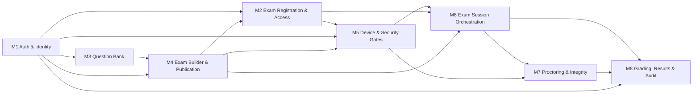

# Online Exam Platform — Module Decomposition

**Project:** `online-exam-platform`
**Document Maintainer:** M. Khubaib Asif
**Version:** 2.0
**Status:** Current module map for the single-platform, Simple Poly-App architecture
**Related Documents:** `file docs/HIGH_LEVEL_DESIGN.md`, `file docs/LOW_LEVEL_DESIGN.md`, `docs/srs/`, `file docs/modules/SCREEN_INVENTORY.md`

---

## Table of Contents

1. [Purpose and Boundary](#1-purpose-and-boundary)
2. [Module Map](#2-module-map)
3. [Module Responsibilities](#3-module-responsibilities)
4. [Dependency Order](#4-dependency-order)
5. [Traceability](#5-traceability)
6. [Shared Infrastructure and Client Surfaces](#6-shared-infrastructure-and-client-surfaces)
7. [Architecture Rules](#7-architecture-rules)

---

## 1. Purpose and Boundary

This document defines the platform's **eight implementation modules** and the dependency order in which they are designed and delivered. It answers only:

- what each module owns;
- where each module begins and ends;
- which modules it may depend on;
- which SRS requirements it covers; and
- where its detailed design is documented.

It does **not** define individual screens, screen states, component contracts, database schemas, API payloads, or detailed user flows. Those concerns belong to the documents listed in the responsibility matrix below.

The platform is a single-platform product with one Simple Poly-App repository and one coordinated application codebase. The backend is a modular monolith: modules are separated by code ownership and dependency rules, not by separately deployed services or repositories. Electron is a signed desktop shell that loads the deployed web application URL for an exam attempt; it does not contain a second exam-renderer frontend.

### 1.1 Governing architecture

The module map is subordinate to the current HLD, LLD, and SRS. A module name in this document is an organisational boundary, not permission to introduce an institution, tenant, class, course, mobile, or separate renderer domain into v1.

### 1.2 Documentation responsibility matrix

| Concern | Source of truth |
| --- | --- |
| System architecture and cross-module contracts |  |
| Implementation contracts, schemas, APIs, state machines, security controls, and test gates |  |
| Actors, user stories, functional requirements, NFRs, and traceability | `docs/srs/` |
| Complete screen list and screen-to-module allocation |  |
| Module-specific flows and component contracts | `file docs/modules/<module>/FLOW.md` and `file COMPONENTS.md` |
| Module-specific screen artefacts and open issues | `docs/modules/<module>/screens/` |
| Module ownership and dependency order | This document |

---

## 2. Module Map

| ID | Module | Primary responsibility | Detailed dossier |
| --- | --- | --- | --- |
| M1 | Auth & Identity | Account lifecycle, email verification, authentication, profile, consent, roles, and account recovery | `docs/modules/m1-auth-identity/` |
| M2 | Exam Registration & Access | Exam discovery, registration policy, invitation redemption, teacher approval, registration state, and launch eligibility | `docs/modules/m2-exam-registration-access/` |
| M3 | Question Bank | Teacher-owned question authoring, question validation, answer-key metadata, versioning, and reusable question selection | `docs/modules/m3-question-bank/` |
| M4 | Exam Builder & Publication | Exam composition, section composition, timing configuration, ordering/shuffle policy, exam revision, access-policy configuration, and teacher publication | `docs/modules/m4-exam-builder/` |
| M5 | Device & Security Gates | Persistent two-device registration, revocation, device binding, per-attempt security gates, attestation, and entry authorisation | Planned module dossier |
| M6 | Exam Session Orchestration | Electron launch authorisation, server-authoritative timer and state machine, forward-only navigation, answer persistence, question/section timeout, reconnect, and final submission | Planned module dossier |
| M7 | Proctoring & Integrity | Proctoring session, evidence and telemetry ingestion, integrity signals, risk evaluation, review states, and teacher-facing integrity evidence | Planned module dossier |
| M8 | Grading, Results & Audit | Objective grading, AI-assisted subjective grading, teacher mark decisions, result publication, student dashboard results, grade history, and audit records | Planned module dossier |

### 2.1 Module identity

The IDs are stable product identifiers. A module may contain multiple internal services, handlers, repositories, workers, and client views, but those implementation units do not become additional product modules unless this document is deliberately revised.

### 2.2 The M2 boundary

M2 replaces the obsolete Institution & Tenant Management module. It owns the relationship between a user and a teacher-owned exam. It does not own accounts, classes, courses, institutions, question content, session execution, device registration, proctoring, grading, or result publication.

The supported registration policies are:

- `PUBLIC`: an eligible authenticated user may register without teacher-by-teacher approval;
- `INVITATION_ONLY`: registration requires a valid invitation issued for that exam; and
- `APPROVAL_REQUIRED`: the user submits a registration request and the exam owner approves or rejects it.

For v1, the **teacher is the only approval authority**. No institution administrator, super administrator, class administrator, or external approver is introduced.

---

## 3. Module Responsibilities

### M1 — Auth & Identity

M1 owns the authenticated user identity used by every other module and the secure first-run onboarding path.

**Owns:**

- one-time bootstrap state and exactly-one-owner creation;
- owner console and owner-authorised teacher invitation lifecycle;
- teacher invitation activation and server-derived role assignment;
- student registration, email verification, login, logout, refresh-token rotation, and password recovery;
- user profile, required signup profile-photo enrolment, opaque photo metadata, and the existing terms-and-conditions consent state;
- role assignment and role enforcement primitives for `OWNER`, `STUDENT`, `TEACHER`, and `PROCTOR`;
- authentication-session security events; and
- the canonical user identifier consumed by exam registration, device binding, attempts, grading, results, and audit.

**Does not own:** exam eligibility, device registration, exam session state, proctoring decisions, grading, or result publication.

### M2 — Exam Registration & Access

M2 turns a discoverable teacher-owned exam into an explicit user registration. It is the sole owner of registration policy and registration state.

**Owns:**

- published-exam discovery metadata;
- registration policy evaluation;
- invitation issuance and redemption;
- registration request creation, approval, rejection, expiry, and revocation;
- teacher approval actions for `APPROVAL_REQUIRED` exams;
- the registration-to-launch eligibility contract; and
- access-control audit events for registration decisions.

**Does not own:** the exam revision itself, question contents, timers, devices, gates, attempts, grades, or results.

### M3 — Question Bank

M3 owns reusable teacher-authored questions and their answer-key or grading metadata.

**Owns:**

- question types supported by the SRS;
- question validation and draft/version lifecycle;
- objective answer keys;
- subjective keywords, reference material, rubric metadata, and optional evidence mode;
- question-bank ownership and reuse selection; and
- immutable question versions referenced by published exam revisions.

**Does not own:** exam sections, exam timing, registration, delivery order, answer submission, or final marks.

### M4 — Exam Builder & Publication

M4 composes immutable exam revisions from M3 question versions and publishes the teacher-owned exam catalogue entry used by M2.

**Owns:**

- exam metadata and lifecycle;
- section composition and question membership/order;
- timing mode and timing configuration;
- whole-paper, section, question, and mixed timing-policy validation;
- forward-only navigation and per-question submission policy configuration;
- shuffle/ordering policy;
- registration-policy selection;
- revision freezing and publication eligibility; and
- teacher publication and unpublication actions.

**Does not own:** individual registration decisions, device gates, live deadlines, answers, grading, or student result visibility.

### M5 — Device & Security Gates

M5 establishes whether a registered user/device may enter a particular attempt. Persistent device registration and per-attempt security gates are separate lifecycles.

**Owns:**

- at most two active registered devices per user;
- non-current-device revocation required before registering a third device;
- device challenge, registration, revocation, and device status;
- per-attempt identity, device, environment, lockdown, consent, and attestation gates;
- gate evidence and gate policy version; and
- the signed entry authorisation consumed by Electron.

**Does not own:** the exam timer, question navigation, answer state, proctoring risk decisions after entry, grading, or result publication.

### M6 — Exam Session Orchestration

M6 is the server-authoritative execution engine for an active attempt.

**Owns:**

- one-attempt enforcement;
- Electron launch-ticket/session exchange;
- session and question state transitions;
- whole-paper, section, question, and mixed timer execution;
- strict forward-only navigation;
- permanent question locking on submit or timeout;
- section-timeout auto-submission/locking and forward advancement;
- durable answer persistence and idempotency;
- bounded reconnect handling and termination after policy exhaustion; and
- final submission and transition to grading.

**Does not own:** account identity, registration approval, device enrolment, raw proctoring evidence policy, final subjective marks, or result publication.

### M7 — Proctoring & Integrity

M7 evaluates integrity evidence during and around an attempt without becoming the authority for timing or state transitions.

**Owns:**

- proctoring-session lifecycle;
- approved evidence and telemetry ingestion;
- event validation, deduplication, ordering, retention, and redaction;
- integrity signals and risk-score computation;
- threshold outcomes and review queues;
- teacher-facing evidence views; and
- integrity/audit linkage.

**Does not own:** identity truth, device registration, exam deadlines, answer persistence, scoring rules, or publication authority.

### M8 — Grading, Results & Audit

M8 converts submitted answers into reviewable and publishable results.

**Owns:**

- deterministic objective grading;
- AI-assisted subjective grading suggestions and evidence;
- pending teacher review state;
- teacher final mark decisions and grade history;
- result calculation and immutable result snapshots;
- teacher-controlled result publication;
- student dashboard result visibility after publication; and
- audit records for grading, overrides, publication, and access.

**Does not own:** live session timing, registration eligibility, device gates, or proctoring capture.

---

## 4. Dependency Order

The dependency graph is directional. A dependency means that the downstream module may consume a documented contract from the upstream module; it does not permit direct access to another module's tables or private implementation.

### 4.1 Delivery sequence

| Sequence | Module | Why it precedes the next layer |
| --- | --- | --- |
| 1 | M1 | Establishes the user identity and role contracts consumed everywhere. |
| 2 | M2 | Establishes who is eligible to enter a teacher-owned exam. |
| 3 | M3 | Provides immutable question versions for exam composition. |
| 4 | M4 | Produces a published, timed, immutable exam revision. |
| 5 | M5 | Establishes persistent device eligibility and per-attempt entry authorisation. |
| 6 | M6 | Runs the authoritative attempt and creates the grading input. |
| 7 | M7 | Collects and evaluates integrity evidence for the attempt. |
| 8 | M8 | Grades, reviews, publishes, and audits the final result. |

The sequence is a delivery order, not a runtime request chain. During an attempt, M6 must not synchronously depend on a slow AI, evidence-processing, or notification job.

### 4.2 Cross-cutting dependency rule

Authentication, authorisation, validation, audit, encryption, observability, queues, object storage, and database access are platform capabilities. They are shared implementation infrastructure inside the Simple Poly-App repository, not additional domain modules in this eight-module product map.

---

## 5. Traceability

This section maps requirements to their owning module at the level needed for project organisation. Detailed requirement-to-test traceability remains in `file docs/srs/05_traceability_matrix.md`.

| Module | Primary SRS coverage | Ownership note |
| --- | --- | --- |
| M1 | FR-001–FR-019; identity portions of FR-020–FR-021 | Owns bootstrap, owner onboarding, identity, role primitives, and account security. |
| M2 | FR-001–FR-004; FR-016–FR-018 | Owns discovery, access policy, invitations, registration, and teacher approval. |
| M3 | FR-005–FR-010 | Owns question-bank authoring and immutable question versions. |
| M4 | FR-019–FR-030 | Owns exam composition, publication, timing configuration, and delivery policy. |
| M5 | FR-031–FR-047 | Owns devices, gates, attestation, and entry authorisation. |
| M6 | FR-048–FR-074 | Owns attempt execution, timing, navigation, answer persistence, reconnect, and submission. |
| M7 | FR-075–FR-089 | Owns proctoring evidence, signals, risk, and integrity review. |
| M8 | FR-090–FR-116 | Owns grading, teacher review, result publication, student visibility, and audit linkage. |

Requirements that cross a boundary are implemented through contracts. For example:

- M3 supplies an immutable question-version reference to M4;
- M4 supplies an immutable published-exam revision and access policy to M2;
- M2 supplies approved registration state to M5 and M6;
- M5 supplies attempt entry authorisation to M6;
- M6 supplies a submitted-attempt snapshot to M7 and M8; and
- M7 supplies integrity findings to M8 without acquiring authority to publish marks.

The exact endpoint, DTO, schema, event, and test mapping remains in the LLD and SRS traceability matrix; it is intentionally not duplicated here.

---

## 6. Shared Infrastructure and Client Surfaces

### 6.1 Shared infrastructure

The following are platform capabilities, not additional product modules:

- PostgreSQL persistence and transaction management;
- Redis coordination, rate limiting, presence, and bounded reconnect support;
- object storage for encrypted evidence and artefacts;
- outbox and background workers;
- cryptography, key management, token signing, and secret management;
- audit, structured logging, metrics, tracing, and alerting;
- email/notification delivery; and
- AI grading-provider integration.

They may be called by modules only through approved interfaces and may not create hidden ownership of domain state.

### 6.2 Client surfaces

Client surfaces are delivery surfaces, not product modules:

- **Web application:** discovery, registration, teacher authoring, teacher approval, device management, result dashboards, and non-exam account surfaces.
- **Electron shell:** signed desktop wrapper that loads the deployed web application URL for every actual exam attempt. It supplies the native lockdown, secure bridge, device/attestation integration, and controlled session launch; it does not ship an independent exam frontend or duplicate exam state.
- **Mobile companion:** not a v1 delivery surface. Any future companion must be introduced through an approved architecture change.

### 6.3 Screen and component ownership

Screen allocation is maintained only in `file docs/modules/SCREEN_INVENTORY.md`. Detailed component and flow ownership is maintained only in each module's `file FLOW.md` and `file COMPONENTS.md`. This document records no screen catalogue and no component specifications.

---

## 7. Architecture Rules

 1. **Single repository:** all application code and module code lives in one Simple Poly-App repository.
 2. **Modular monolith:** modules communicate through typed application contracts and events; they do not import private internals or query another module's tables directly.
 3. **One web application:** the Electron shell loads the deployed web application URL; there is no separate Electron renderer frontend.
 4. **Server authority:** identity, access, timing, state transitions, answer persistence, grading state, result publication, and audit decisions are server-authoritative.
 5. **Stable module count:** the v1 product contains eight modules. Shared infrastructure and client surfaces do not increase this count.
 6. **No academic hierarchy in v1:** institution, tenant, class, course, department, roster, and institution-administrator concepts are outside this module map.
 7. **Teacher approval only:** for `APPROVAL_REQUIRED` exams, the exam owner/teacher approves or rejects registration requests.
 8. **Immutable delivery inputs:** published exam revisions and question versions cannot be modified in place after a live registration or attempt depends on them.
 9. **Security lifecycle separation:** device registration is persistent per user/device; security gates execute for every attempt.
10. **No detail duplication:** detailed screen, component, flow, schema, API, and test contracts belong in their designated source documents.

---

## 8. Change Control

A module boundary may be changed only when the corresponding HLD, LLD, SRS, and affected module dossiers remain consistent. Before implementation, a change must update:

1. this module map;
2. the SRS traceability mapping;
3. the affected module `file FLOW.md` and `file COMPONENTS.md` files; and
4. `file SCREEN_INVENTORY.md` if the change introduces or removes a screen.

A new module, client surface, or academic-hierarchy concept is an architecture change and must not be introduced through an implementation PR alone.

---

*Last updated: 2026-07-30.*