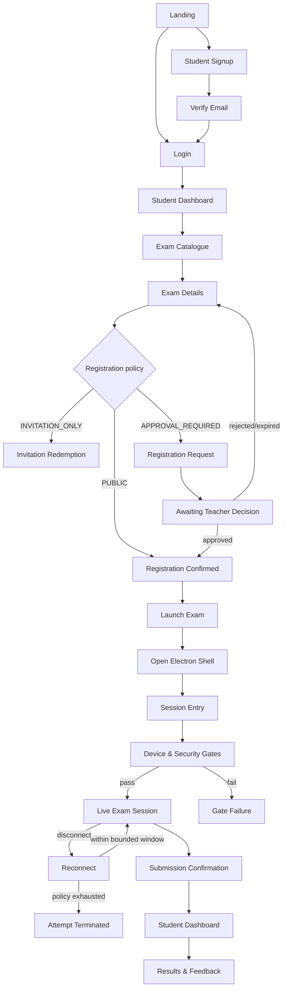
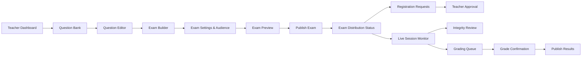
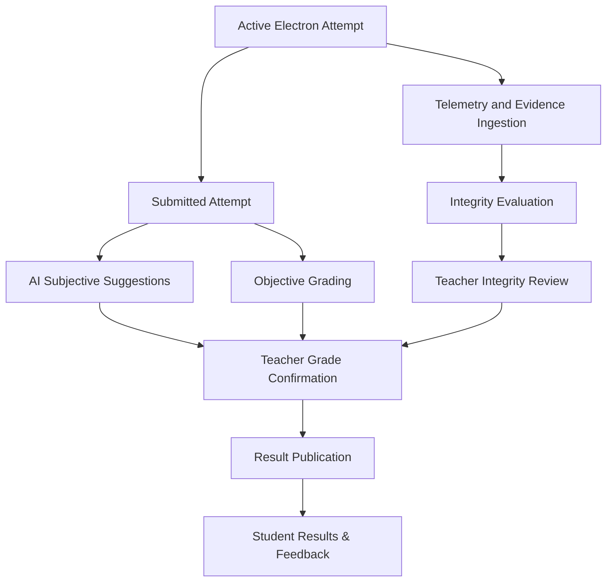

# Online Exam Platform — Screen Inventory

**Project:** `online-exam-platform`
**Document Maintainer:** M. Khubaib Asif
**Version:** 2.0
**Status:** Current screen authority for the single-platform, Simple Poly-App architecture
**Related Documents:** `file docs/HIGH_LEVEL_DESIGN.md`, `file docs/LOW_LEVEL_DESIGN.md`, `file docs/modules/MODULE_DECOMPOSITION.md`, `file docs/design/UI_GUIDELINES.md`

---

## Table of Contents

 1. [Inventory Authority and Rules](#1-inventory-authority-and-rules)
 2. [Client Surface Assignment](#2-client-surface-assignment)
 3. [Shared Application Shell](#3-shared-application-shell)
 4. [End-to-End Screen Flows](#4-end-to-end-screen-flows)
 5. [M1 — Auth & Identity](#5-m1--auth--identity)
 6. [M2 — Exam Registration & Access](#6-m2--exam-registration--access)
 7. [M3 — Question Bank](#7-m3--question-bank)
 8. [M4 — Exam Builder & Publication](#8-m4--exam-builder--publication)
 9. [M5 — Device & Security Gates](#9-m5--device--security-gates)
10. [M6 — Exam Session Orchestration](#10-m6--exam-session-orchestration)
11. [M7 — Proctoring & Integrity](#11-m7--proctoring--integrity)
12. [M8 — Grading, Results & Audit](#12-m8--grading-results--audit)
13. [Screen Closure and State Coverage](#13-screen-closure-and-state-coverage)
14. [Change Control](#14-change-control)

---

## 1. Inventory Authority and Rules

This document is the authoritative inventory of user-visible screens for v1. It answers one question: **which screens exist, which module owns them, which client surface renders them, and what navigation relationship connects them?**

It does not define component internals, detailed business logic, database schemas, API payloads, or platform infrastructure. Those remain in the designated architecture and module documents:

- Module behaviour and screen-level flow: each module's `file FLOW.md`;
- component composition and interaction contracts: each module's `file COMPONENTS.md`;
- API, schema, state-machine, security, and deployment contracts: `file docs/LOW_LEVEL_DESIGN.md`;
- system boundaries and quality attributes: `file docs/HIGH_LEVEL_DESIGN.md`; and
- requirement and acceptance traceability: `docs/srs/`.

### Inventory rules

1. Every screen has exactly one inventory ID and one owning product module.
2. A client surface is a delivery surface, not an additional product module.
3. Loading, empty, validation, permission, failure, reconnect, and success variants are states of an inventoried screen unless they require a genuinely different user task and navigation context.
4. A modal, drawer, stepper, tab, inline panel, or confirmation dialog is not a new screen unless explicitly marked as a route-level screen.
5. The inventory contains no institution, tenant, class, course, department, roster, or academic-administration screens in v1.
6. Teacher approval is the only approval workflow in v1, and only for `APPROVAL_REQUIRED` exam registration requests.
7. The inventory is closed for implementation planning: adding a screen requires the change-control procedure in §14.

---

## 2. Client Surface Assignment

The platform has one coordinated web application and one signed Electron shell. The Electron shell loads the deployed web application URL; it does not ship a separate renderer frontend and it does not contain a second exam UI.

| Surface | Purpose | Permitted screens |
| --- | --- | --- |
| **Web application** | Landing, authentication, account management, exam discovery and registration, teacher authoring, teacher approval, device management, monitoring, grading, result dashboards, and all non-exam workflows. | M1, M2, M3, M4, M7, M8, plus M5 device management and M6 post-submission states. |
| **Electron shell + loaded web application** | Actual exam attempt only. Native main-process controls enforce lockdown, secure navigation, device/attestation integration, and the controlled launch boundary. | M5 entry/gates and M6 live-attempt screens. |
| **Mobile companion** | Not a v1 surface. | None. |

### Surface security boundary

- A normal browser may authenticate, discover exams, register, manage devices, and view published results, but it cannot obtain or render exam-attempt questions.
- Electron loads only the configured `EXAM_WEB_URL` origin over HTTPS and accepts only the server-issued launch/session context.
- The loaded web application selects the Electron presentation mode from the authenticated, server-validated session context; a URL path or client flag alone never grants exam access.
- The Electron main process owns native lockdown and exposes only the minimal validated bridge required by the loaded web application. It is not an independent frontend runtime.

---

## 3. Shared Application Shell

### 3.1 Web shell

The signed-in web shell is shared by teachers, students, and proctors, with navigation derived from the authenticated role and server-authorised capabilities:

- top bar with product identity, current user menu, connection state, and logout;
- role-specific navigation; and
- responsive content area with consistent loading, empty, error, permission, and confirmation patterns.

Landing and authentication screens use the unauthenticated shell. No institution branding, tenant selector, class selector, course selector, or institution-admin navigation exists in v1.

### 3.2 Electron exam shell

The Electron exam shell is intentionally minimal:

- exam title and current section/question context;
- server-synchronised remaining-time display;
- connection and lockdown status;
- native violation/reconnect status where applicable; and
- no address bar, tabs, browser navigation, context menu, or arbitrary external navigation.

The shell does not make timing, navigation, answer persistence, submission, or security decisions. Those decisions remain server-authoritative.

---

## 4. End-to-End Screen Flows

### 4.1 Student discovery-to-result flow

### 4.2 Teacher authoring-to-publication flow

### 4.3 Proctoring and grading flow

---

## 5. M1 — Auth & Identity

**Actors:** Deployment Owner, Teacher, Student, Proctor.
**Surface:** Web application.
**Module dossier:** `docs/modules/m1-auth-identity/`.

M1 owns identity, authentication, and secure initial onboarding screens. Device management is displayed from the shared account area but its domain ownership remains M5.

| ID | Screen | Purpose | Primary owner/contract |
| --- | --- | --- | --- |
| M1-S01 | First-Run Bootstrap | Create exactly one owner account using the deployment-provided one-time bootstrap secret before the platform is initialised. Never shown after initialisation. | M1 / bootstrap contract |
| M1-S02 | Owner Console | Authenticated owner workspace for teacher invitations, invitation status, teacher access disable/revoke, and owner-security status. | M1 / owner-onboarding contract |
| M1-S03 | Teacher Invitation Activation | Activate a single-use owner-issued invitation, verify the matching email, and set the normal teacher password. | M1 / teacher-invitation contract |
| M1-S04 | Landing | Unauthenticated entry point for login and student registration. | M1 / `AuthService` |
| M1-S05 | Login | Authenticate an existing user and route by server-authorised role. | M1 / `AuthService.login` |
| M1-S06 | Student Signup | Public self-registration for `STUDENT` only, including required profile-photo capture under the existing terms-and-conditions checkbox. | M1 / `AuthService.register` + `RegisterStudentPhotoSchema` |
| M1-S07 | Verify Email | Complete or resend email verification without account-existence leakage. | M1 / verification-token contract |
| M1-S08 | Forgot Password | Request password recovery using an enumeration-safe response. | M1 / password-reset contract |
| M1-S09 | Check Your Email | Confirm recovery-email dispatch without revealing account existence. | M1 / password-reset contract |
| M1-S10 | Reset Password | Set a new password from a short-lived, single-use token. | M1 / password-reset contract |
| M1-S11 | Student Dashboard | Student home for registered exams, catalogue access, active registration state, and published results. | M1 shell; M2/M8 data |
| M1-S12 | Teacher Dashboard | Teacher home for owned exams, requests, monitoring, grading, and publication work. | M1 shell; M4/M7/M8 data |
| M1-S13 | Proctor Dashboard | Proctor-facing entry point only if the v1 proctor role is enabled by policy. | M1 shell; M7 data |
| M1-S14 | My Profile / Account Settings | View permitted profile fields and enrolled-photo status; profile-photo bytes and object keys are never exposed to the client. | M1 / profile contract |
| M1-S15 | My Devices | View active registered devices and revoke a non-current device. | M5 / device-management contract |

**Navigation:** `First-Run Bootstrap → Owner Console → Teacher Invitation Activation` is the deployment-owner onboarding path. The normal path is `Landing → Login/Student Signup → Verify Email → role dashboard`. Recovery is `Login → Forgot Password → Check Your Email → Reset Password → Login`. Profile and device management are reached from the signed-in user menu.

---

## 6. M2 — Exam Registration & Access

**Actors:** Student, Teacher.
**Surface:** Web application.
**Module dossier:** `docs/modules/m2-exam-registration-access/`.

M2 contains exam discovery and registration screens. It does not contain classes, courses, institutions, tenant administration, question authoring, or live attempt screens.

| ID | Screen | Purpose | Primary owner/contract |
| --- | --- | --- | --- |
| M2-S01 | Exam Catalogue | List published teacher-owned exams visible to the authenticated user, with bounded filters and registration-state labels. | M2 / discovery contract |
| M2-S02 | Exam Details | Show public metadata, schedule, access policy, eligibility result, registration window, and required action. Do not expose question content or answer keys. | M2 / eligibility contract |
| M2-S03 | Invitation Redemption | Redeem a valid invitation bound to the authenticated user and exam. | M2 / invitation contract |
| M2-S04 | Registration Request | Submit a request for an `APPROVAL_REQUIRED` exam. | M2 / registration contract |
| M2-S05 | Registration Status | Show pending, approved, rejected, expired, revoked, or closed registration state. | M2 / registration contract |
| M2-S06 | Teacher Registration Requests | Teacher-owned queue of pending requests for the teacher's exams. | M2 / teacher-approval contract |
| M2-S07 | Teacher Registration Review | Teacher approves or rejects one request with an auditable decision. | M2 / teacher-approval contract |
| M2-S08 | Exam Distribution Status | Teacher view of registration counts, invitations, policy state, and registration-window status. | M2 / distribution contract |

**Registration policies:** `PUBLIC` permits eligible authenticated users to register; `INVITATION_ONLY` requires a valid invitation; `APPROVAL_REQUIRED` creates a pending request and routes it only to the exam owner/teacher. No client-supplied institution, class, course, or role value participates in eligibility.

**Navigation:** `Student Dashboard → Exam Catalogue → Exam Details → registration action → Registration Status`. For approval-required access: `Teacher Dashboard → Teacher Registration Requests → Teacher Registration Review → Exam Distribution Status`.

---

## 7. M3 — Question Bank

**Actors:** Teacher.
**Surface:** Web application.
**Module dossier:** `docs/modules/m3-question-bank/`.

| ID | Screen | Purpose | Primary owner/contract |
| --- | --- | --- | --- |
| M3-S01 | Question Bank List | Search, filter, sort, archive, and select owned questions. | M3 / question-bank list contract |
| M3-S02 | Question Editor | Create or edit a draft question and its type-specific answer/grading metadata. Fill-in-the-blank is not a v1 question type. | M3 / question command contract |
| M3-S03 | Question Preview | Preview student-visible wording and options without exposing answer keys in student delivery. | M3 / delivery projection |
| M3-S04 | Question Import & Validation | Import supported question data and display bounded validation results. | M3 / import contract |
| M3-S05 | Question Organisation | Manage tags, archive state, and ownership-scoped filters. | M3 / organisation contract |
| M3-S06 | Question Usage & Version History | Show immutable versions and where a question version is referenced. | M3 / version contract |

**Navigation:** `Teacher Dashboard → Question Bank List → Question Editor/Preview/Organisation/Version History`. M4 may open the M3 selector as an embedded route or controlled panel; that reuse does not create a new screen ID.

---

## 8. M4 — Exam Builder & Publication

**Actors:** Teacher.
**Surface:** Web application.
**Module dossier:** `docs/modules/m4-exam-builder/`.

| ID | Screen | Purpose | Primary owner/contract |
| --- | --- | --- | --- |
| M4-S01 | Exam List | List teacher-owned exams and lifecycle states. | M4 / exam query contract |
| M4-S02 | Exam Builder | Compose sections and immutable question-version references. | M4 / exam authoring contract |
| M4-S03 | Exam Settings & Audience | Configure timing mode, section/question durations, navigation policy, registration policy, schedule, proctoring policy, and result policy. | M4 / exam configuration contract |
| M4-S04 | Exam Preview | Preview the student-visible paper and all section transitions before publication. | M4 / preview projection |
| M4-S05 | Publish Exam | Validate and publish an immutable exam revision and access policy. | M4 / publication contract |
| M4-S06 | Exam Distribution Status | View publication, registration, and schedule status after publishing. | M4 / distribution projection |

**Timing configuration exposed here:** one whole-paper timer, section timers, question timers, or mixed timing. When every section is timed, section durations must equal the paper duration. Question and section timeout behaviour is fixed by the server policy: the active question is submitted/locked; unanswered questions are skipped and permanently locked; section execution advances according to the server state machine.

**Navigation:** `Teacher Dashboard → Exam List → Exam Builder → Exam Settings & Audience → Exam Preview → Publish Exam → Exam Distribution Status`. Registration requests are M2 screens and grading/results are M8 screens.

---

## 9. M5 — Device & Security Gates

**Actors:** Student.
**Surface:** Web for device management; Electron shell plus loaded web application for attempt entry.
**Module dossier:** `docs/modules/m5-device-security-gates/`.

| ID | Screen | Purpose | Primary owner/contract |
| --- | --- | --- | --- |
| M5-S01 | Download / Open Desktop App | Explain that the actual attempt must open in the signed Electron application and provide the launch action. | M5 / launch-ticket contract |
| M5-S02 | Session Entry | Receive and validate the one-time launch/session context after Electron loads `EXAM_WEB_URL`. | M5 / launch-ticket and attestation contract |
| M5-S03 | Device & Security Gates | Run per-attempt identity, device, environment, lockdown, consent, and attestation gates. Persistent device registration is not repeated as a new device unless the user explicitly registers one. | M5 / gate orchestration contract |
| M5-S04 | Gate Failure | Explain a failed gate and permitted remediation without revealing security-sensitive detection logic. | M5 / gate outcome contract |
| M5-S05 | Device Registration | Register a device when the user chooses to add one, subject to the two-device cap. | M5 / device registration contract |
| M5-S06 | Revoke Device Confirmation | Confirm revocation of a non-current device before a third device can be registered. | M5 / device revocation contract |

**Navigation:** `Exam Details/Registration Status → Download / Open Desktop App → Session Entry → Device & Security Gates → Live Exam Session`. A failed gate returns to `Gate Failure`; a third-device request routes to `My Devices` and cannot revoke the current device.

---

## 10. M6 — Exam Session Orchestration

**Actors:** Student.
**Surface:** Electron shell plus the same loaded web application URL.
**Module dossier:** `docs/modules/m6-exam-session-orchestration/`.

| ID | Screen | Purpose | Primary owner/contract |
| --- | --- | --- | --- |
| M6-S01 | Live Exam Session | Render the current authorised question, answer controls, server-synchronised timer, section context, and forward-only navigation. | M6 / session command/query contract |
| M6-S02 | Reconnect | Show bounded reconnect state while the server pauses timing for the permitted reconnect window. | M6 / resume contract |
| M6-S03 | Attempt Terminated | Explain termination after the reconnect window or reconnect-attempt limit is exhausted. | M6 / termination contract |
| M6-S04 | Submission Confirmation | Confirm explicit submission or show server-completed submission after timeout. | M6 / submission contract |
| M6-S05 | Attempt Complete | Show that the attempt is complete and route the user back to the web dashboard. | M6 / completion projection |

**Navigation:** `M5 gates → Live Exam Session → Reconnect → Live Exam Session` when resumed, or `Reconnect → Attempt Terminated` when policy is exhausted. Live navigation is strictly forward-only; submitting or timing out a question permanently locks it. There is no browser equivalent of the live exam screen.

---

## 11. M7 — Proctoring & Integrity

**Actors:** Teacher, Proctor if enabled, system/AI workers.
**Surface:** Web application for review; telemetry/evidence originates from the Electron-loaded web application under M6.
**Module dossier:** `docs/modules/m7-proctoring-integrity/`.

| ID | Screen | Purpose | Primary owner/contract |
| --- | --- | --- | --- |
| M7-S01 | Live Session Monitor | Show authorised active attempts, session state, connection status, and bounded operational indicators. | M7 / monitoring projection |
| M7-S02 | Session Integrity Detail | Show a single attempt's evidence timeline, integrity signals, and server decisions. | M7 / evidence projection |
| M7-S03 | Integrity Review | Let the teacher review evidence and record an auditable decision or note. | M7 / review contract |
| M7-S04 | Reconnect Decision | Let the teacher handle a reconnect decision only where the server policy explicitly permits human review. | M7 / reconnect-review contract |

Proctoring does not own timer, answer, identity, or publication authority. AI/system signals are advisory or policy inputs; teacher review is not silently converted into an automatic final disciplinary decision.

**Navigation:** `Teacher Dashboard → Live Session Monitor → Session Integrity Detail → Integrity Review/Reconnect Decision`.

---

## 12. M8 — Grading, Results & Audit

**Actors:** Teacher, Student.
**Surface:** Web application.
**Module dossier:** `docs/modules/m8-grading-results-audit/`.

| ID | Screen | Purpose | Primary owner/contract |
| --- | --- | --- | --- |
| M8-S01 | Grading Queue | List submitted attempts requiring objective completion and/or teacher review. | M8 / grading query contract |
| M8-S02 | Grade Review | Show objective marks, AI suggestions for subjective answers, answer evidence, and pending decisions. | M8 / grading projection |
| M8-S03 | Grade Confirmation | Record the teacher's final marks and decision for subjective answers. | M8 / teacher-decision contract |
| M8-S04 | Result Publication | Let the teacher publish a completed result snapshot to the relevant registered student. | M8 / publication contract |
| M8-S05 | Student Results & Feedback | Show only the authenticated student's published result and permitted feedback. | M8 / student-result contract |
| M8-S06 | Audit Log Viewer | Show authorised audit records for grading, publication, access, and security decisions. | M8 / audit query contract |
| M8-S07 | Result Detail | Show the immutable published result, question-level marks where permitted, feedback, and publication metadata. | M8 / result projection |

Objective answers are graded automatically. Subjective answers may receive AI suggestions, but remain pending until the teacher confirms the final mark. The teacher who owns the exam publishes its results; class or institution assignment is not part of v1.

**Navigation:** `Teacher Dashboard → Grading Queue → Grade Review → Grade Confirmation → Result Publication`. `Student Dashboard → Student Results & Feedback → Result Detail` after publication.

---

## 13. Screen Closure and State Coverage

The screen set above is closed for v1. The following are states within existing screens and must not be added as untracked screens:

| Screen state family | Examples |
| --- | --- |
| Loading and empty | Initial load, no exams, no requests, empty question bank, no grading items |
| Validation | Missing fields, invalid timing combination, invalid invitation, malformed answer, import errors |
| Access and permission | Unauthenticated, wrong role, not eligible, registration closed, approval denied, revoked registration |
| Security and launch | Unsupported device, failed attestation, lockdown failure, camera/consent failure, stale launch context |
| Live execution | Reconnecting, server-time resynchronisation, question timeout, section timeout, whole-paper timeout, forced submission |
| Grading and publication | Objective complete, AI pending, teacher decision pending, already published, publication failure |
| Reliability | Retry, idempotent duplicate acknowledgement, service unavailable, stale revision, terminated attempt |

The inventory deliberately does not add separate screens for the shared cross-cutting capabilities. Authentication, authorisation, validation, audit, encryption, observability, queues, object storage, and database access are implementation capabilities, not product screens. Their user-visible errors and confirmations appear within the owning module's screens.

---

## 14. Change Control

A new screen or removal of an existing screen requires a reviewed update to this document before implementation. The change must identify:

1. the product module and owning role;
2. the client surface and route boundary;
3. the user task that cannot be completed within an existing screen;
4. the affected `file FLOW.md` and `file COMPONENTS.md` dossier;
5. the SRS requirement and HLD/LLD contract affected; and
6. the migration impact on navigation, permissions, deep links, and tests.

Changing a modal into a route, adding a new role, introducing academic-hierarchy management, adding a mobile surface, or creating a second Electron frontend is an architecture change, not a screen-only change.

---

*Last updated: 2026-07-30.*