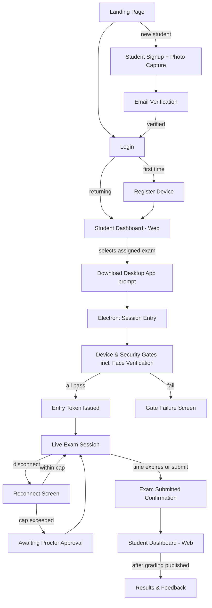
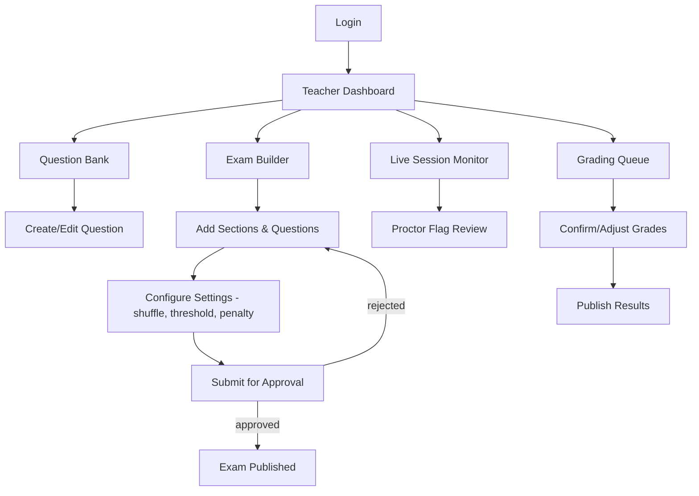
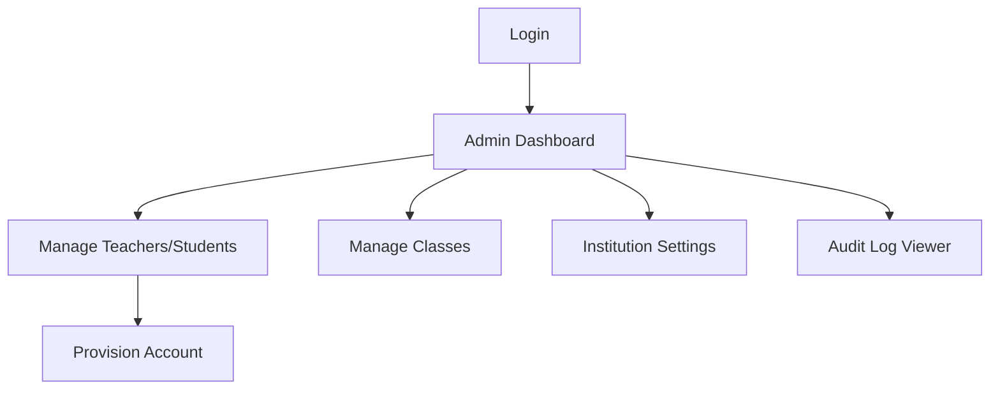
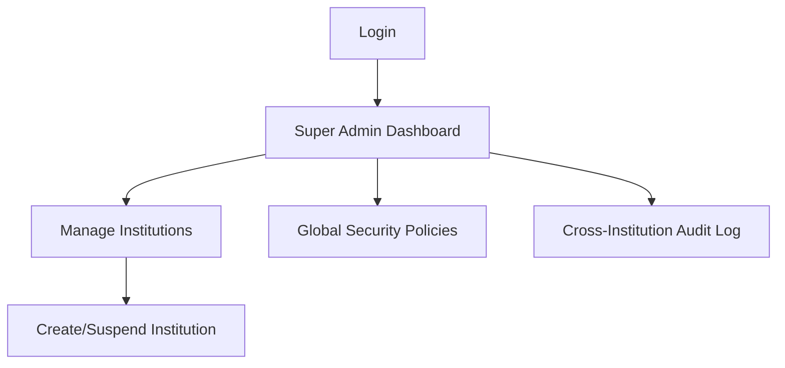
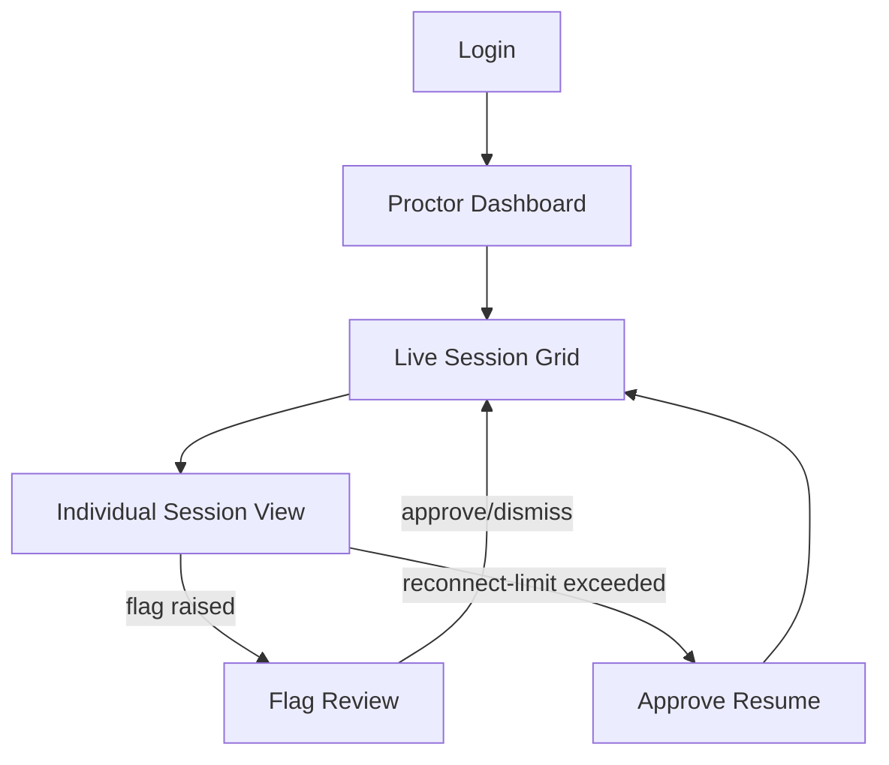

# Online Exam Platform — Screen Inventory

**Project:** `online-exam-platform`
**Document Maintainer:** M. Khubaib Asif
**Version:** 1.0
**Related Documents:** `LOW_LEVEL_DESIGN.md`, `MODULE_DECOMPOSITION.md`, `docs/design/UI_GUIDELINES.md`

---

## Table of Contents

1. [Client Surface Assignment Rule](#1-client-surface-assignment-rule)
2. [Shared Shell](#2-shared-shell)
3. [End-to-End Actor Flows](#3-end-to-end-actor-flows)
4. [M1 — Auth & Identity](#4-m1--auth--identity)
5. [M2 — Institution & Tenant Management](#5-m2--institution--tenant-management)
6. [M3 — Question Bank](#6-m3--question-bank)
7. [M4 — Exam Builder & Approval](#7-m4--exam-builder--approval)
8. [M5 — Device & Security Gate](#8-m5--device--security-gate)
9. [M6 — Session Orchestration Core](#9-m6--session-orchestration-core)
10. [M7 — Proctoring Engine & Dashboard](#10-m7--proctoring-engine--dashboard)
11. [M8 — Grading & Audit](#11-m8--grading--audit)
12. [Open Items](#12-open-items)

---

## 1. Client Surface Assignment Rule

A screen's surface is decided by one test, applied the same way every time
— not re-litigated per module:

> **Electron**, if the screen needs native OS access (device fingerprint,
> process scan, lockdown enforcement) **or** it is Student's live-exam-
> taking experience. **Everything else is Web.** Mobile is exclusively
> secondary-camera pairing (nothing else runs there).

Per the hybrid architecture (LLD §20, Option A): "Electron" below means
the same web app, loaded via a dedicated `/electron/*` route with a
native main process wrapped around it — not a separate build. Per
LLD §20.2's navigation lock, Student never reaches any screen outside
`/electron/*` while inside the Electron shell, and — per the constraint
established during Electron/hybrid discussion — the Web surface actively
refuses to render exam-taking screens for the Student role even if
requested directly, rather than silently allowing it.

---

## 2. Shared Shell

### Web chrome
Persistent across all Web screens except the landing/auth screens (no
signed-in identity yet to show):
- Top bar: institution name/logo (left), role-appropriate nav links
  (center), user menu + logout (right) — per `UI_GUIDELINES.md` §6
  (dark navy titlebar, `--color-bg-titlebar`)
- Left rail (Teacher/Admin/Proctor only): section navigation, collapsed
  by default on narrow viewports
- No shell at all on the Student Web surface beyond the "open desktop
  app" refusal screen (§1) — nothing else exists for Student on Web

### Electron chrome
Per LLD §20.2 window config (`fullscreenable: false` → fullscreen forced
by lockdown, `closable: false`):
- Persistent titlebar strip: exam name, live countdown timer (monospace,
  `--color-text-primary`), connection/lockdown status indicator (green =
  locked & connected, amber = reconnecting, red = violation flagged)
- No browser chrome (address bar, back/forward, tabs) — matches
  `UI_GUIDELINES.md`'s "purpose-built software, not a template" principle
  and LLD §20.2's context-menu block

---

## 3. End-to-End Actor Flows

### Student

### Teacher

### Institution Admin

### Super Admin

### Proctor

---

## 4. M1 — Auth & Identity

**Actors:** all. **Surface:** Web only (Electron never shows login — see
§8, entry happens after Web auth).

| Screen | Purpose | Backend Contract |
|---|---|---|
| Landing Page | Pre-auth entry point, links to Login / Signup | — (static) |
| Login | Credential entry, shared by all roles | `AuthService.login` |
| Student Signup | Self-registration, STUDENT role only (per SEC-1's intended fix — see Issue #4). Captures the reference profile photo used later by M5's face-verification gate. | `AuthService.register` (role constrained to STUDENT) + photo upload — ⚠️ not in LLD, see Issue #8 |
| Forgot Password | Enter email to request a reset link | ⚠️ not in LLD — see Issue #1 |
| Check Your Email | Confirmation shown after Forgot Password submit — deliberately identical whether or not the email exists, no account-existence leak | ⚠️ not in LLD — see Issue #1 |
| Reset Password | Reached via the emailed link (token in URL); enter new password | ⚠️ not in LLD — see Issue #1 |
| Verify Email | Shown after Signup until the emailed verification link is clicked; landing screen when it is | ⚠️ not in LLD — see Issue #1 |
| Register Device | Bind device fingerprint before first exam. Kept in M1 (not M5) for UX-grouping with My Devices, despite `DeviceGateService` being an M5-owned service — a deliberate exception, not an ownership mismatch | `DeviceGateService.register` |
| My Devices | List registered devices (label, platform, last-seen), revoke one. Cap is 2 — a 3rd registration attempt is blocked and routed here to free a slot | `DELETE /devices/:id` |
| My Profile / Account Settings | View/edit own account details | `GET /auth/me` |

**Nav edges:** Landing Page → Login (existing users) / Student Signup (new students only). Login → "Forgot Password?" → Forgot Password → Check Your Email → (emailed link) Reset Password → Login. Student Signup → Verify Email nag → (emailed link) Verify Email confirmation → Register Device → role-appropriate dashboard. Login → role-appropriate dashboard directly (returning, verified users). My Devices / My Profile reached via the user menu in the shared shell (§2), post-login only — not part of the auth sequence itself.

⚠️ Teacher/Institution Admin/Super Admin/Proctor/Approver accounts are provisioned via M2, not self-registered — Student Signup is the one exception, per SEC-1's recommended fix restricting the public endpoint to STUDENT only. Confirm this matches what PR #8 actually merged — see Issue #4.

---

## 5. M2 — Institution & Tenant Management

**Actors:** Super Admin, Institution Admin. **Surface:** Web only.

| Screen | Purpose | Backend Contract |
|---|---|---|
| Admin Dashboard | Landing after login for Admin roles | — |
| Institution List (Super Admin only) | Browse/search institutions | `InstitutionService` (list — not yet named in LLD, see §12) |
| Create/Edit Institution | Onboard a new tenant | `InstitutionService.create` |
| User List | Browse teachers/students/proctors in-institution | `UserService.listByRole` |
| Provision Account | Create a Teacher/Student/Proctor account | `UserService.create` |
| Class Management | Create/edit classes, assign students | ⚠️ not in LLD — see §12 |

**Nav edges:** Admin Dashboard → Institution List (Super Admin) / User List (Institution Admin) → Provision Account.

---

## 6. M3 — Question Bank

**Actors:** Teacher. **Surface:** Web only.

| Screen | Purpose | Backend Contract |
|---|---|---|
| Question Bank List | Browse/search saved questions by tag/type | `QuestionService` (list — not yet named, see §12) |
| Create/Edit Question | Author a question, set correct answer(s) | `QuestionService.create` |
| Question Preview | See exactly what a student will see | `QuestionService.getDecryptedForDelivery` |

**Nav edges:** Teacher Dashboard → Question Bank List → Create/Edit Question. Also reachable from M4's Exam Builder ("Add from Bank").

---

## 7. M4 — Exam Builder & Approval

**Actors:** Teacher, Approver, Institution Admin (per US-1.4). **Surface:** Web only.

| Screen | Purpose | Backend Contract |
|---|---|---|
| Exam List | Teacher's exams by status (draft/pending/approved/published) | — |
| Exam Builder | Sections, questions, ordering, shuffle config | `ExamService.create` / `update` |
| Exam Settings | Duration, proctoring tier, `autoSubmitRiskThreshold`, `maxSilentReconnects`, `reconnectPenaltyBase` — all teacher-configurable per this session's LLD fixes | `ExamService.update` |
| Submit for Approval | Sends exam to Approver queue | `ExamService.transition` |
| Approval Queue (Approver) | List of exams pending review | — |
| Approval Review | Approver reads full exam, signs or rejects | `ExamService.approve` |

**Nav edges:** Exam List → Exam Builder → Exam Settings → Submit for Approval → (Approver) Approval Queue → Approval Review → back to Exam List (approved/rejected).

---

## 8. M5 — Device & Security Gate

**Actors:** Student. **Surface:** Electron (native checks required per §1's rule).

| Screen | Purpose | Backend Contract |
|---|---|---|
| Download Desktop App | Shown on Web if Student lacks the app; the actual "Web won't render exam UI for Student" boundary from earlier discussion | — |
| Session Entry | Electron's first screen — loads `/electron/session-entry` per LLD §20.2 | `verifyAttestationToken` (LLD §11, runs first) |
| Device & Security Gates | Runs VM detection, process scan, camera check, environment scan, **and face verification** (live capture compared against the reference photo from M1 signup — folded in as one gate, not a separate screen, per decision) | `DeviceGateService.runGates` (face-match logic ⚠️ unimplemented, see Issue #8) |
| Gate Failure | Explains which gate failed, how to fix (close app X, disable VM, face didn't match — retry capture) | — |

**Nav edges:** Web Dashboard → Download Desktop App → Electron Session Entry → Device & Security Gates → (pass) M6 Live Exam Session / (fail) Gate Failure → retry Gates.

---

## 9. M6 — Session Orchestration Core

**Actors:** Student. **Surface:** Electron exclusively — no Web equivalent exists, per §1.

| Screen | Purpose | Backend Contract |
|---|---|---|
| Live Exam Session | Question rendering, timer, answer input. Per-question time limits are a planned addition — see Issue #5, including its conflict with `allowBackNavigation` | `SessionService.startSession`, `submitAnswer` |
| Reconnect Screen | Shown during a dropped-connection window | `validateResumeToken` |
| Awaiting Proctor Approval | Shown when reconnect cap exceeded (this session's fix) | `recordReconnect` (via M7) |
| Submit Confirmation | Final review before submit, then confirmation | `SessionService.autoSubmit` / explicit submit |

**Nav edges:** M5 Gates → Live Exam Session → (disconnect) Reconnect Screen → (resumed) Live Exam Session / (cap exceeded) Awaiting Proctor Approval → Live Exam Session (once approved) → Submit Confirmation → Web Dashboard.

---

## 10. M7 — Proctoring Engine & Dashboard

**Actors:** Proctor, System/AI Engine (machine actor, no screen). **Surface:** Web (Proctor dashboard); face-detection hook runs inside M6's Electron-loaded page per LLD §20.5's relocation.

| Screen | Purpose | Backend Contract |
|---|---|---|
| Live Session Grid | Thumbnail/status grid of all active sessions | `ProctoringService.ingestTelemetry` (feed) |
| Individual Session View | Full camera feed + risk score + event timeline for one student | `processAnalysisResult` |
| Flag Review | Approve/dismiss an AI-raised flag. Should show the captured evidence frame, not just a score — see Issue #7 | `reviewFlag` |
| Reconnect Approval | Explicit approval for a capped-out reconnect (this session's fix) | tied to `recordReconnect`'s `limitExceeded` |

**Nav edges:** Proctor Dashboard → Live Session Grid → Individual Session View → Flag Review / Reconnect Approval → back to grid.

---

## 11. M8 — Grading & Audit

**Actors:** Teacher, Institution Admin (audit log only). **Surface:** Web only.

| Screen | Purpose | Backend Contract |
|---|---|---|
| Grading Queue | List of sessions needing grade confirmation | `gradeObjectiveAnswers`, `requestAISuggestions` |
| Grade Confirmation | Teacher reviews/adjusts a score, confirms | `confirmGrade` (this session's L6 fix — publish-guard applies here) |
| Reopen Grading | Unlock a published grade for correction | `reopenGrading` |
| Publish Results | Release grades to students | `publishResults` |
| Audit Log Viewer | Tamper-evident log, per FR-043 | — |
| Student Results & Feedback (Student-facing) | View own published grade | — |

**Nav edges:** Grading Queue → Grade Confirmation → Publish Results → (Student sees) Results & Feedback. Grade Confirmation → Reopen Grading (if `GRADE_ALREADY_PUBLISHED` needs override).

---

## 12. Open Items

These are gaps found while building this inventory and while discussing
proctoring/grading architecture, not implemented here — each is a real
finding, written so a contributor can pick it up directly without needing
this document's full conversation history. Fix in `LOW_LEVEL_DESIGN.md`,
same discipline as prior audit fixes: one at a time, diff first, review
before merge.

---

**Issue #1 — No backend contract for Forgot Password / Verify Email**
- **Module:** M1
- **What's wrong:** No such endpoints exist anywhere in the LLD, despite
  both being standard, expected auth flows.
- **Why it matters:** `isEmailVerified`/`emailVerifiedAt` fields exist on
  `User` but nothing ever sets them; a locked-out user has no self-service
  recovery path.
- **Suggested fix:** Add `AuthService.requestPasswordReset` /
  `resetPassword` / `verifyEmail`, each with a short-lived signed token,
  same HMAC pattern as `ENTRY_TOKEN_HMAC_SECRET`.

**Issue #2 — No named service method for Institution list/search or Class Management**
- **Module:** M2
- **What's wrong:** `InstitutionService.create` exists; listing/searching
  institutions and any class CRUD do not.
- **Why it matters:** Super Admin's Institution List screen and Institution
  Admin's Class Management screen have no backend to call.
- **Suggested fix:** Add `InstitutionService.list` (paginated, bounded
  per API-2's fix) and a `ClassService` with standard CRUD.

**Issue #3 — No named service method for Question Bank list/search**
- **Module:** M3
- **What's wrong:** `QuestionService.create` and
  `.getDecryptedForDelivery` exist; browsing/searching the bank by
  tag/type does not.
- **Why it matters:** Teacher's Question Bank List screen has no backend
  to call.
- **Suggested fix:** Add `QuestionService.list` with tag/type filters,
  paginated per the same bound as Issue #2.

**Issue #4 — Confirm SEC-1's actual resolution matches this document's assumption**
- **Module:** M1
- **What's wrong:** This inventory assumes SEC-1 was resolved as
  "self-registration restricted to STUDENT role only" (the recommended
  fix). PR #8 wasn't merged at time of writing.
- **Why it matters:** If SEC-1 was instead resolved by removing public
  registration entirely, the Student Signup screen in §4 doesn't exist,
  and profile-photo capture (feeds Issue #8) needs a different home —
  likely provisioning-time upload by Institution Admin instead.
- **Suggested fix:** Once #8 is merged, confirm `RegisterSchema`'s `role`
  field is constrained to `STUDENT` only; update this document if not.

**Issue #5 — Per-question time limits not supported**
- **Module:** M6 (config surfaced in M4's Exam Settings)
- **What's wrong:** No per-question timing field exists anywhere in the
  schema or session logic — only whole-exam duration.
- **Why it matters:** Product requirement, currently unimplementable.
- **Suggested fix:** Add `ExamQuestion.timeLimitSeconds` (nullable).
  Enforcement MUST be server-authoritative, not client-tracked — same
  principle as REL-1/REL-2 (the exam-duration timer fixes): a
  client-only countdown can be trivially ignored by a modified client.
  **Open design decision, not just implementation:** this conflicts with
  `allowBackNavigation: true` (existing exam setting) — does enabling
  per-question limits force back-navigation off, or do limits only
  block extending time, not revisiting? Needs a product decision before
  schema work starts.

**Issue #6 — §26.1 Client-Side Telemetry Collection is stale (real bug, not a gap)**
- **Module:** M6 / M7 (Electron)
- **What's wrong:** Still describes the pre-hybrid architecture ("all
  network calls in the main process — the sandboxed renderer has no
  direct network access") and calls `window.examBridge.reportViolation(...)`
  — a method removed when `examBridge` was collapsed to native-only
  methods under the hybrid architecture's Option A (§20.4).
- **Why it matters:** This code does not compile/run as written — it
  calls a function that no longer exists on the bridge.
- **Suggested fix:** Telemetry batching should emit directly over the
  renderer's own WebSocket connection (`socket.emit(CLIENT_EVENTS.TELEMETRY_BATCH, ...)`),
  same as every other renderer→backend call under Option A — not routed
  through IPC at all.

**Issue #7 — No evidence capture for AI proctoring flags**
- **Module:** M7
- **What's wrong:** `ANALYSIS_RESULT` only ever carries booleans/scores
  (`faceDetected`, `multipleFaces`, `gazeOffScreen`, `confidence`) — no
  frame/image is ever captured or stored when a flag fires.
- **Why it matters:** Proctor's Flag Review screen has a score to look
  at but no actual evidence — a proctor can't visually confirm what
  triggered a flag before approving/dismissing it.
- **Suggested fix:** On flag, capture a single low-res frame client-side,
  upload to encrypted object storage (same pattern as `biometricRef`),
  store the reference on the `ProctoringFlag` row. Consider storage-cost
  and consent/privacy implications before implementing.

**Issue #8 — Biometric face verification is a route stub only, no implementation**
- **Module:** M1 (photo capture), M5 (verification gate)
- **What's wrong:** `POST /gates/verify-face` exists as a single line in
  the API reference table. No service method, no matching algorithm, no
  threshold/confidence logic — nothing implementing it, despite
  `profilePhotoUrl`, `biometricRef`, and `BIOMETRIC_ENC_KEY` already
  existing in the schema/env config.
- **Why it matters:** Without this, device-fingerprint registration is
  the only identity signal at exam entry — it proves which device, not
  who's using it. This is a real, currently-open gap, not a nice-to-have.
- **Suggested fix, and this is the part that matters most:** do NOT
  implement this as a bare client-reported boolean ("matched: true/false")
  — that is the exact same trust failure the client-attestation work
  (§20.x) exists to prevent; a modified client could simply always claim
  a match. Either (a) upload the captured photo and have the **server**
  run the comparison, or (b) client does a fast local check for UX
  responsiveness, but the photo is *also* uploaded so the server/a human
  proctor can override a false positive. Never let the client's verdict
  alone gate entry.