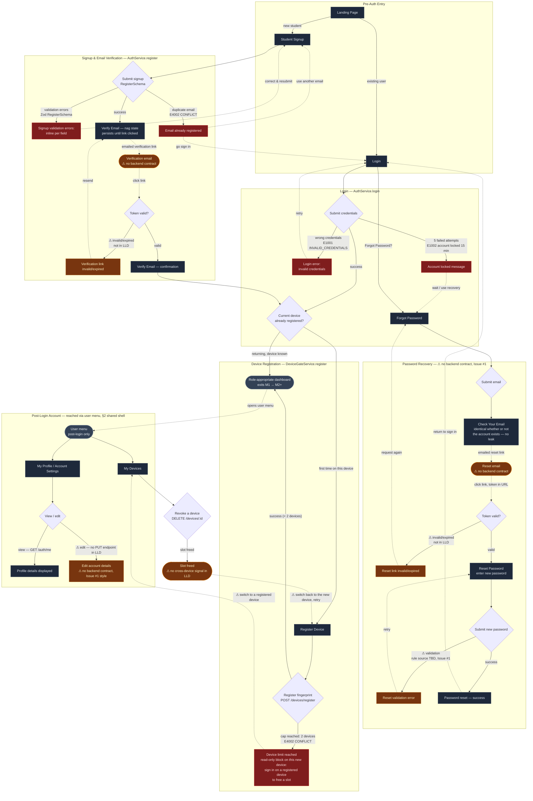

# M1 — Auth & Identity — Screen Flow

**Module:** M1 — Auth & Identity
**Surface:** Web only (Electron never shows login — see `SCREEN_INVENTORY.md` §8)
**Sources of truth:** `SCREEN_INVENTORY.md` §4 (screens + backend contracts),
`LOW_LEVEL_DESIGN.md` §7 (Auth module, Zod schemas), §12 (Device module).
**Scope:** wireframe flow spec only 

This document contains **one** Mermaid `flowchart` covering all ten M1 screens
from `SCREEN_INVENTORY.md` §4:

Landing Page · Login · Student Signup · Forgot Password · Check Your Email ·
Reset Password · Verify Email · Register Device · My Devices · My Profile.

Every failure / validation / error branch is drawn.

---

## Legend

| Shape / style | Meaning |
|---|---|
| Rectangle | A screen (a real destination in §4) |
| Diamond | A decision / branch point |
| Rounded (stadium) | A terminal that exits M1 scope (e.g. role dashboard = M2+) or an email side-channel |
| Solid arrow | In-app navigation |
| Dashed arrow | A **cross-device physical hop** (student switches machines) or an out-of-app step (clicking an emailed link) |
| `⚠` prefix on a node/edge | **Not grounded in the LLD** — a gap or a product decision made this session. See "Grounding & open gaps" below. |

`classDef` styling in the diagram:
- **screen** — normal screens
- **error** — failure / locked / validation-error states
- **gap** — `⚠` nodes and edges that are not backed by the LLD

---

## Flow diagram

---

## Grounding & open gaps

Everything drawn as a solid node/edge traces to `SCREEN_INVENTORY.md` §4 or
`LOW_LEVEL_DESIGN.md` §7/§12. The `⚠` items below are **not** grounded and are
surfaced here so they can be resolved and folded back into the LLD (same
discipline as `SCREEN_INVENTORY.md` §12).

| # | `⚠` item in diagram | Why it's a gap | Source / disposition |
|---|---|---|---|
| G1 | Verify Email — email side-channel, token validity, invalid/expired branch | No `verifyEmail` endpoint or token contract exists in the LLD | `SCREEN_INVENTORY.md` §12 **Issue #1** — suggested `AuthService.verifyEmail` w/ short-lived signed token |
| G2 | Forgot Password → Check Your Email → Reset Password (whole subgraph), incl. reset-link validity & reset password-field validation | No `requestPasswordReset` / `resetPassword` endpoints; no Zod schema governs the new-password field on reset | `SCREEN_INVENTORY.md` §12 **Issue #1** — suggested `AuthService.requestPasswordReset` / `resetPassword` |
| G3 | Cap-reached cross-device loop: block on new device → revoke on a registered device → return & retry | The LLD enforces the cap (`DeviceService.register` throws `E4002` at `deviceCount >= 2`) but has **no cross-device coordination** — nothing signals the new device that a slot was freed | **Product decision this session** .
| G4 | My Profile — edit account details | `GET /auth/me` exists (read); there is **no** update/PUT endpoint for a user editing their own account | Not in LLD; same class as Issue #1. View is grounded, edit is not. |

### Grounded facts (for `COMPONENTS.md`)

- **Login** → `AuthService.login` (`POST /auth/login`, `LoginSchema`). Wrong
  credentials = `E1001`; lock after **5** failed attempts for **15 min** =
  `E1002` (LLD §7.2 `recordFailedLogin`).
- **Student Signup** → `AuthService.register` (`POST /auth/register`,
  `RegisterSchema`). Duplicate email = `E4002 CONFLICT` (LLD §7.2). ⚠ Note two
  real frictions carried into `COMPONENTS.md`: `RegisterSchema.role` is **not**
  STUDENT-constrained (`SCREEN_INVENTORY.md` §12 Issue #4) and `RegisterSchema`
  **requires `institutionId` (uuid)**, which a public self-registering student
  has no obvious way to supply. Photo capture at signup is ⚠ Issue #8 (not in
  LLD).
- **Register Device** → `DeviceGateService.register` (`POST /devices/register`).
  Cap = **2** (`deviceCount >= 2` → `E4002`), LLD §12.1.
- **My Devices** → list + `DELETE /devices/:id`, per §4. Reachable **post-login
  only** via the user menu (§2 shared shell), not part of the auth sequence.
- **My Profile** → `GET /auth/me`, per §4.

---

*No fields, validation rules, or endpoints in this document were invented. Where
a screen needs something neither `SCREEN_INVENTORY.md` §4 nor
`LOW_LEVEL_DESIGN.md` provides, it is marked `⚠` and listed above rather than
filled in with a plausible-looking value.*
