# M1 — Auth & Identity — Screen Flow

**Module:** M1 — Auth & Identity
**Surface:** Web only (Electron never shows login — see `SCREEN_INVENTORY.md` §8)
**Sources of truth:** `SCREEN_INVENTORY.md` §5 (screens + backend contracts),
`LOW_LEVEL_DESIGN.md` §7.1 (auth and signup-photo schemas), §11 (device module), and §15 (identity gate).
**Scope:** wireframe flow spec only

This document contains **one** Mermaid `flowchart` covering all M1 screens
from `SCREEN_INVENTORY.md` §5:

First-Run Bootstrap · Owner Console · Teacher Invitation Activation · Landing Page · Login · Student Signup · Verify Email · Forgot Password · Check Your Email · Reset Password · Register Device · My Devices · My Profile.

Every failure / validation / error branch is drawn.

---

## Legend

| Shape / style | Meaning |
|---|---|
| Rectangle | A screen (a real destination in §4) |
| Diamond | A decision / branch point |
| Rounded (stadium) | A terminal that exits M1 scope (e.g. role dashboard = M2+) or an email side-channel |
| Solid arrow | In-app navigation |
| Dashed arrow | A **cross-device physical hop** (student switches machines) or an out-of-app step (clicking an emailed link) |
| `⚠` prefix on a node/edge | Deferred behaviour that is explicitly outside the current v1 contract. See "Grounding & resolved contracts" below. |

`classDef` styling in the diagram:
- **screen** — normal screens
- **error** — failure / locked / validation-error states
- **gap** — retained only for future-scope items that are explicitly outside the current contract

---

## Flow diagram

```mermaid
flowchart TD
    %% ─────────────────────────────────────────────
    %% Class definitions
    %% ─────────────────────────────────────────────
    classDef screen fill:#1e293b,stroke:#475569,color:#e2e8f0;
    classDef error  fill:#7f1d1d,stroke:#b91c1c,color:#fee2e2;
    classDef gap    fill:#78350f,stroke:#d97706,color:#fef3c7,stroke-dasharray: 4 3;
    classDef term   fill:#334155,stroke:#64748b,color:#f1f5f9;

    %% ═════════════════════════════════════════════
    %% SUBGRAPH 0 — FIRST-RUN BOOTSTRAP AND TEACHER ONBOARDING
    %% ═════════════════════════════════════════════
    subgraph BOOT[First-run bootstrap — Auth & Identity]
        FIRST[First-Run Bootstrap]:::screen
        FIRST --> BOOTSUB{POST /v1/bootstrap/owner}
        BOOTSUB -->|"invalid, expired, replayed, or rate-limited secret<br/>generic error + correlation ID"| BOOTERR[Bootstrap unavailable]:::error
        BOOTERR -.->|retry only through protected deployment flow| FIRST
        BOOTSUB -->|"PlatformState=INITIALISED"| CLOSED[Bootstrap closed<br/>owner already exists]:::error
        BOOTSUB -->|"valid secret + UNINITIALISED"| OWNERCREATED[Exactly one OWNER created<br/>secret invalidated atomically]:::term
        OWNERCREATED --> OWNERVERIFY[Owner email verification]:::screen
        OWNERVERIFY --> OWNERCONSOLE[Owner Console]:::screen
        OWNERCONSOLE --> INVITE[Create Teacher Invitation]:::screen
        INVITE --> INVITESUB{POST /v1/owner/teacher-invitations}
        INVITESUB -->|"owner auth/step-up/idempotency failure"| INVITEERR[Invitation error]:::error
        INVITEERR -.->|retry| INVITE
        INVITESUB -->|"single-use link delivered"| TEACHERLINK([Teacher invitation link]):::term
        TEACHERLINK -.-> TEACHERACT[Teacher Invitation Activation]:::screen
        TEACHERACT --> REDEEM{POST /v1/teacher-invitations/redeem}
        REDEEM -->|"wrong email, expired, revoked, replayed"| REDEEMERR[Invitation cannot be redeemed]:::error
        REDEEMERR -.->|use valid invitation| TEACHERACT
        REDEEM -->|"valid + email verified"| TEACHERCREATED[Exactly one TEACHER account created<br/>role derived server-side]:::term
        TEACHERCREATED --> LOGIN
    end

    %% ═════════════════════════════════════════════
    %% SUBGRAPH 1 — PRE-AUTH ENTRY
    %% ═════════════════════════════════════════════
    subgraph PRE[Pre-Auth Entry]
        LAND[Landing Page]:::screen
        LOGIN[Login]:::screen
        LAND -->|existing user| LOGIN
        LAND -->|new student| SIGNUP[Student Signup]:::screen
    end

    %% ═════════════════════════════════════════════
    %% SUBGRAPH 2 — LOGIN BRANCHES  (AuthService.login)
    %% ═════════════════════════════════════════════
    subgraph L[Login — AuthService.login]
        LOGIN --> LOGINSUB{Submit credentials}
        LOGINSUB -->|"wrong credentials<br/>E1001 INVALID_CREDENTIALS"| LOGINERR[Login error:<br/>invalid credentials]:::error
        LOGINERR -.->|retry| LOGIN
        LOGINSUB -->|"5 failed attempts<br/>E1002 account locked 15 min"| LOCKED[Account locked message]:::error
        LOCKED -.->|wait / use recovery| FORGOT
        LOGINSUB -->|success| DEVCHECK{Current device<br/>already registered?}
    end

    %% Forgot-password entry from Login
    LOGIN -->|Forgot Password?| FORGOT[Forgot Password]:::screen

    %% ═════════════════════════════════════════════
    %% SUBGRAPH 3 — SIGNUP + EMAIL VERIFICATION
    %% ═════════════════════════════════════════════
    subgraph S[Signup & Email Verification — AuthService.register]
        SIGNUP --> SIGNSUB{Submit signup<br/>RegisterStudentSchema + photo}
        SIGNSUB -->|"validation errors<br/>Zod RegisterStudentSchema + photo metadata"| SIGNERR[Signup validation errors:<br/>inline per field]:::error
        SIGNERR -.->|correct photo, fields, terms & resubmit| SIGNUP
        SIGNSUB -->|"duplicate email<br/>E4002 CONFLICT"| DUPERR[Email already registered]:::error
        DUPERR -.->|use another email| SIGNUP
        DUPERR -.->|go sign in| LOGIN
        SIGNSUB -->|"valid fields + photo + terms"| PHOTO[Private reference photo enrolled<br/>opaque key only]:::term
        PHOTO --> VNAG[Verify Email — nag state<br/>persists until link clicked]:::screen
        VNAG -.->|emailed verification link| VMAIL([Verification email side-channel]):::term
        VMAIL -.->|click link| VTOKEN{Token valid?}
        VTOKEN -->|invalid or expired| VTOKERR[Verification link invalid/expired]:::error
        VTOKERR -.->|resend| VNAG
        VTOKEN -->|valid| VDONE[Verify Email — confirmation]:::screen
    end

    VDONE --> DEVCHECK

    %% ═════════════════════════════════════════════
    %% SUBGRAPH 4 — PASSWORD RECOVERY
    %% ═════════════════════════════════════════════
    subgraph P[Password Recovery — AuthService]
        FORGOT --> FSUB{Submit email}
        FSUB --> CHECKMAIL[Check Your Email<br/>identical whether or not<br/>the account exists — no leak]:::screen
        CHECKMAIL -.->|emailed reset link| RMAIL([Reset email<br/>short-lived single-use token]):::term
        RMAIL -.->|click link, token in URL| RTOKEN{Token valid?}
        RTOKEN -->|invalid/expired| RTOKERR[Reset link invalid/expired]:::error
        RTOKERR -.->|request again| FORGOT
        RTOKEN -->|valid| RESET[Reset Password<br/>enter new password]:::screen
        RESET --> RESETSUB{Submit new password}
        RESETSUB -->|PasswordResetSchema invalid| RESETERR[Reset validation error]:::error
        RESETERR -.->|retry| RESET
        RESETSUB -->|success| RESETOK[Password reset — success]:::screen
    end

    RESETOK -.->|return to sign in| LOGIN

    %% ═════════════════════════════════════════════
    %% SUBGRAPH 5 — DEVICE REGISTRATION + CAP FLOW  (DeviceGateService.register)
    %% ═════════════════════════════════════════════
    subgraph D[Device Registration — DeviceGateService.register]
        DEVCHECK -->|"returning, device known"| DASH([Role-appropriate dashboard<br/>exits M1 → M2+]):::term
        DEVCHECK -->|"first time on this device"| REGDEV[Register Device]:::screen
        REGDEV --> REGSUB{Register fingerprint<br/>POST /devices/register}
        REGSUB -->|"success (< 2 devices)"| DASH
        REGSUB -->|"cap reached: 2 devices<br/>E4002 CONFLICT"| CAPBLOCK[Device limit reached<br/>read-only block on this new device:<br/>sign in on a registered device<br/>to free a slot]:::error
    end

    %% ── Cross-device cap-resolution loop ──
    CAPBLOCK -.->|switch to a registered device| MYDEV[My Devices]:::screen
    MYDEV --> REVOKE{Revoke a device<br/>DELETE /devices/:id}
    REVOKE -->|"slot freed"|SLOTFREE([Slot freed<br/>server accepts retry on new device]):::term
    SLOTFREE -.->|switch back to the new device, retry| REGDEV

    %% ═════════════════════════════════════════════
    %% SUBGRAPH 6 — POST-LOGIN ACCOUNT (via user menu, not the auth sequence)
    %% ═════════════════════════════════════════════
    subgraph A[Post-Login Account — reached via user menu, §2 shared shell]
        MENU([User menu<br/>post-login only]):::term
        MENU --> MYDEV
        MENU --> PROFILE[My Profile / Account Settings]:::screen
        PROFILE --> PVIEW{View / edit}
        PVIEW -->|view only — GET /v1/auth/me| PDATA[Profile details displayed]:::screen
    end

    DASH -.->|opens user menu| MENU
```

---

## Grounding & resolved contracts

Every node and edge traces to `SCREEN_INVENTORY.md`, `HIGH_LEVEL_DESIGN.md`,
`LOW_LEVEL_DESIGN.md`, or the SRS. Profile-photo capture is part of student
signup, the existing terms checkbox is the only consent control, and the server
owns validation, private storage, enrolment metadata, and later reference
matching. Password recovery and email verification use the explicit LLD schemas
and endpoints; self-profile editing remains outside the v1 contract.

| Contract | Source | M1 treatment |
|---|---|---|
| Required signup profile photo | HLD §11.2; LLD §7.1 | Same multipart registration command; no separate screen or consent flow. |
| Private storage and canonical metadata | LLD §7.1, §13.3 | M1 displays preview/status only; it never receives or exposes the stored object key. |
| Per-attempt reference comparison | HLD §13.2; LLD §11.1, §15.1 | M5/M7 execute the gate; M1 supplies the enrolled reference identity, not the verdict. |
| Existing terms-and-conditions consent | SRS identity requirements; signup screen contract | One checked field gates submission; no additional biometric-consent procedure. |

---

*No fields, validation rules, or endpoints in this document are authority beyond
the cited HLD, LLD, SRS, and screen inventory contracts.*
