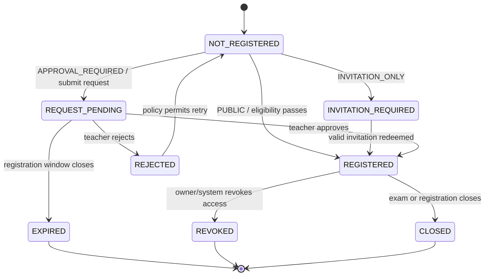
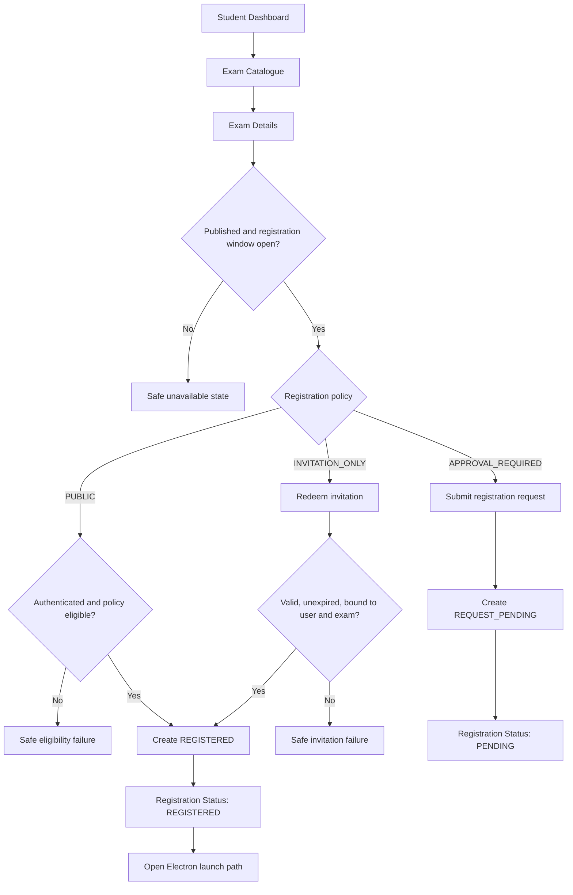
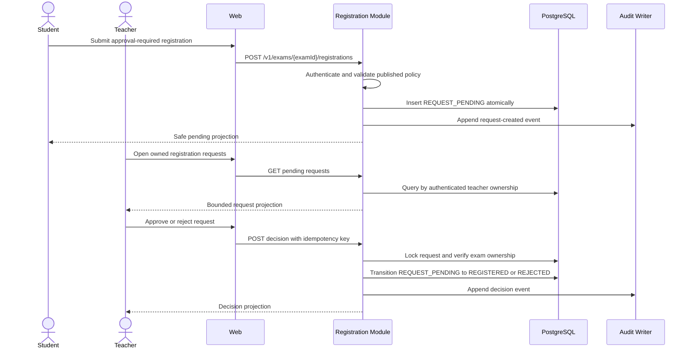

# M2 — Exam Registration & Access — Flow Design

**Module:** M2 — Exam Registration & Access
**Primary actors:** Student, Teacher
**Primary surface:** Shared web application
**Authoritative references:** `docs/architecture/HIGH_LEVEL_DESIGN.md` §§9, 11, 14; `docs/architecture/LOW_LEVEL_DESIGN.md` §§10, 17; `docs/modules/MODULE_DECOMPOSITION.md` §§2–4; `docs/modules/SCREEN_INVENTORY.md` §6

M2 converts a published teacher-owned exam into a server-authorised registration. It owns discovery, policy evaluation, invitations, registration state, and teacher approval. It does not own accounts, exam composition, devices, live sessions, proctoring, grading, or results.

---

## 1. Registration state machine

`REGISTERED` is necessary but not sufficient for exam entry. M5 independently evaluates persistent device eligibility and per-attempt security gates before M6 can create an attempt.

## 2. Student discovery and registration

The client never supplies a role, teacher ID, institution, class, course, or eligibility verdict. The server derives the user from the authenticated session and evaluates the immutable published exam revision.

## 3. Teacher approval flow

Only the exam owner/teacher may decide. No institution administrator, super administrator, class administrator, or automated client-side approval path exists in v1.

## 4. Failure and security rules

| Condition | Required behaviour |
| --- | --- |
| Unknown or unauthorised exam | Return the standard safe not-found/unauthorised response. |
| Duplicate registration | Return the current projection; do not create a second record. |
| Concurrent student commands | Enforce unique `(examId, userId)` and idempotent command handling. |
| Concurrent teacher decisions | Lock the registration row and accept only `REQUEST_PENDING`. |
| Closed registration window | Reject without exposing unpublished or restricted content. |
| Teacher no longer owns exam | Reject and append a security-relevant audit event. |
| Registration revoked | M5 launch-ticket issuance must fail even if an old page is open. |
| Stale client state | Re-read server state before every mutating decision. |

## 5. Screen contract map

| Screen ID | Transition | Owning contract |
| --- | --- | --- |
| M2-S01 | Dashboard → catalogue | Published catalogue query |
| M2-S02 | Catalogue → details | Eligibility and policy projection |
| M2-S03 | Details → invitation redemption | Single-use user-bound redemption |
| M2-S04 | Details → request pending | Idempotent registration command |
| M2-S05 | Registration command → status | Registration state projection |
| M2-S06 | Teacher dashboard → request queue | Teacher-owned pending query |
| M2-S07 | Queue → review → decision | Auditable approve/reject command |
| M2-S08 | Teacher dashboard → distribution | Counts and policy-window projection |

## 6. Exit criteria

M2 is complete when published discovery never leaks question content, policy is evaluated server-side, teacher approval is ownership-scoped, every transition is auditable and idempotent, and only `REGISTERED` users can proceed to M5 launch-ticket evaluation.
