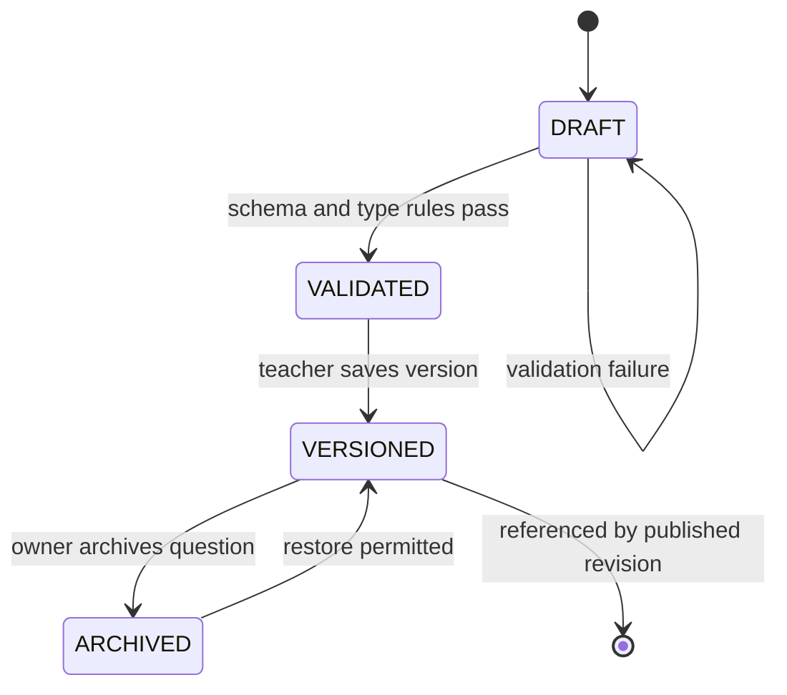
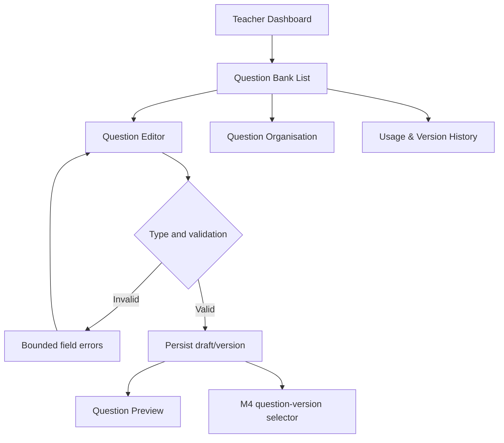
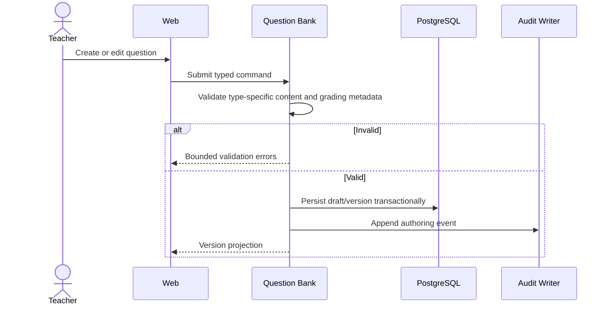

# M3 — Question Bank — Flow Design

**Module:** M3 — Question Bank
**Primary actor:** Teacher
**Primary surface:** Shared web application
**Authoritative references:** `docs/architecture/HIGH_LEVEL_DESIGN.md` §§9, 12; `docs/architecture/LOW_LEVEL_DESIGN.md` §8; `docs/modules/MODULE_DECOMPOSITION.md` §3; `docs/modules/SCREEN_INVENTORY.md` §7

M3 owns reusable teacher-authored question drafts and immutable versions. It does not own exam sections, timing, registration, answer delivery, grading decisions, or results.

---

## 1. Question lifecycle

A published revision references an immutable question version. Editing a draft never mutates a version already referenced by a published revision.

## 2. Authoring flow

## 3. Supported v1 types and rules

- `MCQ`, `MSQ`, `TRUE_FALSE`, `SHORT_ANSWER`, and `LONG_ANSWER` are supported.
- Fill-in-the-blank is excluded from v1.
- Objective answer keys are private authoring data and never enter student delivery projections.
- Subjective metadata may contain keywords, rubric metadata, teacher reference material, book/document references, and optional evidence mode.
- A question version referenced by an immutable published revision cannot be edited or deleted in place.

## 4. Screen contract map

| Screen ID | Transition | Owning contract |
| --- | --- | --- |
| M3-S01 | list → editor/organisation/history | Ownership-scoped question query |
| M3-S02 | editor → draft/version | Type-specific question command |
| M3-S03 | version → preview | Student-safe preview projection |
| M3-S04 | import → validation result | Bounded import validation |
| M3-S05 | list → organisation | Tags/archive/filter command |
| M3-S06 | version → references | Immutable usage/version query |

## 5. Exit criteria

M3 is complete when all supported types have deterministic schemas, invalid drafts cannot become versions, published references are immutable, answer keys remain private, and every authoring mutation is ownership-scoped and auditable.
