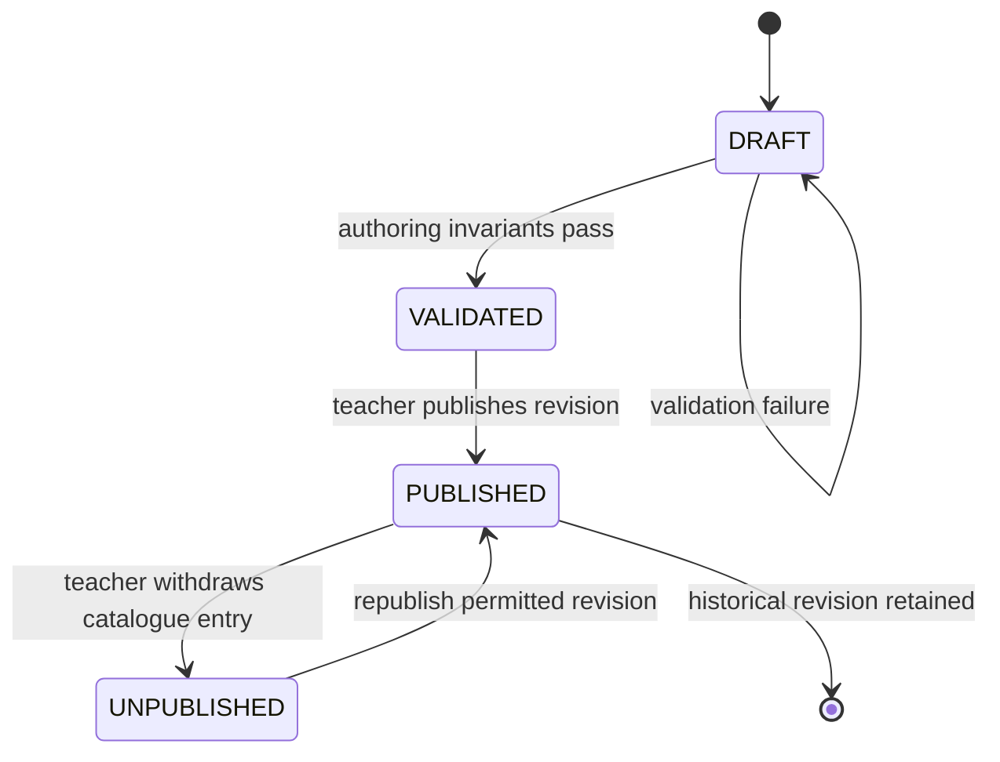
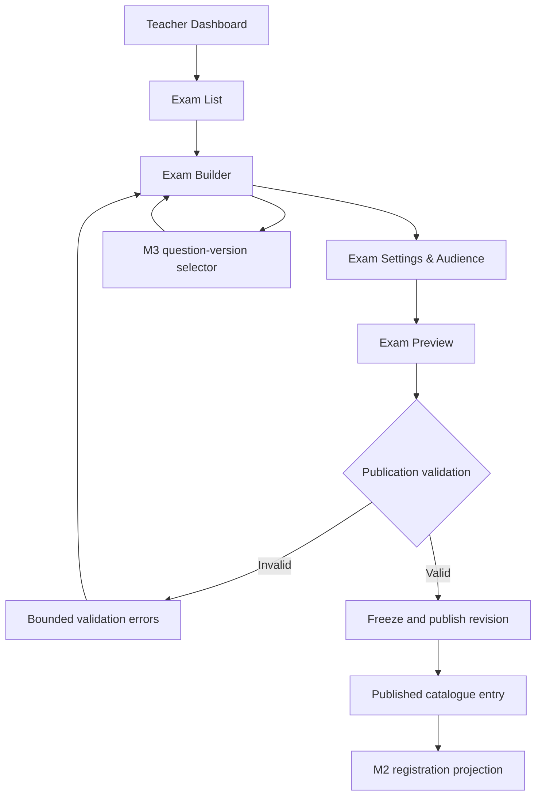
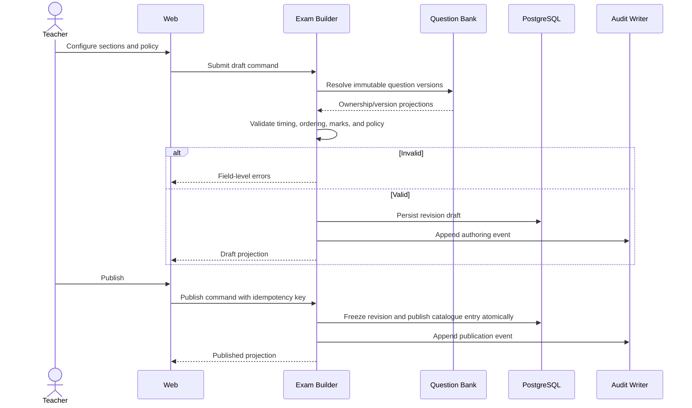

# M4 — Exam Builder & Publication — Flow Design

**Module:** M4 — Exam Builder & Publication
**Primary actor:** Teacher
**Primary surface:** Shared web application
**Authoritative references:** `docs/architecture/HIGH_LEVEL_DESIGN.md` §§9, 11, 12, 14; `docs/architecture/LOW_LEVEL_DESIGN.md` §9; `docs/modules/MODULE_DECOMPOSITION.md` §3; `docs/modules/SCREEN_INVENTORY.md` §8

M4 composes immutable exam revisions from M3 question versions, validates timing and access policy, and publishes the teacher-owned catalogue entry consumed by M2. It does not approve individual registrations, execute attempts, grade answers, or publish results.

---

## 1. Exam lifecycle

Publication freezes question-version references, section structure, timing policy, registration policy, proctoring policy, and result policy. Later edits create a new revision.

## 2. Authoring and publication flow

## 3. Timing and navigation validation

Supported timing modes are `WHOLE_PAPER`, `SECTION_TIMED`, `QUESTION_TIMED`, and `MIXED`. If every section is timed, section durations must sum exactly to the paper duration. Navigation is forward-only; submitting or timing out a question permanently locks it. These policies are configured by M4 but enforced by M6.

## 4. Screen contract map

| Screen ID | Transition | Owning contract |
| --- | --- | --- |
| M4-S01 | list → builder/distribution | Ownership-scoped exam query |
| M4-S02 | list → draft composition | Exam draft command |
| M4-S03 | builder → settings/audience | Timing and access configuration |
| M4-S04 | draft → preview | Student-safe preview projection |
| M4-S05 | valid draft → published revision | Publication command |
| M4-S06 | published → distribution status | Publication/registration projection |

## 5. Exit criteria

M4 is complete when only the exam owner can mutate or publish, all timing and policy invariants are server-validated, published revisions are immutable and auditable, and publication creates no implicit student registration or approval.
