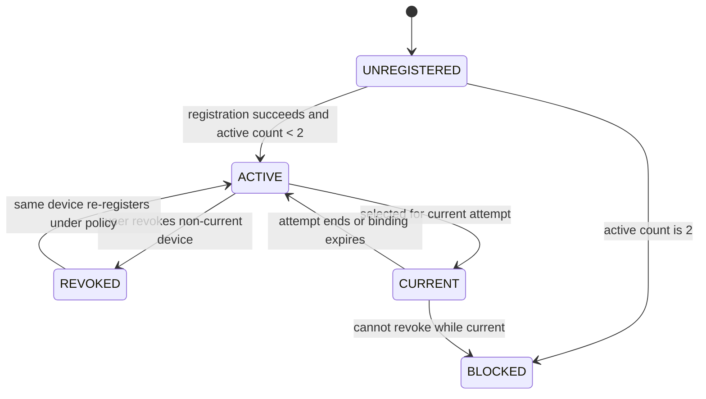
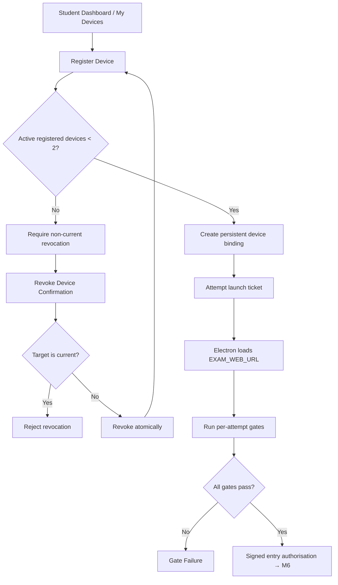
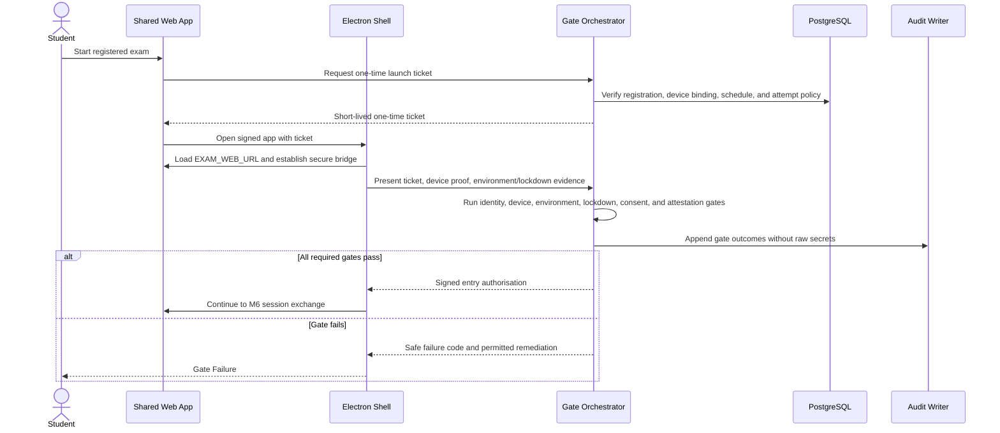

# M5 — Device & Security Gates — Flow Design

**Module:** M5 — Device & Security Gates
**Primary actor:** Student
**Primary surfaces:** Shared web application for device management; signed Electron shell plus the same loaded web application URL for attempt entry
**Authoritative references:** `docs/HIGH_LEVEL_DESIGN.md` §§5, 9, 11, 13, 16; `docs/LOW_LEVEL_DESIGN.md` §§11, 14, 17; `docs/modules/MODULE_DECOMPOSITION.md` §3; `docs/modules/SCREEN_INVENTORY.md` §9

M5 separates persistent device registration from per-attempt security gates. It authorises entry; it does not run the exam timer, own answers, or make final proctoring or grading decisions.

---

## 1. Device lifecycle

A user may have at most two active registered devices. Registering a third requires revoking a non-current device first. Device registration persists; security gates execute again for every attempt.

## 2. Registration and entry flow

No browser can bypass M5 to create a live attempt. A browser may display registration or a launch instruction, but the actual attempt requires the signed Electron shell.

## 3. Per-attempt gate flow

Gate verdicts are server-authoritative. The client supplies evidence; it never supplies a final pass value.

## 4. Gate rules

| Rule | Required behaviour |
| --- | --- |
| Current-device revocation | Reject; a current device cannot be revoked during its active binding. |
| Device cap | Enforce atomically in the database; never trust a client count. |
| Ticket replay | One-time ticket and nonce are consumed atomically. |
| Browser attempt | Reject live-session creation outside the Electron presentation mode. |
| Gate failure | Do not create or resume an attempt unless policy explicitly permits it. |
| Gate retry | Re-evaluate policy and evidence; do not reuse a previous verdict blindly. |
| Sensitive evidence | Store only bounded, encrypted, access-controlled evidence references. |

## 5. Screen contract map

| Screen ID | Transition | Owning contract |
| --- | --- | --- |
| M5-S01 | Registration status → desktop launch | Launch-ticket contract |
| M5-S02 | Electron open → session context | Session-entry contract |
| M5-S03 | Session entry → gate runner | Per-attempt gate orchestration |
| M5-S04 | Failed gate → remediation/end | Gate outcome contract |
| M5-S05 | My Devices → register | Persistent device registration |
| M5-S06 | My Devices → revoke confirmation | Non-current revocation |

## 6. Exit criteria

M5 is complete when two-device limits are atomic, current-device revocation is impossible, every attempt reruns gates, browser attempts are rejected, launch tickets are single-use, and only signed server authorisation reaches M6.
