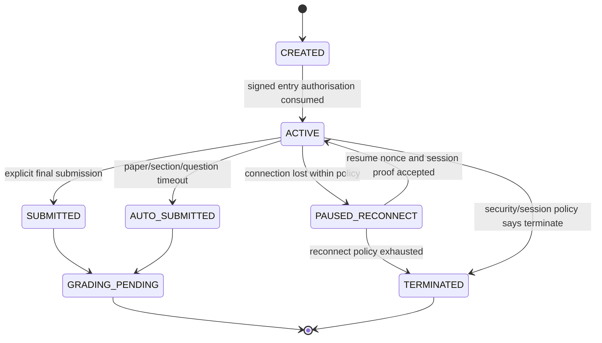
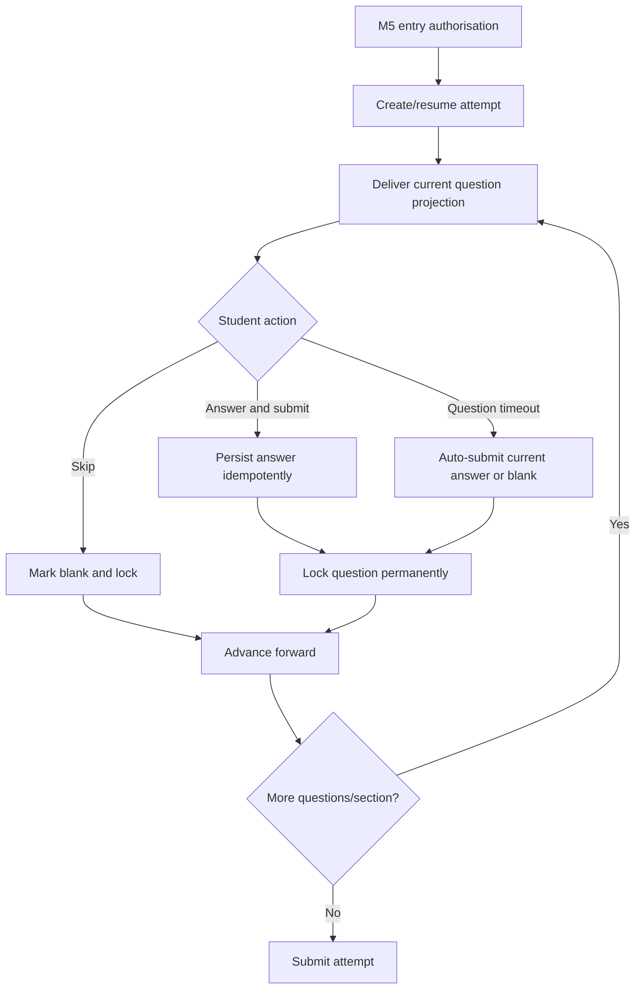
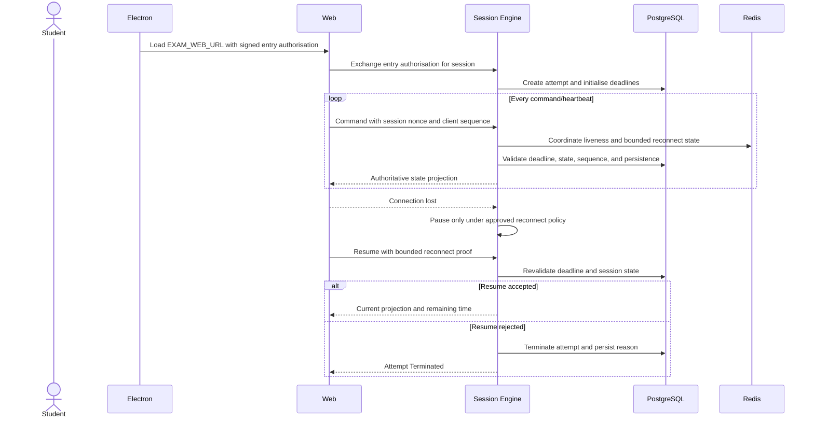

# M6 — Exam Session Orchestration — Flow Design

**Module:** M6 — Exam Session Orchestration
**Primary actor:** Student
**Primary surface:** Shared web application loaded inside the signed Electron shell
**Authoritative references:** `docs/architecture/HIGH_LEVEL_DESIGN.md` §§5, 9, 11, 12, 16; `docs/architecture/LOW_LEVEL_DESIGN.md` §§12–14; `docs/modules/MODULE_DECOMPOSITION.md` §3; `docs/modules/SCREEN_INVENTORY.md` §10

M6 is the server-authoritative execution engine. It owns attempt state, deadlines, navigation, answer persistence, reconnect, and submission. It does not own identity, registration approval, device enrolment, proctoring evidence policy, or final marks.

---

## 1. Attempt lifecycle

The server derives current time and authoritative state. Client countdowns and navigation controls are projections only.

## 2. Question flow

Navigation is strictly forward-only. A skipped question is permanently locked; a timeout auto-submits the current answer or marks it blank and locks it according to the configured policy. Backtracking is impossible after the server transition.

## 3. Timer and reconnect flow

## 4. Timeout and submission rules

| Event | Server action |
| --- | --- |
| Whole-paper deadline | Auto-submit/lock active question and complete attempt. |
| Section deadline | Auto-submit/lock active question/section and advance according to policy. |
| Question deadline | Auto-submit current answer or blank, lock question, advance. |
| Explicit question submit | Persist answer and permanently lock question. |
| Final submit | Close attempt idempotently and create grading input. |
| Duplicate command | Return current authoritative projection without a second mutation. |

## 5. Screen contract map

| Screen ID | Transition | Owning contract |
| --- | --- | --- |
| M6-S01 | gate pass → live session | Session query/command contract |
| M6-S02 | connection loss → reconnect | Resume contract |
| M6-S03 | reconnect failure → termination | Termination projection |
| M6-S04 | submit/timeout → confirmation | Submission contract |
| M6-S05 | final close → complete | Completion projection |

## 6. Exit criteria

M6 is complete when every state transition, deadline, answer write, lock, reconnect, and submission is server-authoritative, idempotent, durable, and auditable, with no browser live-attempt path.
