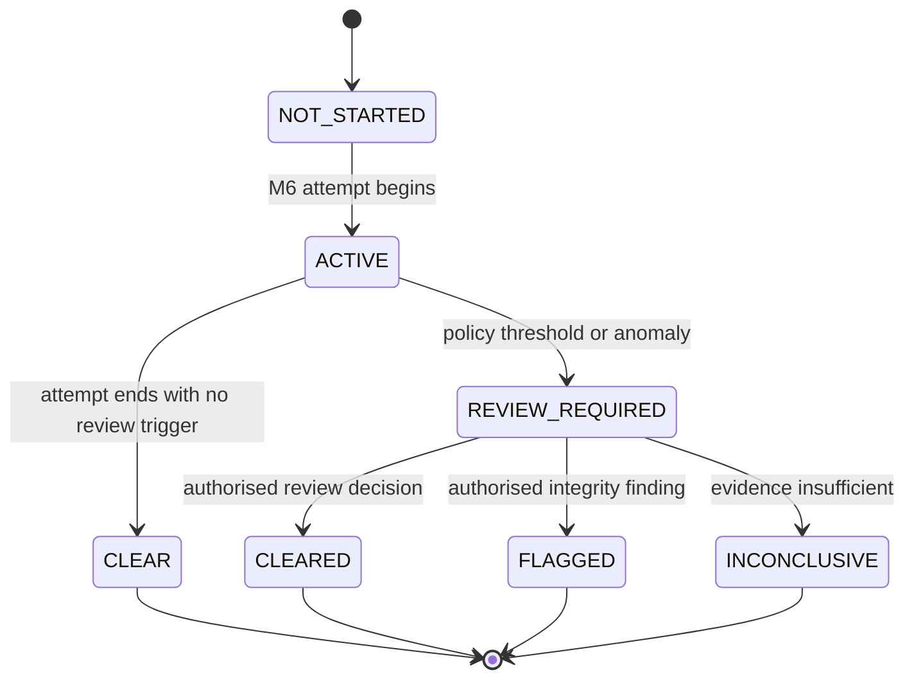
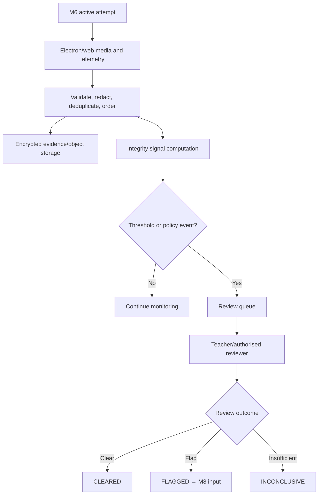
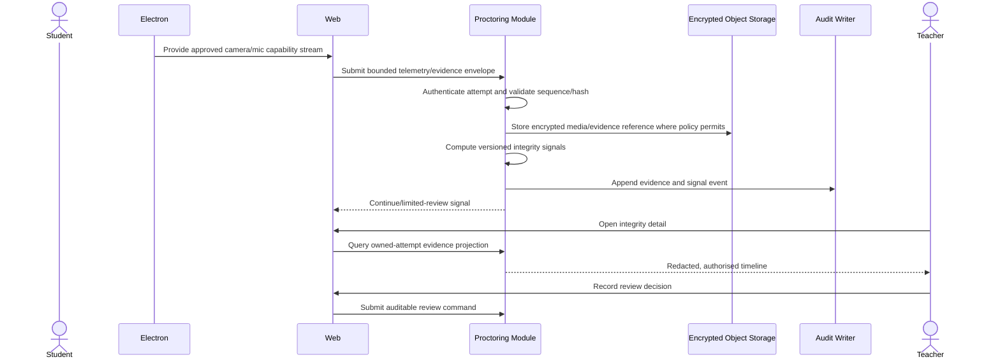

# M7 — Proctoring & Integrity — Flow Design

**Module:** M7 — Proctoring & Integrity
**Primary actors:** Student, Teacher, Proctor if enabled, system/AI workers
**Primary surfaces:** Evidence originates from the Electron-loaded web application; review uses the shared web application
**Authoritative references:** `docs/HIGH_LEVEL_DESIGN.md` §§9, 11, 13, 16; `docs/LOW_LEVEL_DESIGN.md` §15; `docs/modules/MODULE_DECOMPOSITION.md` §3; `docs/modules/SCREEN_INVENTORY.md` §11

M7 ingests and evaluates integrity evidence. It does not become the authority for identity, timing, answer state, grading, or result publication.

---

## 1. Integrity lifecycle

A signal or AI output is not itself a final disciplinary result. The configured policy and authorised review workflow determine the integrity state.

## 2. Evidence and review flow

Camera and microphone capture uses lightweight client capabilities, but M7 trusts only validated server-ingested evidence and policy-versioned signals. It never accepts a client-supplied `riskScore` or `flagged` decision.

## 3. Live monitoring flow

## 4. Integrity rules

| Rule | Required behaviour |
| --- | --- |
| Identity mismatch | Record a policy-versioned signal; do not change M6 identity or timing state directly. |
| Camera/mic unavailable | Apply the exam's configured server policy; never silently bypass a required gate. |
| Evidence ordering | Validate per-attempt sequence, timestamp bounds, and deduplication key. |
| Storage | Encrypt evidence, separate keys, restrict access, and apply retention/deletion jobs. |
| Teacher review | Scope to exam-owner or explicitly authorised reviewer policy; audit every decision. |
| AI output | Advisory/policy input only; no unaudited final disciplinary result. |

## 5. Screen contract map

| Screen ID | Transition | Owning contract |
| --- | --- | --- |
| M7-S01 | Teacher dashboard → live monitor | Active-attempt monitoring projection |
| M7-S02 | monitor → evidence detail | Redacted evidence timeline |
| M7-S03 | detail → integrity review | Auditable review command |
| M7-S04 | review → reconnect decision | Policy-scoped reconnect review |

## 6. Exit criteria

M7 is complete when media/telemetry is validated and bounded, evidence is encrypted and access-controlled, signals are deterministic/versioned, teacher review is auditable, and no proctoring path can mutate timing, answers, marks, or publication directly.
