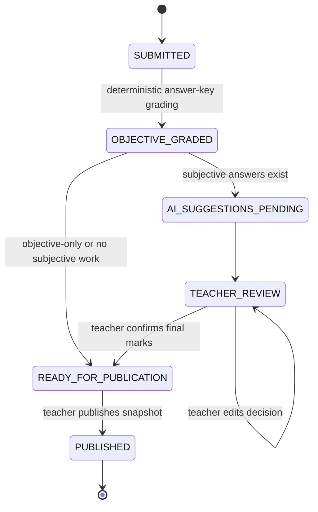
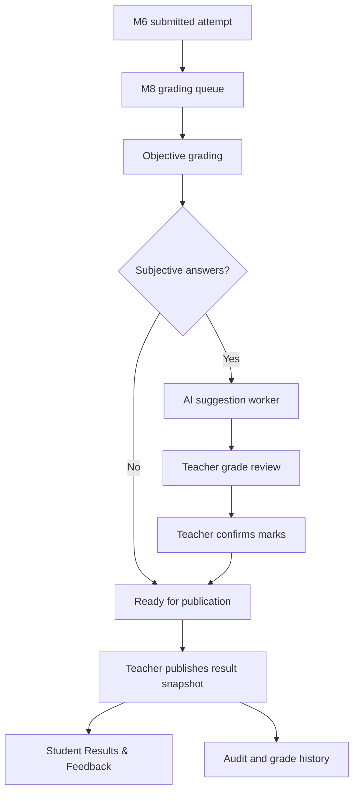
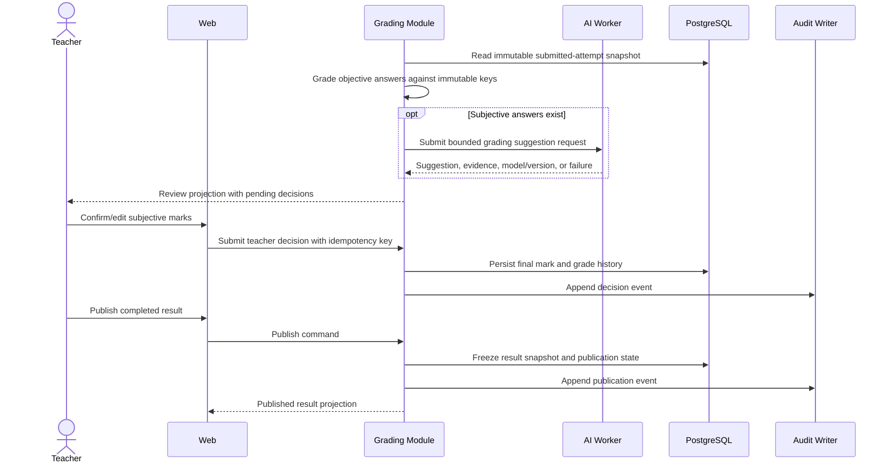

# M8 — Grading, Results & Audit — Flow Design

**Module:** M8 — Grading, Results & Audit
**Primary actors:** Teacher, Student, AI grading worker, authorised reviewer
**Primary surface:** Shared web application
**Authoritative references:** `docs/HIGH_LEVEL_DESIGN.md` §§9, 11, 13, 16; `docs/LOW_LEVEL_DESIGN.md` §16; `docs/modules/MODULE_DECOMPOSITION.md` §3; `docs/modules/SCREEN_INVENTORY.md` §12

M8 converts a submitted attempt into a reviewable result, obtains teacher decisions for subjective answers, publishes an immutable result snapshot, and records the audit trail. The teacher who owns the exam publishes results; no class or institution assignment is required in v1.

---

## 1. Grading lifecycle

AI suggestions never become final marks automatically. A result is not student-visible until the authorised teacher publishes it.

## 2. Grading and publication flow

## 3. Detailed review flow

## 4. Rules and failure paths

| Condition | Required behaviour |
| --- | --- |
| Objective answer | Grade deterministically from the immutable question version/key. |
| Subjective answer | AI may suggest; teacher must confirm final mark. |
| AI unavailable | Keep item pending; never fabricate or silently assign final mark. |
| Concurrent teacher decision | Idempotency and row/version checks prevent lost updates. |
| Result publication | Only completed, authorised teacher-owned result can publish. |
| Post-publication edit | Create a controlled correction/version and audit it; never mutate history silently. |
| Student access | Return only the authenticated student's published snapshot. |

## 5. Screen contract map

| Screen ID | Transition | Owning contract |
| --- | --- | --- |
| M8-S01 | teacher dashboard → grading queue | Submitted-attempt query |
| M8-S02 | queue → grade review | Grading projection |
| M8-S03 | review → grade confirmation | Teacher decision command |
| M8-S04 | completed review → publication | Result publication command |
| M8-S05 | student dashboard → results | Published student projection |
| M8-S06 | authorised staff → audit log | Audit query contract |
| M8-S07 | results → detail | Immutable result projection |

## 6. Exit criteria

M8 is complete when objective grading is deterministic, subjective marks remain teacher-controlled, result publication is explicit and ownership-scoped, student visibility is publication-gated, and grading/publication corrections are auditable.
